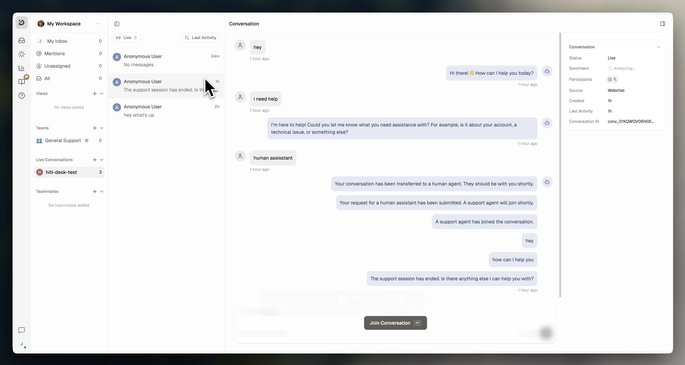
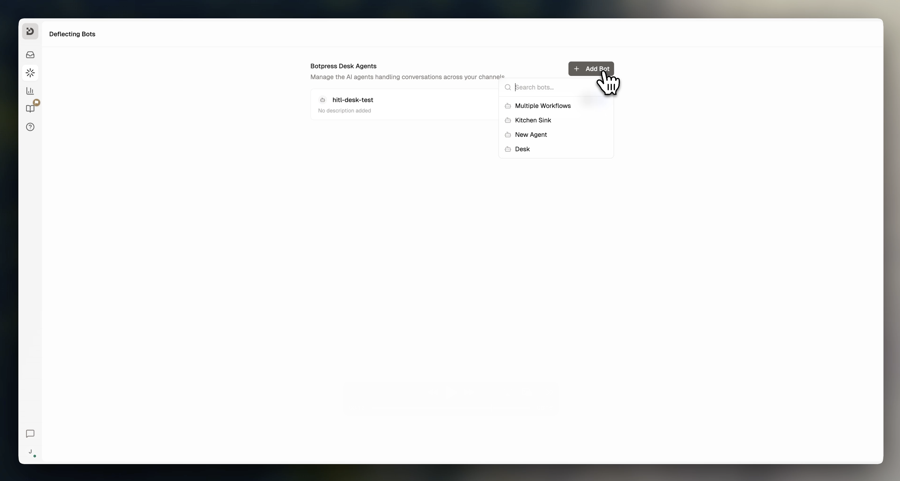

The `desk-hitl` plugin connects your agent to Botpress Desk for human handoff. When escalated, your agent calls `startHitl` to create a Desk ticket and a support agent takes over from there.

<Frame>
  
</Frame>

## Add desk-hitl to your agent

Add the plugin to `agent.config.ts`:

```typescript
import { defineConfig, z } from "@botpress/runtime"

export default defineConfig({
  name: "my-agent",

  dependencies: {
    integrations: {
      webchat: "webchat@0.3.0",
    },
    plugins: {
      "desk-hitl": {
        version: "desk-hitl@latest",
      },
    },
  },
})
```

### Customize handoff messages

Override the default messages the plugin sends when an agent joins or a session ends:

```typescript
plugins: {
  "desk-hitl": {
    version: "desk-hitl@latest",
    config: {
      agentAssignedMessage: "A support agent has joined the conversation.",
      sessionEndedMessage: "The support session has ended. Is there anything else I can help you with?",
    },
  },
},
```

## Connect your bot in Botpress Desk

To enable escalations, link your bot to Botpress Desk from the Desk UI. This is a one-time step per bot. Your bot must be deployed at least once before it appears in the list.

<Steps>
  <Step>
    Run `adk deploy` to deploy your bot.
  </Step>
  <Step>
    Open [**Botpress Desk**](/desk/introduction).
  </Step>
  <Step>
    Go to **AI Agents → Deflecting Bots**.
  </Step>
  <Step>
    Add your bot.
  </Step>
</Steps>

<Frame>
  
</Frame>

<Warning>
  If you skip this step, `startHitl` will fail with: _"This bot is not connected to Botpress Desk. Enable it on the Deflecting Bots page in Botpress Desk, then republish."_
</Warning>


## Create an escalation tool

Wrap `startHitl` in an `Autonomous.Tool` so the model can decide when to escalate. Create a file called `handToSupport.ts` under `src/tools/`:

```typescript
import { Autonomous, context, plugins, z } from "@botpress/runtime"

export default new Autonomous.Tool({
  name: "handToSupport",
  description:
    "Transfer the conversation to a support agent. Use when the user explicitly asks for a support agent, or when their issue is beyond the bot's capabilities.",
  input: z.object({
    reason: z.string().describe("Why the conversation needs a support agent"),
    priority: z.enum(["low", "medium", "high", "urgent"]).default("medium"),
  }),
  handler: async ({ reason, priority }) => {
    const conversation = context.get("conversation")

    await plugins["desk-hitl"].actions.startHitl({
      conversationId: conversation.id,
      title: reason,
      priority,
    })
  },
})
```

Fields passed to `startHitl`:

| Field | Type | Description |
|-------|------|-------------|
| `conversationId` | `string` | The conversation to escalate — required |
| `title` | `string` | Ticket title shown in Desk |
| `priority` | `'low' \| 'medium' \| 'high' \| 'urgent'` | Ticket priority (default: `'medium'`) |
| `userName` | `string` | Customer name shown in the Desk ticket |
| `userEmail` | `string` | Customer email shown in the Desk ticket |

## Use the tool in a conversation handler

Add the tool to `conversations/index.ts` and instruct the model when to use it:

```typescript
import { Conversation } from "@botpress/runtime"
import handToSupport from "../tools/handToSupport"

export default new Conversation({
  channel: "*",
  handler: async ({ execute }) => {
    await execute({
      instructions: `You are a helpful support assistant.
If the user needs help beyond your capabilities or explicitly asks for a support agent, use the handToSupport tool. After calling it, do not send any message.`,
      tools: [handToSupport],
    })
  },
})
```
