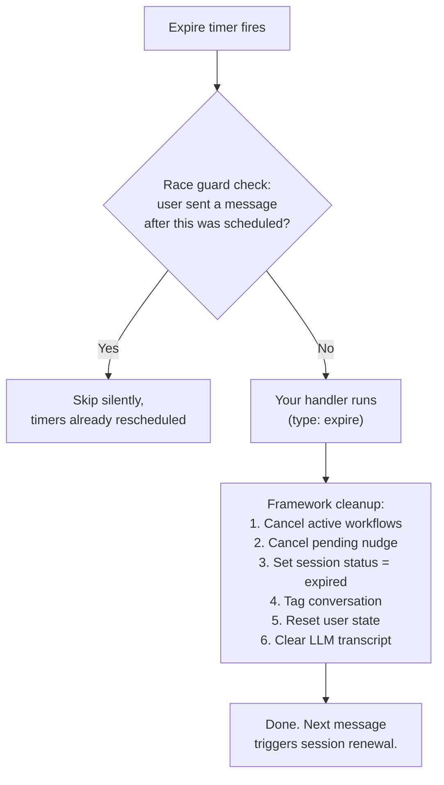

Lifecycle management adds idle nudges and session expiration to your conversations. You configure timers, and the framework handles scheduling, state resets, and session tracking.

## Basic setup

Add a `lifecycle` prop to your conversation:

```typescript
import { Conversation } from "@botpress/runtime"
import { z } from "@botpress/sdk"

export default new Conversation({
  channel: "webchat.channel",
  state: z.object({
    topic: z.string().optional(),
  }),

  lifecycle: {
    nudge: { after: "5m", interval: "10m", max: 3 },
    expire: { after: "30m" },
  },

  handler: async (props) => {
    if (props.type === "nudge") {
      await props.conversation.send({
        type: "text",
        payload: { text: "Still there? Let me know if you need anything." },
      })
      return
    }

    if (props.type === "expire") {
      await props.conversation.send({
        type: "text",
        payload: { text: "Closing this session due to inactivity. Come back anytime!" },
      })
      return
    }

    await props.execute({ instructions: "You are a helpful assistant." })
  },
})
```

## Concepts

### Nudge

A nudge is an automated reminder sent when the user has been silent for a configured duration. Nudges are:

- **Configurable** - you set when the first one fires (`after`), how often to repeat (`interval`), and when to stop (`max`)
- **Auto-resetting** - any user message resets the nudge timer
- **Handler-controlled** - the framework decides when to nudge, you decide what to say
- **Workflow-aware** - nudges are automatically suppressed while a workflow is running

### Expiration

Expiration is when a conversation session ends due to prolonged inactivity. When it fires:

1. Your handler runs first (`type: "expire"`) so you can send a goodbye message or save a summary
2. Then the framework takes over: cancels workflows, tags the conversation, resets state, clears the transcript

### Session

A session is a single period of activity within a conversation. One conversation can have many sessions over its lifetime. The framework manages a `session` object automatically:

| Field | Type | Description |
|-------|------|-------------|
| `id` | `string` | Unique identifier for this session. Changes on every expiration. |
| `number` | `number` | Monotonically increasing counter. Session 1, 2, 3... |
| `status` | `'active'` or `'expired'` | Whether this session is currently live. |
| `startedAt` | `string` | ISO timestamp when this session began. |
| `lastActivityAt` | `string` | ISO timestamp of the last user message. |
| `nudgeCount` | `number` | How many nudges have fired in this session. Resets on new activity and on session renewal. |

Access it via `conversation.session`:

```typescript
const session = props.conversation.session

if (session) {
  console.log(`Session #${session.number}, status: ${session.status}`)
}
```

The session object is read-only. It returns `undefined` for conversations without lifecycle configured.

## What happens when a conversation expires



## Duration strings

Lifecycle durations use `ms`-compatible strings:

| String | Duration |
|--------|----------|
| `'30s'` | 30 seconds |
| `'5m'` | 5 minutes |
| `'1h'` | 1 hour |
| `'24h'` | 24 hours |
| `'2d'` | 2 days |

Durations are validated at construction time. Invalid or non-positive values throw immediately.

## Common patterns

### Escalating nudges

Use `nudgeCount` to change the tone as nudges progress:

```typescript
if (props.type === "nudge") {
  const session = props.conversation.session!
  const messages = [
    "Still there? Take your time.",
    "Just checking in. Do you need help with anything?",
    "I'll close this session soon if you don't need anything else.",
  ]
  const text = messages[session.nudgeCount - 1] ?? messages[messages.length - 1]
  await props.conversation.send({ type: "text", payload: { text } })
  return
}
```

### Welcome back after expiration

Detect when a user returns after a session expired:

```typescript
if (props.type === "message" && props.conversation.session?.number! > 1) {
  await props.conversation.send({
    type: "text",
    payload: { text: `Welcome back! This is session #${props.conversation.session!.number}.` },
  })
}
```

### Nudge-only (no expiration)

Configure nudges without expiration. The conversation stays open indefinitely:

```typescript
lifecycle: {
  nudge: { after: "10m", interval: "30m", max: 2 },
}
```

### Expiration-only (no nudges)

Silently expire after inactivity without reminders:

```typescript
lifecycle: {
  expire: { after: "1h" },
}
```

### Different timeouts per channel

Each conversation file has its own lifecycle. Use this for channel-appropriate timing:

```typescript
// conversations/support.ts - aggressive nudging, short timeout
lifecycle: {
  nudge: { after: "3m", interval: "5m", max: 3 },
  expire: { after: "15m" },
}

// conversations/sales.ts - patient, longer timeout
lifecycle: {
  nudge: { after: "30m", max: 1 },
  expire: { after: "24h" },
}
```

## Things to know

- **Timers are wall-clock based.** `after: "5m"` means 5 minutes of real time since the last user message, not "bot idle time."
- **Only user messages reset timers.** Bot messages, events, and workflow callbacks do not reset the nudge/expire timers.
- **Expiration always wins.** Even if nudges are suppressed during a workflow, the expire timer keeps ticking. Set `expire.after` longer than your longest expected workflow.
- **Session data survives expiration.** `session.number` persists. Only user state and transcript are cleared.
- **No behavior change without opt-in.** Conversations without `lifecycle` work exactly as before.
- **Lifecycle events are invisible to the LLM.** Nudge and expire events are not added to the transcript. Only your handler's `send()` calls appear in the conversation history.

---

Next, learn how to persist data across conversations with state.

<Card title="Manage states" icon="database" href="/adk/conversations/state">
  Conversation, bot, and user state.
</Card>
