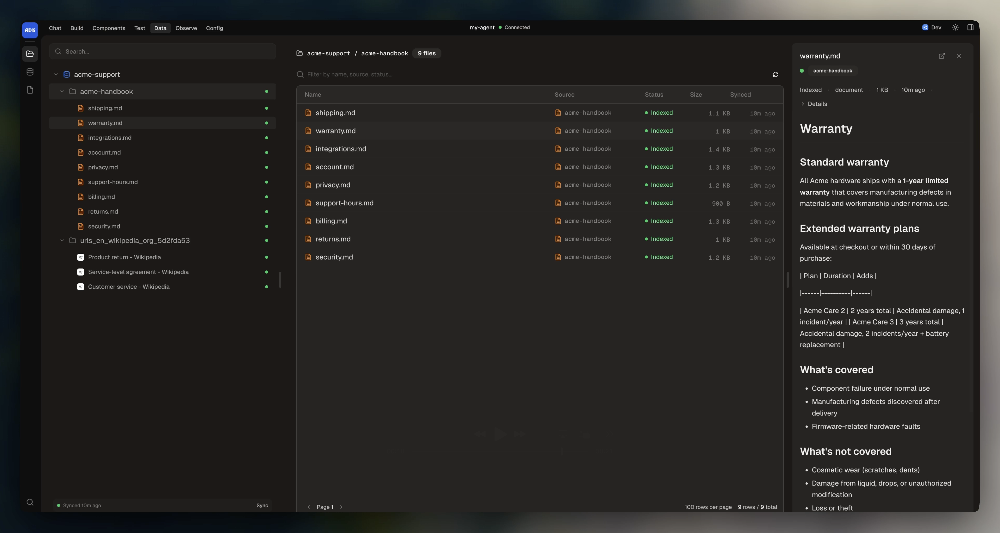

Knowledge bases let your agent answer questions based on your documents, websites, and files. When you pass a knowledge base to `execute()`, the AI model automatically searches it for relevant content and includes citations in its responses.

## Creating a knowledge base

Create a file in `src/knowledge/`:

```typescript
import { Knowledge, DataSource } from "@botpress/runtime"

export default new Knowledge({
  name: "product-docs",
  description: "Product documentation and FAQ",
  sources: [
    DataSource.Website.fromSitemap("https://docs.example.com/sitemap.xml"),
  ],
})
```

The dev console under **Knowledge** lets you browse your knowledge bases, see indexing status per source, view individual files, and trigger syncs manually. To test that your knowledge base returns the right results, use the **RAG Search** view in the dev console. It lets you run queries against your knowledge bases and see the matched passages, scores, and source documents.

<Frame>
  
  
</Frame>

## Data sources

### Website from sitemap

Index all pages in a sitemap:

```typescript
const DocsSource = DataSource.Website.fromSitemap(
  "https://example.com/sitemap.xml",
  {
    filter: ({ url }) => !url.includes("/admin"),
    maxPages: 1000,
    maxDepth: 10,
  }
)
```

### Website from base URL

Crawl a website starting from a URL (requires the Browser integration):

```typescript
const DocsSource = DataSource.Website.fromWebsite(
  "https://example.com",
  {
    filter: ({ url }) => !url.includes("/admin"),
    maxPages: 500,
    maxDepth: 5,
  }
)
```

### Website from llms.txt

Index pages referenced in an `llms.txt` file:

```typescript
const DocsSource = DataSource.Website.fromLlmsTxt(
  "https://example.com/llms.txt"
)
```

### Website from specific URLs

Index a fixed list of pages:

```typescript
const DocsSource = DataSource.Website.fromUrls([
  "https://example.com/pricing",
  "https://example.com/faq",
  "https://example.com/terms",
])
```

### Website source options

| Option | Type | Description |
|--------|------|-------------|
| `id` | `string` | Optional unique identifier for the source |
| `filter` | `(ctx) => boolean` | Filter function receiving `{ url, lastmod?, changefreq?, priority? }` |
| `fetch` | `string \| function` | Fetch strategy: `"node:fetch"` (default), `"integration:browser"`, or custom function |
| `maxPages` | `number` | Maximum pages to index (1-50000, default: 50000) |
| `maxDepth` | `number` | Maximum sitemap depth (1-20, default: 20) |

### Directory

Use a directory as a data source:

```typescript
const FileSource = DataSource.Directory.fromPath("./src/knowledge/docs", {
  filter: (filePath) => filePath.endsWith(".md") || filePath.endsWith(".txt"),
})
```

## Using knowledge in conversations

Pass knowledge bases to `execute()` via the `knowledge` array:

```typescript
import { Conversation } from "@botpress/runtime"
import ProductDocs from "../knowledge/product-docs"
import FAQ from "../knowledge/faq"

export default new Conversation({
  channel: "webchat.channel",
  handler: async ({ execute }) => {
    await execute({
      instructions: "Answer questions using the documentation. Cite your sources.",
      knowledge: [ProductDocs, FAQ],
    })
  },
})
```

The AI model searches the knowledge bases automatically when it needs information. Results include citations that trace back to the source documents.

## Refreshing knowledge

Knowledge bases are indexed during `adk dev` and `adk deploy`. To re-index on a schedule, use a workflow:

```typescript
import { Workflow } from "@botpress/runtime"
import ProductDocs from "../knowledge/product-docs"

export default new Workflow({
  name: "refresh-knowledge",
  schedule: "0 0 * * *",
  handler: async () => {
    await ProductDocs.refresh()
  },
})
```

Force re-indexing even if content hasn't changed:

```typescript
await ProductDocs.refresh({ force: true })
```

Refresh a single source within a knowledge base:

```typescript
await ProductDocs.refreshSource("my-source-id", { force: true })
```

---

Next, learn how to test your agent with evals.

<Card title="Write and run evals" icon="flask-conical" href="/adk/testing/evals">
  Automated conversation tests for your agent.
</Card>
