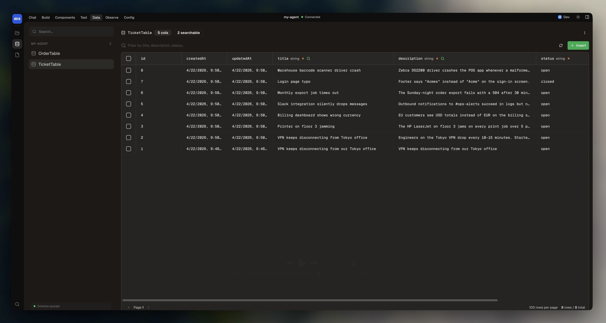

Tables provide typed, structured storage for your agent. You define a schema using `z` from `@botpress/runtime`, and the ADK syncs it with Botpress on deploy. Tables are accessible from conversations, workflows, actions, tools, and triggers.

## Creating a table

Create a file in `src/tables/`:

```typescript
import { Table, z } from "@botpress/runtime"

export default new Table({
  name: "OrderTable",
  description: "Customer orders",
  keyColumn: "userId",
  columns: {
    userId: z.string(),
    items: z.array(z.string()),
    total: z.number(),
    status: z.string(),
  },
})
```

The `description` field is optional but useful when the table gets surfaced to the LLM (via Zai or knowledge). `keyColumn` is optional too; it sets the default key used when calling [`.upsertRows()`](#upsert-rows) so you don't have to pass it on every call.

<Frame>
  
  
</Frame>

### Naming rules

Table names:

- Must start with a letter, underscore, or `$`
- Must be 35 characters or less
- Must contain only letters, numbers, and underscores
- Must end with `Table`
- Cannot be a UUID

### Searchable columns

You can mark columns as searchable to enable semantic search:

```typescript
export default new Table({
  name: "TicketTable",
  columns: {
    title: { schema: z.string(), searchable: true },
    description: { schema: z.string(), searchable: true },
    status: z.string(),
    priority: z.string(),
  },
})
```

### Computed columns

A computed column is derived from other columns. Set `computed: true`, pass the columns it depends on into `dependencies`, and return its value from `value`:

```typescript highlight={7,9-10}
export default new Table({
  name: "OrderTable",
  columns: {
    quantity: z.number(),
    unitPrice: z.number(),
    total: {
      computed: true,
      schema: z.number(),
      dependencies: ["quantity", "unitPrice"],
      value: (row) => row.quantity * row.unitPrice,
    },
  },
})
```

Computed columns recalculate whenever their dependencies change. When you write to the table, you can pass `waitComputed: true` to block any further modifications to the table until the recalculation finishes:

```typescript
await OrderTable.createRows({
  rows: [{ quantity: 3, unitPrice: 20 }],
  waitComputed: true,
})
```

## Managing table data

You can manage your table data in the dev console under **Data > Tables**. Here, you can:

- View the sync state between your code and Botpress' servers
- Add/update/delete rows
- Filter and sort
- Export to CSV
- Copy data between development and production environments

## CRUD operations

To perform operations on your table within your agent's code, import the table and use the typed instance methods.

### Create rows

```typescript
import OrderTable from "../tables/order-table"

const { rows } = await OrderTable.createRows({
  rows: [{ userId: "user123", total: 99.99, status: "pending" }],
})
```

### Find rows

```typescript
const { rows } = await OrderTable.findRows({
  filter: { status: "pending" },
  orderBy: "createdAt",
  orderDirection: "desc",
  limit: 10,
})
```

### Get a single row

```typescript
const row = await OrderTable.getRow({ id: 42 })
```

### Update rows

```typescript
await OrderTable.updateRows({
  rows: [{ id: orders[0].id, status: "completed" }],
})
```

### Upsert rows

Insert or update based on a key column:

```typescript
const { inserted, updated } = await OrderTable.upsertRows({
  keyColumn: "userId",
  rows: [{ userId: "user123", total: 149.99, status: "pending" }],
})
```

If you [set `keyColumn` on the table](#creating-a-table), you can omit it here.

<Note>
If `keyColumn` is omitted on both the table defintion and the `upsertRows` call, it defaults to `id`.
</Note>

### Delete rows

<CodeGroup>
```typescript Delete rows by name
await OrderTable.deleteRows({ status: "cancelled" })
```

```typescript Delete rows by ID
await OrderTable.deleteRowIds([1, 2, 3])
```

```typescript Delete all rows
await OrderTable.deleteAllRows()
```
</CodeGroup>

## Filtering

When calling `findRows()`, you can pass in filters for specific rows. These can use [MongoDB-style operators](https://www.mongodb.com/docs/manual/reference/mql/query-predicates/) for advanced queries:

```typescript
const { rows } = await OrderTable.findRows({
  filter: {
    total: { $gt: 100 },
    status: { $in: ["pending", "processing"] },
  },
})
```

### Operators

| Operator | Description |
|----------|-------------|
| `$eq` | Equal to |
| `$ne` | Not equal to |
| `$gt` | Greater than |
| `$gte` | Greater than or equal |
| `$lt` | Less than |
| `$lte` | Less than or equal |
| `$in` | In array |
| `$nin` | Not in array |
| `$exists` | Field exists |
| `$regex` | Regex match |
| `$options` | Regex flags: `"i"` for case-insensitive, `"c"` for case-sensitive |

### Logical operators

You can combine filters with `$and`, `$or`, and `$not`:

```typescript
const { rows } = await OrderTable.findRows({
  filter: {
    $or: [
      { status: "pending" },
      { total: { $gt: 500 } },
    ],
  },
})
```

## Semantic search

You can search across [`searchable` columns](#searchable-columns) using natural language:

```typescript
const { rows } = await TicketTable.findRows({
  search: "VPN connection issues",
  limit: 10,
})
```

Combine with filters for hybrid queries:

```typescript
const { rows } = await TicketTable.findRows({
  search: "network problems",
  filter: { status: "open" },
  limit: 20,
})
```

## Aggregation

Aggregation groups rows by one or more columns and computes summary statistics for other columns. This transforms your table data into summary reports.

Pass a `group` object to `findRows()` where each key is a column name and the value is either a single operation or an array of operations:

```typescript
const { rows } = await OrderTable.findRows({
  group: {
    status: "key",              // Group by status
    total: ["sum", "avg"],      // Sum and average the total column
    id: "count",                // Count rows in each group
  },
})
```

The returned rows have different fields based on your group configuration. The field names combine the column name (in `camelCase`) with the operation:

```typescript
// For the group config above, each row in the result contains:
{
  statusKey: "pending",     // The grouping value
  totalSum: 1500.00,        // Sum of totals in this group
  totalAvg: 125.00,         // Average of totals in this group
  idCount: 12,              // Number of rows in this group
}
```

Operations vary by column type:

| Operation | Available for | Returns | Description |
|-----------|---------------|---------|-------------|
| `key` | All types | Same as column | Groups rows by this value |
| `count` | All types | `number` | Number of rows in the group |
| `sum` | Numbers | `number` | Sum of values |
| `avg` | Numbers | `number` | Average of values |
| `max` | Numbers, strings, dates | Same as column | Maximum value |
| `min` | Numbers, strings, dates | Same as column | Minimum value |
| `unique` | All types | Array | Array of unique values |
