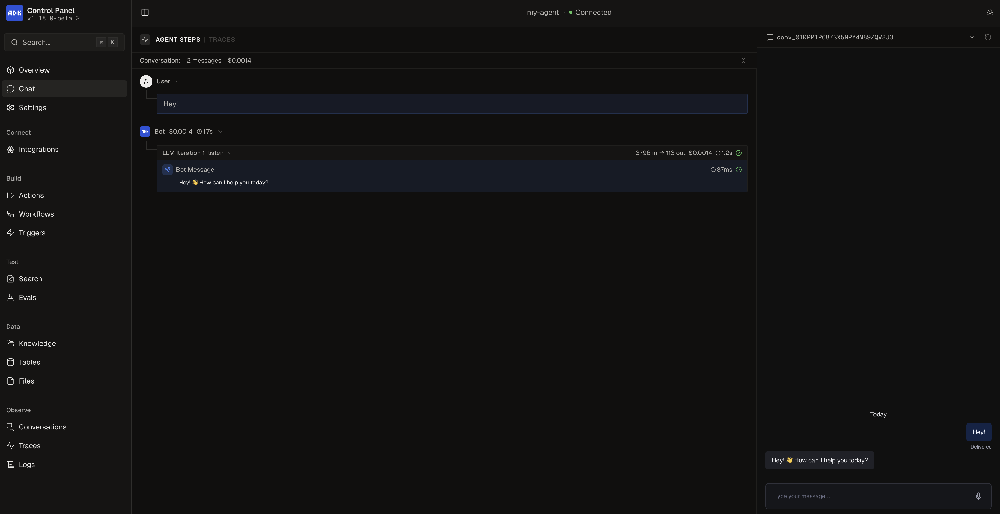

This quickstart walks through creating an ADK agent, running it locally, and deploying it to Botpress Cloud.

<Info>
  Before you start, [install the ADK CLI](/adk/get-started/install). You'll also need a [Botpress account](https://sso.botpress.cloud) to log in with.
</Info>

<Steps>
  <Step title="Log in to Botpress">
    Authenticate with your Botpress account:

    ```bash
    adk login
    ```

    Follow the prompts to sign in through your browser. The CLI saves your credentials for every command that follows.
  </Step>

  <Step title="Create a project">
    Run the init command and pass a name for your project:

    ```bash
    adk init my-agent
    ```

    The CLI walks you through a short wizard. Pick the `hello-world` template to start with a working agent:

    ```txt
     ▄▀█ █▀▄ █▄▀  Botpress ADK
     █▀█ █▄▀ █░█  Initialize New Agent

     Step 1 of 2

    Select a template:

      blank
        Empty project with just the folder structure

    › hello-world
        A working chatbot with chat and webchat integrations

      slack-triage
        Slack bot that monitors a channel, classifies requests, and routes to the right person

      knowledge-assistant
        RAG-powered Q&A agent with knowledge base and source citations

      crm-enrichment
        Scheduled workflow that enriches CRM contacts with AI-driven classification
    ```

    The wizard also asks for a package manager, then prompts you to pick a Botpress workspace to link the project to. Linking sets where `adk deploy` ships your agent.

    Once it's done, move into the project directory:

    ```bash
    cd my-agent
    ```
  </Step>

  <Step title="Explore the project">
    Here's what's inside your new project:

    <Tree>
      <Tree.Folder name="my-agent" defaultOpen>
        <Tree.File name="agent.config.ts" />
        <Tree.File name="AGENTS.md" />
        <Tree.File name="CLAUDE.md" />
        <Tree.File name="package.json" />
        <Tree.File name="README.md" />
        <Tree.File name="tsconfig.json" />
        <Tree.Folder name="src" defaultOpen>
          <Tree.Folder name="actions" />
          <Tree.Folder name="conversations" />
          <Tree.Folder name="knowledge" />
          <Tree.Folder name="tables" />
          <Tree.Folder name="triggers" />
          <Tree.Folder name="workflows" />
        </Tree.Folder>
      </Tree.Folder>
    </Tree>

    `agent.config.ts` is your agent's main config file. It defines which AI models your agent uses, what it remembers between conversations, and which integrations it connects to.

    `AGENTS.md` and `CLAUDE.md` teach AI coding assistants how to work in this project, so tools like Claude Code and Cursor can help you build.

    Each folder under `src/` holds one kind of building block. The `hello-world` template's conversation handler lives at `src/conversations/index.ts`:

    ```typescript highlight={7}
    import { Conversation } from '@botpress/runtime'

    export default new Conversation({
      channel: '*',
      handler: async ({ execute }) => {
        await execute({
          instructions: `You are a helpful AI assistant built with Botpress ADK.`,
        })
      },
    })
    ```

    The highlighted `instructions` field is your agent's system prompt. Edit it to change what your agent does and how it responds.
  </Step>

  <Step title="Run your agent locally">
    Start the development server:

    ```bash
    adk dev
    ```

    `adk dev` builds your agent, watches your files, and rebuilds on every save.

    Open the dev console at [http://localhost:3001](http://localhost:3001):

    <Frame>
      
      
    </Frame>

    Go to the Chat page to talk to your agent. The other pages let you inspect conversations, Workflows, tables, and integration settings.
  </Step>

  <Step title="Deploy to Botpress Cloud">
    When you're ready to ship your agent, run:

    ```bash
    adk deploy
    ```

    This builds a production bundle and uploads it to the workspace you linked during `adk init`. If you skipped the linking step, run `adk link` before deploying.
  </Step>
</Steps>
