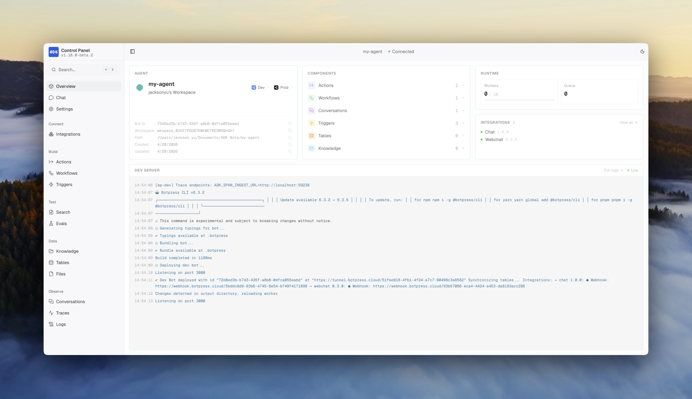
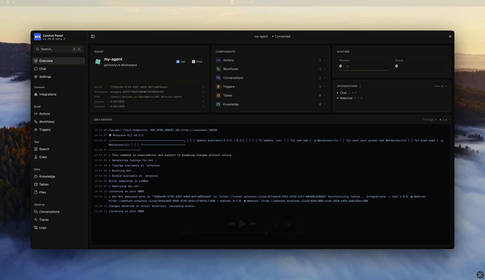

<Frame>
  
  
</Frame>

The ADK is a TypeScript framework for building AI agents that run on the Botpress Platform. You write conversations, workflows, tools, and actions as code. The platform handles hosting, scaling, and channel delivery.

## What you can build

- **Customer support agents** that resolve tickets, look up orders, and escalate to humans
- **Internal tools** that automate workflows across Slack, email, and databases
- **Sales assistants** that qualify leads, book meetings, and sync with your CRM
- **Multi-channel bots** that work across webchat, WhatsApp, Telegram, and more

## How it works

You write TypeScript. The ADK CLI handles the rest.

```bash
adk init my-agent     # Scaffold a project
adk dev               # Run locally with hot reload
adk deploy            # Ship to Botpress Cloud
```

Your agent is organized around a few core primitives:

| Primitive | What it does |
|-----------|-------------|
| **Conversations** | Handle user messages on a channel |
| **Workflows** | Run multi-step background processes |
| **Tools** | Give the AI model functions it can call |
| **Actions** | Reusable logic callable from anywhere |
| **Tables** | Structured data storage |
| **Knowledge** | RAG-powered document retrieval |
| **Triggers** | React to external events |
| **Evals** | Automated conversation tests |

Each primitive lives in its own file under `src/`. The ADK discovers them automatically, no manual registration.

## Start here

<CardGroup cols={2}>
  <Card title="Install" icon="download" href="/adk/get-started/install">
    Get the CLI and log in to Botpress.
  </Card>
  <Card title="Quickstart" icon="rocket" href="/adk/get-started/quickstart">
    Build and deploy your first agent in minutes.
  </Card>
  <Card title="Build with a coding assistant" icon="sparkles" href="/adk/get-started/quickstart-coding-assistant">
    Pair the ADK with Claude Code, Cursor, or Codex.
  </Card>
  <Card title="What's new" icon="newspaper" href="/changelog">
    Latest features, improvements, and breaking changes.
  </Card>
</CardGroup>
