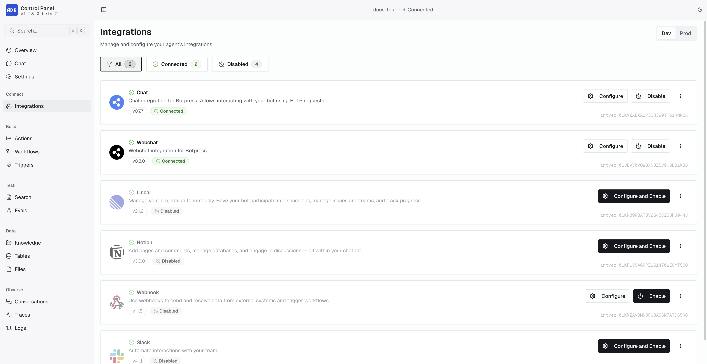
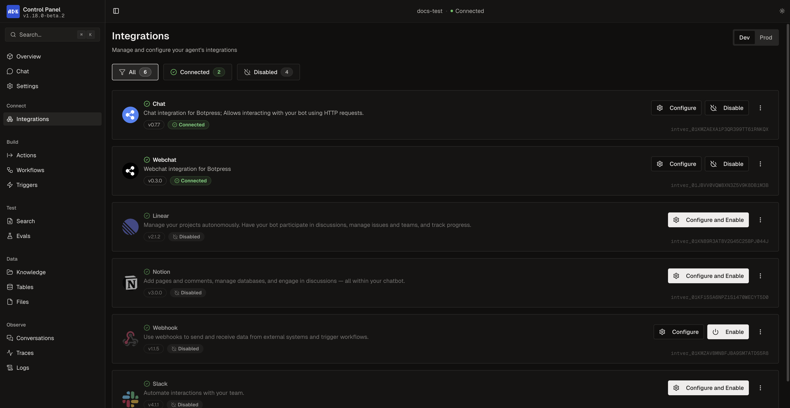

Integrations connect your agent to external services and platforms. This guide covers how to find, add, configure, and manage integrations in your ADK project.

## Finding integrations

### Search the Botpress Integration Hub

Search for integrations by keyword:

```bash
adk search crm
```

### List available integrations

Browse all available integrations from the Botpress Integration Hub:

```bash
adk list --available
```

### View integration details

Get detailed information about a specific integration, including its actions, events, and channels:

```bash
adk info linear
```

You can also filter the output:

```bash
adk info linear --actions    # Show only actions
adk info linear --events     # Show only events
adk info linear --channels   # Show only channels
```

See the [CLI reference](/adk/cli-reference) for all available flags and options.

## Adding integrations

Add an integration using the `adk add` command:

```bash
adk add linear
```

```txt
✓ Added linear version 2.1.2 as linear to agent.config.ts dependencies

Added as disabled. Enable and configure it in the Control Panel.
```

This adds the integration to your `agent.config.ts` as a string shorthand:

```typescript
dependencies: {
  integrations: {
    chat: "chat@0.7.7",
    webchat: "webchat@0.3.0",
    linear: "linear@2.1.2",
  },
},
```

<Note>
  Newly added integrations are disabled by default. Enable and configure them in the Control Panel during `adk dev`.
</Note>

### Pinning a version

Add a specific version instead of the latest:

```bash
adk add notion@3.0.0
```

### Using an alias

Add an integration with a custom alias. This is useful when you need multiple instances of the same integration:

```bash
adk add webhook --alias webhookOrders
```

The alias is how you reference the integration in your code:

```typescript
import { actions } from "@botpress/runtime";

await actions.webhookOrders.send({ url: "https://api.example.com/orders", data: payload });
```

<Note>
  Avoid aliasing built-in channel integrations (webchat, chat, slack, teams, telegram, whatsapp). The runtime uses the alias to identify these integrations, and a custom alias will prevent default message components from loading.
</Note>

### Workspace-scoped integrations

Add a private or custom integration from your workspace:

```bash
adk add my-workspace/custom-integration@1.0.0
```

## Configuring integrations

Integration settings (API keys, tokens, OAuth credentials) are managed in the Control Panel, not in `agent.config.ts`.

1. Run `adk dev` to start the development server
2. Open the Control Panel at `http://localhost:3001/integrations`
3. Find the integration and click to configure it
4. Enter the required settings and enable it

<Frame>
  
  
</Frame>

Each integration card in the Control Panel shows its current status:

| Status | Meaning |
|--------|---------|
| Connected | Enabled, registered, and configured |
| Disabled | Turned off, can be enabled |
| Needs Action | Requires installation, configuration, or enabling |
| Failed | Registration error |

<Note>
  If your project uses the older object format for integrations in `agent.config.ts`, the CLI will automatically detect it and prompt you to migrate to string shorthand when you run `adk dev`.
</Note>

## Listing installed integrations

View integrations currently installed in your project. The **Alias** column shows the key you use to reference each integration in your code:

```bash
adk list
```

```txt
Installed Integrations (3)

Alias               Name                          Version
───────────────────────────────────────────────────────────────
chat                chat                          0.7.7
webchat             webchat                       0.3.0
linear              linear                        2.1.2
```

## Updating integrations

### Update a specific integration

```bash
adk upgrade linear
```

### Update all integrations interactively

```bash
adk upgrade
```

This shows available updates and lets you choose which to upgrade:

```txt
✓ Upgraded:
  • linear (2.0.0 → 2.1.2)

Run adk dev to install the updated integrations
```

## Removing integrations

Remove an integration from your project:

```bash
adk remove linear
```

```txt
✓ Removed linear from agent.config.ts dependencies
  Run adk dev to update your project
```

You can also run `adk remove` without a name to choose interactively.

## Using integrations in code

Once an integration is installed and enabled, its actions become available in your agent:

```typescript
import { actions } from "@botpress/runtime";

// Call an integration action
await actions.linear.createIssue({
  title: "Bug report from user",
  teamId: "TEAM-123",
});
```

You can subscribe to integration events in [Triggers](/adk/concepts/triggers) and [Conversations](/adk/concepts/conversations) (via the `events` prop).
