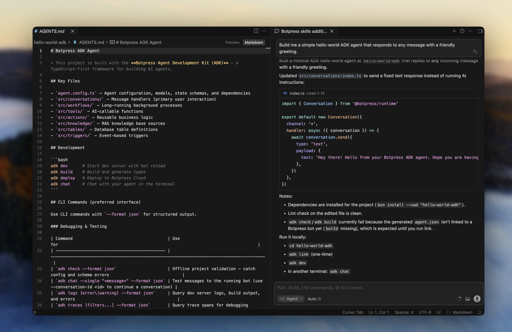

Install the ADK CLI, give Cursor ADK knowledge with skills, then let it build your agent from a simple prompt.

<Frame>
  
</Frame>

## Install the CLI

<CodeGroup>
  ```bash macOS & Linux
  curl -fsSL https://github.com/botpress/adk/releases/latest/download/install.sh | bash
  ```

  ```powershell Windows (PowerShell)
  powershell -c "irm https://github.com/botpress/adk/releases/latest/download/install.ps1 | iex"
  ```
</CodeGroup>

## Install ADK skills

Skills give Cursor deep knowledge of ADK conventions, primitives, and CLI commands:

```bash
bunx skills add botpress/skills -s '*' -a cursor -y
```

## Build your agent

Open your project in Cursor, use the chat panel (<kbd>Cmd</kbd> + <kbd>L</kbd>), and give it a prompt:

```
Initialize a simple ADK hello world bot for me.
```

Cursor will scaffold the project and write the agent code. Once it's done, run these commands from the project folder:

```bash
adk link   # connects your agent to Botpress (opens a browser to log in)
adk dev    # starts the dev console
```

Open the dev console and start chatting with your agent:

<Frame>
  
  
</Frame>

## Add more features

Keep prompting Cursor to extend your bot. For example:

```
Add a tool that looks up the weather for a given city.
```

Chat with your bot in the dev console to try out your changes.

## Deploy your agent

When you're ready to share your bot, deploy it to Botpress Cloud:

```bash
adk deploy
```

---

<Card title="Agent configuration" icon="settings" href="/adk/setup/configuration">
  Learn about project structure, models, state, and dependencies.
</Card>
