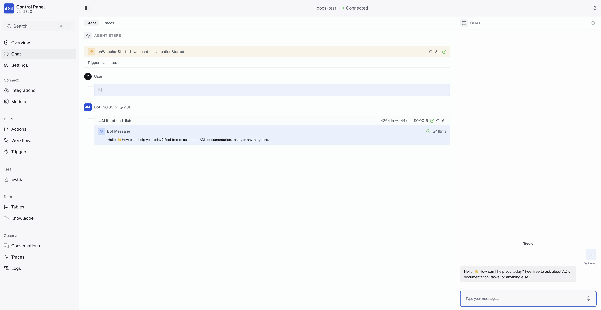

This guide walks you through installing the ADK and creating your first agent project.

<Info>
  You will need:

  - A [Botpress account](https://sso.botpress.cloud)
  - [Node.js](https://nodejs.org/en) (v22.0.0 or higher)
  - A supported package manager — [bun](https://bun.sh), [pnpm](https://pnpm.io), [yarn](https://yarnpkg.com) or [npm](https://www.npmjs.com)
</Info>

## Installation

Install the ADK CLI globally:

<CodeGroup>

```bash macOS & Linux
curl -fsSL https://github.com/botpress/adk/releases/latest/download/install.sh | bash
```

```powershell Windows (PowerShell)
powershell -c "irm https://github.com/botpress/adk/releases/latest/download/install.ps1 | iex"
```

</CodeGroup>

Verify the installation:

```bash
adk --version
```

## Create your first agent

Initialize a new agent project:

```bash
adk init my-agent
```

```txt
 ▄▀█ █▀▄ █▄▀  Botpress ADK
 █▀█ █▄▀ █░█  Initialize New Agent

 Step 1 of 2


Select a template:

› blank
    Empty project with just the folder structure

  hello-world
    A working chatbot with chat and webchat integrations
```

Select the `hello-world` template. Next, choose your preferred package manager:

```txt
 ▄▀█ █▀▄ █▄▀  Botpress ADK
 █▀█ █▄▀ █░█  Initialize New Agent

 Step 2 of 2


Select a package manager:

● Bun
    Install with bun
○ pnpm
    Install with pnpm
○ Yarn
    Install with yarn
○ npm
    Install with npm
```

If you are logged in, the CLI will also prompt you to select a workspace to link your agent to.

The CLI automatically installs dependencies and creates a `my-agent` directory. See [Project Structure](/adk/project-structure) for a full breakdown of the generated files.

Navigate into your project:

```bash
cd my-agent
```

## Test your agent

Now, you're ready to test your agent.

### Start the development server

Start the development server with hot reloading:

```bash
adk dev
```

This command:

1. Generates TypeScript types for your integrations
2. Builds your agent
3. Starts a local development server
4. Watches for file changes and automatically rebuilds

### View the Control Panel

While `adk dev` is running, visit [`http://localhost:3001/`](http://localhost:3001/) to access the Control Panel. This gives you a visual overview of your agent project where you can browse conversations, actions, workflows, tables, triggers, knowledge bases, and [configure integration settings](/adk/managing-integrations#integration-configuration).

You can also test your agent directly from the built-in Chat view:

<Frame>
  
</Frame>

### Chat in the terminal

Alternatively, open a new terminal window and start a conversation with your agent from the command line:

```bash
adk chat
```

```txt
Botpress Chat
Type "exit" or press ESC key to quit
👤 Hey!
🤖 Hello! How can I assist you today?
>>
```

## Build your agent

Compile your agent for production:

```bash
adk build
```

This creates an optimized build in the `.adk/bot/.botpress/dist` directory.

## Deploy your agent

When you're ready, you can deploy your agent to Botpress Cloud:

```bash
adk deploy
```

This uploads your agent to your Botpress workspace and makes it available for use.

<Note>
  If you skipped workspace selection during `adk init`, run `adk login` then `adk link` to connect your agent before deploying.
</Note>

<Check>
  You deployed your first agent using the ADK!
</Check>

## Next steps

<CardGroup Cols={2}>
  <Card title="Project Structure" horizontal icon="folder" href="/adk/project-structure">
    Learn about ADK project organization
  </Card>
  <Card title="Conversations" horizontal icon="message-square" href="/adk/concepts/conversations">
    Create your first conversation handler
  </Card>
</CardGroup>
