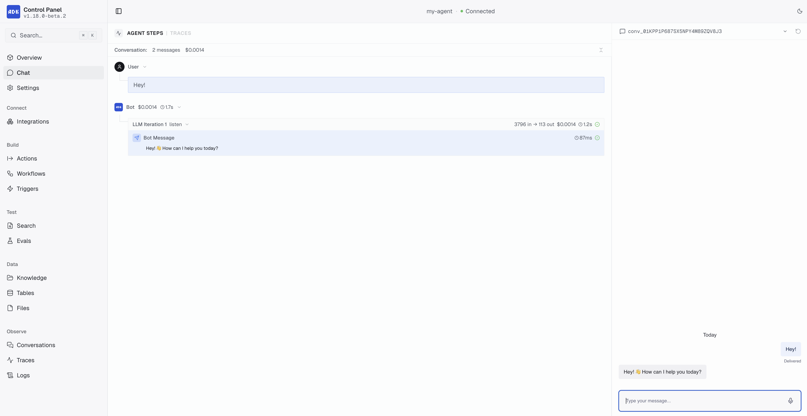

The ADK separates development and production into two environments. Secrets and configuration values are stored per environment, so your dev API keys never touch production.

You can switch between environments in the dev console using the environment toggle in the upper-right corner. This controls which environment's secrets, configuration, and data you view/edit.

<Tip>
You can also toggle between environments with <kbd>Cmd</kbd> + <kbd>Shift</kbd> + <kbd>E</kbd> (Mac) or <kbd>Ctrl</kbd> + <kbd>Shift</kbd> + <kbd>E</kbd> (Windows/Linux).
</Tip>

<Frame>
  
  
</Frame>

## Project files

Your project has three files that manage environment state:

| File | Contains | Committed to version control |
|------|----------|-----------------|
| `agent.json` | Production bot ID, workspace ID, API URL | Yes |
| `agent.local.json` | Development bot ID | No (gitignored) |
| `.adk/secrets.json` | Secret values for dev and prod | No (gitignored, mode 0600) |

The `.adk/` directory also contains generated types, build artifacts, and logs. It's fully gitignored.

## Secrets

Secrets store sensitive values like API keys, passwords, and tokens. They are declared in `agent.config.ts` and their values are stored locally, separate from your code.

### Declaring secrets

Add secrets to your config:

```typescript
secrets: {
  OPENAI_KEY: { description: "OpenAI API key" },
  SENTRY_DSN: { optional: true, description: "Error tracking DSN" },
},
```

Required secrets (the default) are enforced at deploy time. `adk dev` warns you if they're unset, but doesn't block the dev server from starting. Optional secrets never block deployment.

### Setting values

You can set values using `adk secret:set` command:

```bash
adk secret:set OPENAI_KEY "sk-..."
adk secret:set OPENAI_KEY "sk-prod-..." --prod
```

Development and production values are stored in separate buckets inside `.adk/secrets.json`. Setting a development value never touches production values, and vice versa.

<Tip>
  Check out the [CLI reference](/adk/cli-reference#configuration-and-secrets) for full documentation of the `adk secret` command.
</Tip>

### Using secrets at runtime

To use secrets at runtime, just import `secrets` from `@botpress/runtime` and reference them directly:

```typescript
import { secrets } from "@botpress/runtime"

const res = await fetch("https://api.openai.com/v1/chat/completions", {
  headers: { Authorization: `Bearer ${secrets.OPENAI_KEY}` },
})

if (secrets.SENTRY_DSN) {
  Sentry.init({ dsn: secrets.SENTRY_DSN })
}
```

The `secrets` import is a typed proxy over environment variables. Required secrets are typed as `string`, optional ones as `string | undefined`.

<Note>
  Secrets are read-only at runtime. Attempting to reassign the value of a secret will throw an error.
</Note>

### Managing secrets in the dev console

You can also manage secrets from the dev console under **Settings > Secrets**. The UI lets you add, edit, and delete secrets for both development and production environments. Schema changes (adding or removing declarations) write back to `agent.config.ts`.

<Frame>
  
  
</Frame>

### Naming rules

Secret keys must be `SCREAMING_SNAKE_CASE`:

- Start with an uppercase letter
- At least 2 characters
- No trailing underscore
- Cannot start with `SECRET_`, `BP_`, or `BOTPRESS_` (reserved)

### How secrets flow to production

**Development secrets**: If you're running your agent with `adk dev` and save changes to your development secrets via the dev console, your agent will immediately restart using the new values.

**Production secrets**: If you save changes to your production secrets via the dev console, the changes will only write to `agent.config.ts`. The new values will take effect on your production agent the next time you run `adk deploy`.

## Configuration

The `configuration` object in `agent.config.ts` defines static, deploy-time settings for your agent. Unlike secrets, configuration values are not sensitive. Unlike state, they are read-only at runtime.

### Declaring a schema

Define your schema in `agent.config.ts`:

```typescript
configuration: {
  schema: z.object({
    supportEmail: z.string().default("help@example.com"),
    maxRetries: z.number().default(3),
    enableBeta: z.boolean().default(false),
  }),
},
```

### Setting values

```bash
adk config                                        # Validate and fill missing values interactively
adk config:set supportEmail "help@mycompany.com"   # Set a dev value
adk config:set supportEmail "help@mycompany.com" --prod  # Set a prod value
adk config:get supportEmail                        # Read a value
```

Configuration values can also be managed from the dev console:

<Frame>
  
  
</Frame>

### Using configuration at runtime

```typescript
import { configuration } from "@botpress/runtime"

const email = configuration.supportEmail
const retries = configuration.maxRetries
```

Configuration is read-only. Attempting to set a value at runtime throws an error.

## Preflight checks

Run `adk check` to validate your project without starting the dev server:

```bash
adk check
```

This checks:
- Node.js version compatibility
- Runtime version compatibility
- Project structure and primitives
- Generated type assets

Preflight checks also run automatically during `adk dev` and `adk deploy`.
