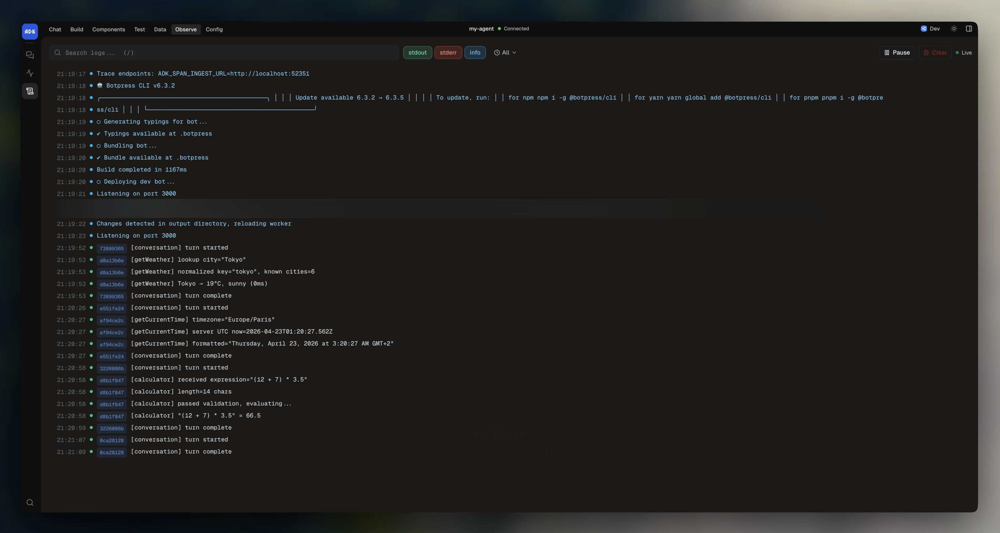

The ADK provides two observability views in the dev console and a CLI command for reading logs.

## Traces

The **Traces** view in the dev console shows a timeline of every span in your agent's execution. Each conversation turn, workflow step, tool call, and LLM request is captured as a span with timing and metadata.

<Frame>
  
  
</Frame>

### What you can see

- **Handler spans** showing conversation and workflow handler execution
- **Autonomous execution** spans for each `execute()` call, including iteration count and model used
- **Tool call spans** with input, output, and duration
- **LLM call spans** with model, token usage, and latency
- **Knowledge search spans** with queries and result counts
- **Error spans** with stack traces

### Filtering

Filter traces by time range, span type, or search for specific content. Click any span to expand its details and see its child spans.

## Logs

The **Logs** view in the dev console shows structured log output from your agent. Any `console.log`, `console.warn`, or `console.error` from your handlers, tools, and actions appears here.

<Frame>
  
  
</Frame>

### CLI

You can also read logs from the command line:

```bash
adk logs                         # Show recent logs
adk logs --follow                # Stream logs in real time
adk logs error                   # Errors only
adk logs warning since=1h        # Warnings and errors from the last hour
adk logs limit=100               # Last 100 entries
```

The positional filter tokens are `error` / `warning` / `info` (cumulative level), `since=<duration>`, and `limit=<n>`. See the [CLI reference](/adk/cli-reference#adk-logs) for all flags.

Logs are stored in `.adk/logs/` while the dev server is running.
