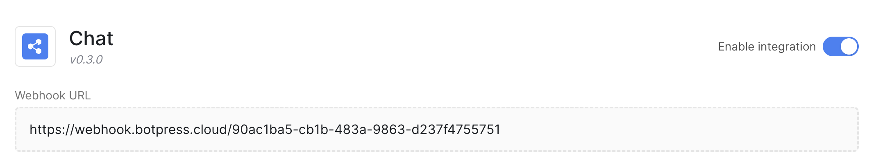

import chatApiPayloadSize from "/snippets/api-payload-limits.mdx"

The Chat API offers an HTTP API to chat with your bot. It allows you to integrate Botpress into a backend application (in contrast with [Webchat](/webchat/get-started/introduction), which allows you to integrate Botpress with your website).

<Note>
The Chat API is only available via an integration built by Botpress. Because of this, all users, conversations and messages created using the Chat API belong to the Chat integration.

This means you can't use the Chat API to fetch conversations that occur within other integrations, like WhatsApp or Webchat. For that, check out the [Runtime API](../runtime-api/getting-started).
</Note>

## Installation

{/* TODO(driftable): This hub link is subject to changes and should be auto-generated */}
To use this API, make sure the [Chat integration](https://studio.botpress.cloud/home?exploreHub=1&hubItemId=intver_01JVYWESY3BVAM5FR3XT9X813H&search=Chat+integration) is installed to your bot. Then, make sure your integration is enabled and configured.

## Configuration

The Chat Integration has no required configuration—you can use it as-is. However, it does expose a few options:

* **Encryption Key:** Used to verify incoming requests. If you set this field, you are then responsible for signing the `x-user-key` header yourself. Check out the [Authentication](#authentication) section for more information.

* **Webhook URL:** Called by the Chat API to notify you of chat-related events. The standard way of listening to Chat API events is by opening an SSE stream—if you set this field, you will receive events both on the SSE stream and on the webhook. Check out the [Realtime](#realtime) section for more information.

* **Webhook Secret:** Only used if you set a webhook URL. Included in requests sent to your webhook to ensure that requests made to your webhook are coming from the Chat API.

## Getting Started

To use the Chat API:

1. Find your webhook ID. You can find it in the Chat Integration's configuration page:



The webhook ID is the string at the end of the **Webhook URL**. In this case, the webhook ID starts with **90** and ends with **51**:

2. Check if you can reach the API by sending a GET request on `https://chat.botpress.cloud/$YOUR_WEBHOOK_ID/hello`.

3. Create a chat user (this is not the same as a user in your Botpress Dashboard) by calling the [createUser](/api-reference/chat-api/openapi/createUser) operation.

    <Note>
    This operation won't be available if you are using manual authentication. Check out the [Authentication](#authentication) section for more information.
    </Note>

4. In the response's body you will find a user key. Copy this key.

5. Create a conversation with your bot by calling the [createConversation](/api-reference/chat-api/openapi/createConversation) operation. You will need to provide a user key to authenticate yourself.

6. Send a message to your bot by calling the [createMessage](/api-reference/chat-api/openapi/createMessage) operation. You will need to provide:

    - A user key to authenticate yourself
    - A conversation ID to specify which conversation you are sending the message to
    - A message payload. For example, a simple text message has the following payload format: `{ "type": "text", "text": "hello bot" }`.

7. Wait for your bot to respond, then list messages on the conversation by calling the [listMessages](/api-reference/chat-api/openapi/listMessages) operation. You will need to provide:

    - A user key to authenticate yourself
    - A conversation ID to specify which conversation you are listing the messages from.

## Authentication

All requests sent to the Chat Integration's API are authenticated with a `x-user-key` header. There are two ways to get this user key:

- You call the `createUser` operation and get the key in the response's body. This operation is the only one that is not authenticated.
- You can sign it yourself.

We refer to the second method as manual authentication. Use this method to ensure that only you can chat with your bot over the Chat API.

### How to sign your requests manually

To sign your requests yourself, you must choose:

- A **user ID**. This can be any valid string, as long as it's not already taken by another user.
2. An **encryption key**. This can be any valid string. You must set this key in the Chat integration's [configuration](#configuration). This is so the integration knows that you are using manual authentication.

The `x-user-key` header is a [JWT](https://en.wikipedia.org/wiki/JSON_Web_Token). Here's how to sign it using the [jsonwebtoken](https://www.npmjs.com/package/jsonwebtoken) NodeJS library:

```javascript
const jwt = require('jsonwebtoken')
const YOUR_USER_ID = '$YOUR_USER_ID'
const YOUR_ENCRYPTION_KEY = '$YOUR_ENCRYPTION_KEY'
const xUserKey = jwt.sign({ id: YOUR_USER_ID }, YOUR_ENCRYPTION_KEY, { algorithm: 'HS256' })
```

When handling an incoming request, the Chat Integration will detect that you are using manual authentication and will use your encryption key to verify the `x-user-key` JWT header. If the signature is invalid, the request will be rejected with an unauthorized status code.

By manually signing your requests, you ensure that nobody except you can chat with your bot over the Chat API.

<Warning>

### Limitation to manual authentication
When using manual authentication, calling [createUser](/api-reference/chat-api/openapi/createUser) will result in an error response. When needed, call [getOrCreateUser](/api-reference/chat-api/openapi/getOrCreateUser) instead.
</Warning>

## Realtime

The Chat API offers two ways of listening to chat events in real time:

1. [Server-Sent Events](https://en.wikipedia.org/wiki/Server-sent_events), which is the standard way.
2. Webhooks, or HTTP callback URLs.

### Server-Sent Events

To listen to chat-related events on an SSE stream, you must call the [listenConversation](/api-reference/chat-api/openapi/listenConversation) operation. This operation will open an SSE stream that you can listen to.

## Official JavaScript Client

There is an [official JavaScript client for the Chat API](https://www.npmjs.com/package/@botpress/chat). It is by far the most convenient way to interact with the Chat API. We strongly recommend using it.

Features:

* Strongly typed operation inputs and outputs.
* Handled manual authentication if you pass an encryption key and user ID.
* Uses an SSE client to listen to conversation events.

## Quotas/limits

The maximum payload size for the Chat API is {chatApiPayloadSize}.
