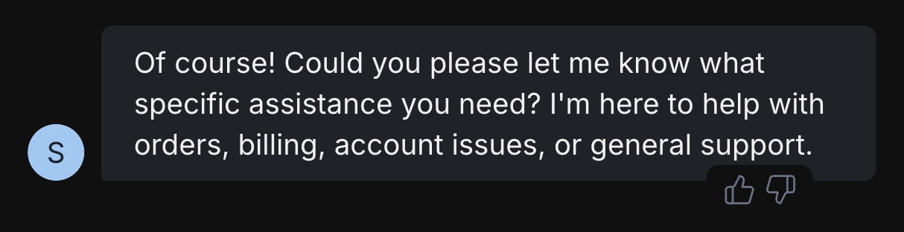

<Update label="July 11, 2025">

    ## Features & Enhancements

    - Added a notification indicator to Webchat:

    <Frame>
      
      
    </Frame>

    - Improved timeout handling for integration API calls longer than 60 seconds
    - Added helpful messages to Webchat window when error occurs
    - Integration updates:
        - **SendGrid**: added support for Markdown
        - **Resend**: added CC and BCC fields to sendMail action
        - **Messenger**: added support for sending media and files
        - **Slack/WhatsApp**: improved Markdown handling
        
    - Added Gemini 2.5

    ## Bug Fixes

        - Fixed aggregation issues for Tables API
        - Fixed an issue with renaming bots
        - Fixed an issue with Slack reply threading

</Update>

<Update label="July 4, 2025">

    ## Features & Enhancements

        - **New onboarding flow**:

            When you create a new bot, Studio now has an onboarding flow that automatically builds a production-ready AI agent, styled and tailored to your brand.

            <Tabs>
                <Tab title="1. Choose a use case">
                    <Frame>
                      
                      
                    </Frame>
                </Tab>
                <Tab title="2. Provide knowledge sources">
                    <Frame>
                      
                      
                    </Frame>
                </Tab>
                <Tab title="3. Try out your AI agent">
                    <Frame>
                        
                        
                    </Frame>
                </Tab>
            </Tabs>

        - Screenshot Card now takes fully-styled webpage screenshots
        - Teams integration: added a Start DM Card

    ## Bug Fixes

        - Fixed issue where changes to rich text Knowledge Bases weren't properly reflected

</Update>

<Update label="June 27, 2025">

    ## Features & Enhancements

        - Increased timeout for crawling websites containing many pages, preventing missing pages in the Knowledge Base
        - Slack integration: Added the ability to pass a Slack `userId` to an external service

    ## Bug Fixes

        - Fixed an issue where the Conversation Started Trigger was not firing
        - Fixed an issue with Zendesk integration where Zendesk wasn’t receiving user email addresses from the Start HITL Card

</Update>

<Update label="June 20, 2025">

    ## Features & Enhancements

        - Improved uninstall flow for integrations

    ## Bug Fixes

        - Fixed various issues in Studio's multiplayer
        - Fixed issue that caused user variables to be erased
        - Fixed issue with Stripe integration where payment links were not being properly created
        - Fixed issue with Telegram integration where uploading a sticker caused an infinite loop in bot

</Update>

---

<Update label="June 13, 2025">

    ## Features & Enhancements

        - Improved **AI Spend** section with a representation of each bot's usage:
            <Tabs>
                <Tab title="Total">
                    <Frame>
                        
                        
                    </Frame>
                </Tab>
                <Tab title="Daily Average">
                    <Frame>
                      
                      
                    </Frame>
                </Tab>
            </Tabs>

        - Added a playground for the Instagram integration
        - WhatsApp integration improvements:
            - Improved formatting for text messages
            - New dropdown label option for choice messages
        - When an HITL agent joins the chat, their messages are now sent from a distinct user
        - Added support for new models:
            - Qwen3 32B
            - Llama 4 Scout
        - Visual improvements to **Files** section in the Dashboard
        - LLMz responses now use citations
        - General improvements to RAG efficiency

    ## Bug Fixes

        - Fixed issue with improper formatting when pasting into a rich text Knowledge Base

</Update>

---

<Update label="June 6, 2025">

    ## Features & Enhancements

        - Webchat style refresh:

            <Frame>
            
            
            </Frame>

            - The new look also includes:
                - Improved animations
                - New typing indicator

        - You can now leave message feedback in Webchat:

            <Frame>
            
            
            </Frame>

        - Added support for new models:
            - Claude 4 Sonnet
            - DeepSeek R1 and V3
            - Llama 4

    ## Bug Fixes

        - Fixed issue where users couldn’t leave the WhatsApp sandbox environment
        - Fixed issue with accessing shared drives with the Google Drive integration

    ## Miscellaneous

        - Improved error for failed payments

</Update>

---

<Update label="May 30, 2025">

    ## Features & Enhancements

        - Added new Card to set a custom inactivity timeout:

            <Frame>
                
                
            </Frame>

        - Bumped LLM timeout from 30 seconds to 90 seconds
        - Bots using the BigCommerce integration can now recommend best-selling products without hallucinating

    ## Bug Fixes
    
        - Fixed issue where variables assigned in the last Card in a Workflow weren’t stored
        - Various WhatsApp integration fixes:
            - Fixed error with OAuth flow when the user had more than 50 WhatsApp business accounts
            - Fixed an error when receiving [Contact](https://developers.facebook.com/docs/whatsapp/cloud-api/messages/contacts-messages) messages from WhatsApp
        - Fixed issue with Intercom integration

</Update>

---

<Update label="May 23, 2025">

    ## Features & Enhancements

        - The [Fixed Schedule](/learn/reference/triggers#fixed-schedule) Trigger now displays both the timezone and next run:

            <Frame>
            
            </Frame>

        - Added [Monday.com](http://Monday.com) integration

    ## Bug Fixes

        - Fixed issue where Workflows incorrectly timed out under certain conditions
        - Fixed issue where proactive messages didn’t work properly for new conversations in Webchat 2.5
        - Fixed issue where tables weren’t horizontally scrollable in Webchat
        - Fixed issue where tables in Dashboard overflowed
        - Fixed issue with missing parameter in `appendValues` call to Google Sheets API

</Update>

---

<Update label="May 16, 2025">

    ## Features & Enhancements

        - Fixed links to documentation in Botpress Studio
        - Added option to filter logs by message content
        - Added notifications menu in Dashboard:

            <Frame>
            
            </Frame>

    ## Bug Fixes

        - Fixed issue where Studio wouldn’t load under certain conditions
        - Fixed issue where you couldn’t reset FAB/avatar images to default
        - Fixed an issue where the [Conversation Started](/learn/reference/triggers#conversation-started) Trigger didn’t work within the shareable Webchat window
        - Improved rendering of Markdown in Webchat

</Update>

---

<Update label="May 9, 2025">

    ## Features & Enhancements
        - **Improvements to Webchat**:
            - Now supports richer Markdown rendering
            - Webchat preview now has a sidebar with a list of recent conversations
            - You can now add an image to your Webchat’s Floating Action Button (FAB)
        - You can now filter your bot’s logs by `userId` or `conversationId`

    ## Bug Fixes
    
        - Updated React library version and documentation

    ## Miscellaneous

        - Added a callout to Botpress Hub when the HITL plugin is required and hasn't been installed yet

</Update>

---

<Update label="May 2, 2025">

    ## Features & Enhancements
        - The Slack integration now has a configuration option to **reply as a thread**:

            <Frame>
            
            </Frame>

        - **HITL improvements**:
            - The Webchat composer for the HITL integration now supports **uploading files**
            - The HITL inbox now displays when the **last message** in each conversation was sent:

                <Frame>
                
                </Frame>
    ## Bug Fixes
        - Fixed an issue where variables with circular dependencies would cause bots to crash
        - Fixed an issue where moving a Workflow or a folder inside another folder caused the tables to disappear
        - Increased duration before timeout when indexing knowledge bases with a large number of vectors

    ## Miscellaneous

    - Changed the default language setting for the WhatsApp **Start Conversation** Card to address a potential error

</Update>

---

<Update label="April 25, 2025">

    ## Features & Enhancements

        - Added new models from OpenAI:
            - o4-mini
            - o3
            - 4.1
        - Users with viewer permissions for a Workspace can now view logs for that Workspace’s bots
        - Users can now upload multiple files to a single message in Webchat
        - The payload for button/dropdown components now includes the `value` of the button

    ## Bug Fixes

        - Fixed an issue in Knowledge Bases  where the similarity score was in the wrong order
        - Fixed the new keyboard shortcut (`ctrl`+ `P`) for search in Studio
        - Fixed an issue where there was a mismatch with imported data
        - Fixed an issue with the default Webchat theme
        - Various fixes and improvements for the Slack integration
        - Various fixes for the BigCommerce integration

</Update>

---

<Update label="April 11, 2025">

    ## Features & Enhancements

        - Revamped and improved **Usage** tab:
            - New section to track AI spend
            - Revised UI makes it clearer to understand usage between bots
        - You can now specify the storage location of Webchat user/conversation data in the Dashboard settings:
            - **Session storage**: Creates a new user/conversation every time the page is re-opened
            - **Local storage**: Keeps user/conversation data across page visits
        - Request headers for the Webhook integration are now passed into the event payload

    ## Bug Fixes

        - Solved an issue where a React apps running Botpress would not run under certain circumstances
        - Fixed a bug where Human-In-The-Loop (HITL) messages were displayed in the wrong order

    ## Miscellaneous

        - Improvements to backend processing so deleting bots is now faster

</Update>