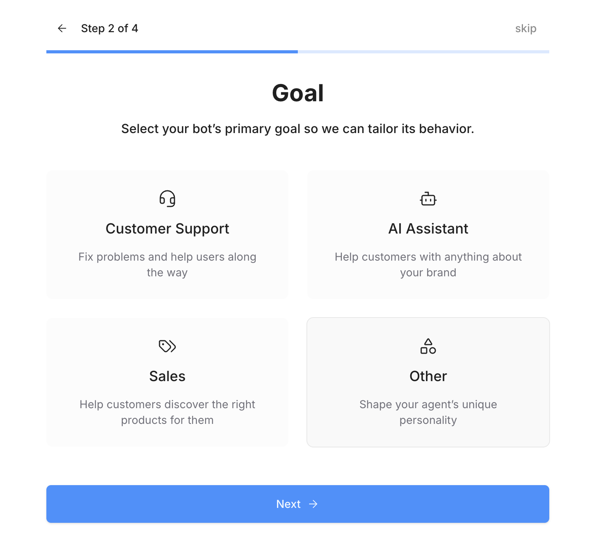
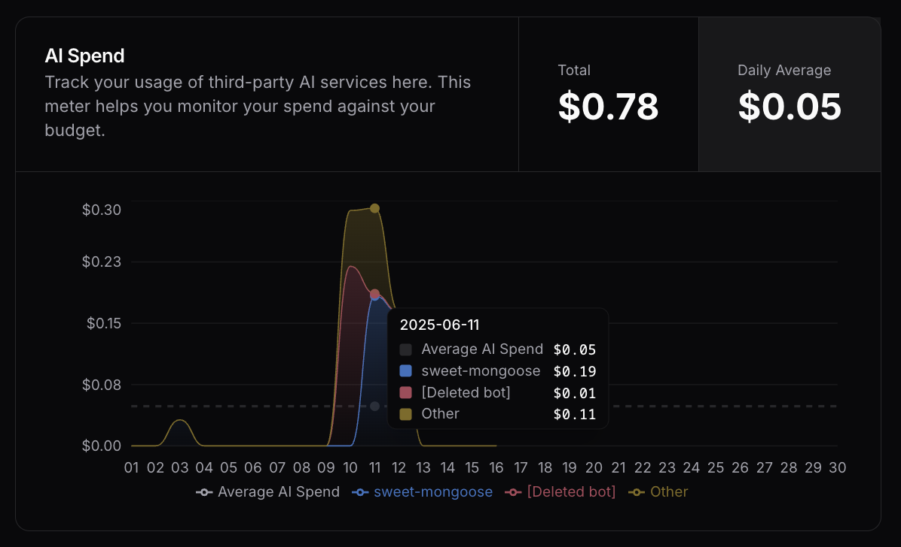

<Update label="November 14, 2025">
  ## Features & enhancements

  ### GPT-5.1 support

  - Added support for GPT-5.1 from OpenAI

  ### Webchat 3.4

  - Released Webchat 3.4. Improvements include:
    - Added the ability to paste images from clipboard
    - Improved scrolling smoothness
    - Improved typing indicators
    - Improved media rendering
    - Improved performance and reliability

  ### Dashboard

  - Redesigned Webchat configuration split into four sections:

  <Tabs>
    <Tab title="Bot Identity">
      <Frame>
        
        
      </Frame>
    </Tab>
    <Tab title="Bot Appearance">
      <Frame>
        
        
      </Frame>
    </Tab>
    <Tab title="Deploy Settings">
      <Frame>
        
        
      </Frame>
    </Tab>
    <Tab title="Features">
      <Frame>
        
        
      </Frame>
    </Tab>
  </Tabs>

  - Added keyboard shortcuts to Workspace selector

  ## Card tray

  - Redesigned the Card tray as a modal:

    <Frame>
      
      
    </Frame>

  ## Integrations

  - **Hunter**: Added [Hunter](/integrations/integration-guides/hunter) integration
  - **Slack**: Added ability for bot to retrieve a private channel
  - **WhatsApp**: Fixed an issue where messages were being duplicated under certain circumstances
  - **HubSpot**: Improved error logging when pipeline status can't be found

  ## Bug fixes

  - Fixed an issue where searching in Studio was not working under certain circumstances
  - Fixed an issue where hotkeys weren’t working properly when tables were open
  - Fixed an issue with Human Handoff where typing indicator showed even when the support agent wasn't typing
  - Fixed a visual issue with Knowledge Bases in the Dashboard in dark mode
  - Fixed an issue where log filters weren’t updating the displayed logs correctly

</Update>

<Update label="November 7, 2025">
  ## Features & enhancements

  - Redesigned billing section in the Dashboard:

  <Frame>
    
    
  </Frame>

  - Added option to rename [Execute Code Cards](/studio/concepts/cards/execute-code)
  - Added handling to allow adding duplicate files to Webchat message
  - Added option to configure custom analytics for an entire workspace

  ## Integrations

  - **HubSpot**: Added [Search Company](/integrations/integration-guides/hubspot#search-company) Card
  - **Workable**: Added [Get Job Questions](/integrations/integration-guides/workable#get-job-questions) Card
  - **Intercom HITL**: Improved handling for email address formatting
  - **Sharepoint**: Fixed an issue with syncing document libraries on registration

  ## Bug fixes

  - Fixed an issue with the [AI Transition](/studio/concepts/cards/ai/ai-transition) Card where newly-added fields would be impossible to delete
  - Fixed an issue where the [Capture Information](/studio/concepts/cards/capture-information) Card's **Skip if variable is already filled** option wasn't working    properly
  - Fixed issue where the Dashboard's hotkeys were interfering with the Help Desk bot
  - Fixed visual issues with viewing Knowledge Bases on mobile Dashboard
  - Fixed a visual issue where Webchat bot contact info was being displayed even when configuration fields were empty

  ## Miscellaneous

  - Added two new methods returned by the Webchat React library's [`useWebchat`](/webchat/react-library/hooks/use-webchat-client) hook: `bindConversation` and `bindUser`

</Update>

<Update label="October 31, 2025">
  ## Features & enhancements

  ### New Actions experience

  Overhauled the Actions experience and added ability generate Actions and Schemas using AI:

  <Tabs>
    <Tab title="Just write your prompt...">
      <Frame>
        
        
      </Frame>
    </Tab>
    <Tab title="then use the generated Action.">
      <Frame>
        
        
      </Frame>
    </Tab>
  </Tabs>

  ### Dashboard improvements

  - Added the ability to manage Knowledge Bases from the Dashboard:

  <Frame>
    
    
  </Frame>

  - Redesigned agent overview page with better metrics, feature visibility, and a link to the bot's shareable preview:

  <Frame>
    
    
  </Frame>

  - Redesigned Conversations tab that shows you Conversation Insights, sentiment analysis and an AI summary:

  <Frame>
    
    
  </Frame>

  ## Integrations

  - **Workable**: Added [Workable](/integrations/integration-guides/workable) integration
  - **Mintlify**: Added [Mintlify](/integrations/integration-guides/mintlify) integration
  - **WhatsApp**: Fixed an issue with parsing Mexican phone numbers
  - **Freshchat**: Fixed an issue with handling empty events
  - **HubSpot**: Fixed an issue where Cards that return search results would cause errors when no results were found
  - **Instagram**: Added option for bot to reply to comments on posts
  - **Twilio**:
    - Added new Cards: **Start Conversation** and **Get or Create User**
    - Added better Markdown support

  ## Bug fixes

  - Fixed visual bug when loading variable picker in a Card's inspector
  - Fixed a bug where user variables would reset with each new conversation in the Emulator
  - Fixed an issue where sending multiple API requests to upsert rows using the Tables API was causing duplicate rows

  ## Miscellaneous

  - Added file metadata to the [`searchFiles`](/api-reference/files-api/openapi/searchFiles) endpoint's response
</Update>

<Update label="October 24, 2025">
  ## Integrations

  - **BambooHR**: Added BambooHR integration
  - **Instagram**: Added option for bot to reply to comments on posts
  - **Airtable**: Improved error logging when Cards fail

  ## Bug fixes

  - Fixed an issue where loading multiple documents into a Knowledge Base would stall if the Knowledge Base also contained many website pages
  - Fixed visual bug with pagination in Knowledge Base documents

  ## Miscellaneous

  - Retired integrations are now listed as deprecated in Studio, preventing installation
</Update>

<Update label="October 17, 2025">
  ## Features & enhancements

  - Improved the UI for the Studio's **Publish** button:

  <Frame>
    
    
  </Frame>

  - Added support for [Claude Haiku 4.5](https://www.anthropic.com/news/claude-haiku-4-5) via the Anthropic integration

  ## Bug fixes

  - Fixed an issue where clicking Tools in your bot's home screen would cause a crash if your bot only contained standard Nodes
  - Fixed an issue where duplicating a Workflow would incorrectly display "Integration not installed or disabled" even though the integration was installed
  - Fixed an issue where imported bots would display ghost Knowledge Bases
  - Fixed an issue where previously-created variables were unavailable to select in certain Cards' output
  - Fixed an issue where the `event` object's state was inaccessible in Actions
  - Fixed an issue where URLs with backslashes weren’t crawling properly
</Update>

<Update label="October 10, 2025">
  ## Bug fixes

  - Fixed an issue where the **Copy to bot** option wasn't displaying all available bots after a certain number
  - Fixed a bug with storing a Card's output in a variable, where:
    - Existing Workflow variables weren't visible in the output picker
    - Creating a variable within the picker resulted in a duplicate variable if it had the same name as an existing variable
  - Fixed an issue where the Set Activity Timeout Card wasn't working under certain circumstances
  - Fixed an issue that was making the Webchat typing indicator appear and disappear irregularly while a bot prepared its reply
  - Fixed an issue where file storage wasn't always being reduced even when file was deleted from bot

  ## Features & enhancements

  - Conversations with the Botpress Help Desk now persist between the Dashboard and the Studio

  ## Integrations

  - **WhatsApp**: Added better support for international phone numbers

</Update>

<Update label="October 3, 2025">
  ## Features & enhancements

  ### Login

  - Refreshed [login page](https://sso.botpress.cloud/login):

  <Frame>
  
  </Frame>

  ### Onboarding

  - Improved onboarding experience:

    - Refreshed, more focused UI
    - Added option to describe your bot's goal when selecting **Other**:

  <Tabs>
    <Tab title="Select goal">
      <Frame>
        
        
      </Frame>
    </Tab>
    <Tab title="Describe goal">
      <Frame>
        
        
      </Frame>
    </Tab>
  </Tabs>

    - Tasks now run in the background while you're setting up your agent, making the onboarding experience much faster

  ### Studio

  - Added [Claude Sonnet 4.5](https://www.anthropic.com/news/claude-sonnet-4-5) to Studio

  ## Integrations

  - **Apify**: Added [Apify integration](/integrations/integration-guides/plus-apify) for advanced website crawling
  - **WhatsApp**:
    - Added [new Triggers](integrations/integration-guides/whatsapp/introduction#triggers) to for monitoring [message templates](https://developers.facebook.com/docs/whatsapp/message-templates/guidelines/)
    - Fixed an issue where Freshchat agents' messages weren't being displayed on WhatsApp
  - **HubSpot**: Updated [Get Contact](/integrations/integration-guides/hubspot#get-contact) Card to retrieve all contact properties by default

  ## Miscellaneous

  <Warning>
    ### Webchat v1 deprecation

    We're deprecating Webchat v1 (and any old implementations tied to it). This means
    any Webchat deployments on your website that use v1 will stop functioning. To avoid
    service disruption, all users currently using v1 must migrate to Webchat v2 or higher
    before **December 31, 2025**.

    If you're currently a Webchat v1 user, you should have already received an email with instructions for upgrading. For any questions, don't hesitate to contact our support team.
  </Warning>

</Update>

<Update label="September 26, 2025">
  ## Features & enhancements

  ### Webchat

  - Added the option to configure a [custom Webchat toggle](/webchat/interact/use-custom-toggle):

  <Frame>
    
    
  </Frame>

  - Added the option to [inject Webchat into a specific HTML element](/webchat/get-started/embed-in-element)
  - Added the option to enable sound effects for Webchat
  - Improved the Webchat customization UI

  ### Autonomous Nodes

  - Added the option to [set a specific LLM for Retrieval-Augmented Generation (RAG) tasks](/studio/concepts/bot-settings#rag-language-model), like searching a Knowledge Base
  - Added the option to [override your bot's default LLM settings](/studio/concepts/nodes/autonomous-node#override-default-models) at the Node level

  ### Studio

  - Added the option to select another bot when Studio is already open in another tab:

  <Frame>
    
    
  </Frame>

  ## Integrations

  - [Email Notifier](/integrations/integration-guides/plus-email-notifier): Added an integration for sending emails from a generic email address
  - **Apollo**: Added [Apollo](/integrations/integration-guides/apollo) integration
  - **Attio**: Added [Attio](https://attio.com/) integration
  - **Slack**: Added support for tagged Slack users in incoming message payloads

  ## Bug fixes

  - Fixed an issue where dynamically including Knowledge Bases in Autonomous Nodes (using a variable) wasn't working properly
  - Fixed an issue with the Slack integration where quick replies would result in a 400 error
</Update>

<Update label="September 19, 2025">
  ## Features & enhancements

  - Added option to rename rich text Knowledge Bases
  - Improved UI for array input fields in Cards
  - Added a safer check when deleting bots:

    <Frame>
      
      
    </Frame>

  - Added a search tab to workspace/bot selection dropdown

  ## Integrations

  - **Klaviyo**: Added [Klaviyo integration](/integrations/integration-guides/klaviyo)
  - **Pipedrive**: Added [Pipedrive integration](/integrations/integration-guides/pipedrive)
  - **MailerLite**: Added [MailerLite integration](/integrations/integration-guides/mailerlite)
  - **Slack**: Added support for incoming Slack messages containing images, audio, files, and multiple files
  - **Loops**: Added attachment support to the **Send Transactional Email** Card
  - **SendGrid**: Fixed an issue with CC and BCC emails not being received
  - **Linear**: Fixed an issue with the integration's event handling
  - **WhatsApp**: Improved handling when the integration is rate limited by WhatsApp

  ## Bug fixes

  - **UI fixes**:
    - Fixed issue with Dashboard sidebar on mobile
    - Fixed issue where the **Copy Share Link** wasn't clickable when viewing a Workflow in the Hub

  - Fixed issue where the Capture Information Card wasn't working properly for files
  - Fixed issue where shareable Webchat link would show error screen when error hadn’t occurred
  - Fixed issue where negative feedback from Webchat wasn’t being displayed in Conversations tab

</Update>

<Update label="September 12, 2025">
  ## Features & enhancements

  - Improved the variable management experience for Autonomous Nodes:

    <Frame caption="You can now assign read/write access to individual variables as needed.">
      
      
    </Frame>

  - Improved speed for crawling website Knowledge Bases during onboarding
  - **Integrations**:
      - **Canny:** Added Canny integration
      - **Loops:** Added Loops integration
      - **Feature Base**: Added Feature Base integration
      - **Webflow**: Added several new events

  ## Bug fixes

  - Fixed an issue where bot exports were failing
  - Fixed various UX issues in Dashboard, Studio and Webchat
  - Fixed various bugs in HubSpot integration
</Update>

<Update label="September 5, 2025">
  ## Features & enhancements

  - Improved UI for Webchat settings:

    <Tabs>
      <Tab title="General">
        <Frame>
          
          
        </Frame>
      </Tab>
      <Tab title="Theme">
        <Frame>
          
          
        </Frame>
      </Tab>
    </Tabs>

  - Fixed an issue with using additional stylesheet URLs with the Webchat React library
  - Improved speed for crawling website Knowledge Bases during onboarding
  - **Integrations:**
    - **HubSpot**: Added HubSpot integration
    - **SendGrid**: Fixed issue with API keys

  ## Bug fixes

  - Fixed an issue where bot exports were failing
  - Fixed a visual bug with the close button on Webchat error screens

</Update>

<Update label="August 29, 2025">

## Features & enhancements

- Fresh layout for Dashboard bot menu:

    <Frame>
      
      
    </Frame>

- Added ability to edit fields in Tables directly from the Dashboard
- Added search option in dropdown menu to select a bot
- Improved speed when creating new bots
- Improvements to Studio UI:
  - Moved the Schema editor to a modal
  - Improved experience when testing a Trigger and viewing the event’s payload
- Added [Cal.com](http://Cal.com) integration

## Bug fixes

- Fixed various visual bugs in Dashboard, including on mobile
- Fixed visual bugs in Studio:
  - UI issues with editing frozen tables
  - Workflow variable values not displaying updates in Studio
- Fixed an issue where the Conversation Started event was emitted multiple times
- Fixed an issue with BigCommerce integration where syncing large datasets caused a timeout

</Update>

<Update label="August 22 2025">

## Features & enhancements

- Improved the Card inspector UI, which now appears in the Studio's right panel instead of obstructing your Workflow:

<Frame>
  
  
</Frame>

- Improved UX for cancelling your subscription:
  - Subscription end date now displayed
  - Added a modal to give feedback when cancelling subscription
- Improved general performance and speed for bots across the board
- Integrations:
  - **Calendly**: Added Calendly integration
  - **Twilio**: Added support for receiving media (audio, images, videos, files)

  ## Bug fixes

  - Fixed an issue where users without the proper permissions had access to the Billing section in the Dashboard
  - Fixed minor issues with Webchat events

</Update>

<Update label="August 15, 2025">

## Features & enhancements

- You can now choose any Google Font when styling Webchat:

  <Frame>
    
    
  </Frame>

- You can now view analytics for either the current bot or the entire Workspace:

  <Frame>
    
    
  </Frame>

- Improved syntax highlighting for logs in emulator

## Bug fixes

- Fixed an issue where focusing the Webchat composer on mobile zoomed in unintentionally
- Fixed a visual bug where multi-line inputs for integration Cards were cut off
- Fixed a visual bug with Usage tab popovers

</Update>

<Update label="August 8, 2025">

## Features & enhancements

<Frame>

</Frame>

- GPT-5 is now available in Botpress Studio
  - OpenAI's new GPT-OSS models are also available with Fireworks AI, Cerebras and Groq integrations
- Various UI improvements in Studio:
  - Improved UI for integration playgrounds
  - Card tray now displays the Card type (based on the currently selected Node) and displays a message when a Card can’t be added to a Node
- Webchat:
  - Added a `conversationId` argument to the Webchat initialization script—this allows users to programmatically load Webchat with a specific conversation
  - Improved handling of images that fail to load
- Integrations:
  - **Messenger**: Added a playground and made general improvements
  - **Telegram:** Improved Markdown support, added support for captions on images, improved error handling
  - **Freshchat:** General fixes and improvements
  - **Zendesk:** Added the option to customize the Botpress system username in Zendesk
  - **Email:** Minor fix

## Bug fixes

- Fixed an issue where conversation variables weren't usable in Capture Information Cards and Autonomous Nodes
- Fixed an issue with searching for files based on tags in the Dashboard
- Fixed a visual issue with filtering logs in Dashboard

</Update>

<Update label="August 1, 2025">

    ## Features & enhancements

    - Improvements to user experience in Analytics tab

    ## Bug fixes

    - Fixed an issue where Tables Cards were missing labels when added to a Node
    - Fixed an issue with missing newlines when exporting large tables as CSV
    - Fixed various visual bugs in the Dashboard

</Update>

<Update label="July 25, 2025">

    ## Features & enhancements

    - Users can now decide which members of a Workspace can access bots within that Workspace
    - Improvements to search results in the Card Tray
    - Improved UX for deleting bots in the Dashboard
    - Improvements to log filtering in the Dashboard
    - Integration updates:
        - **Email**: added a new provider-agnostic email integration
        - **HITL**: Start HITL Card now provides more specific configuration fields based on which HITL integration is being used
        - **Slack**: added support for threading in all channel types
        - **Teams**: improvements to Start DM Card

    ## Bug fixes

    - Fixed issue with testing the timeout Workflow in the emulator
    - Fixed average values for analytics

</Update>

<Update label="July 18, 2025">

    ## Features & enhancements

    - New menu for updating add-ons in Dashboard:

        <Frame>
          
          
        </Frame>

    - Updates to Dashboard Settings:
        - New section for configuration variables
        - Option to delete bot

    - Studio now displays the version of plugins
    - Improved labelling of LLMZ-appropriate models in Studio

</Update>

<Update label="July 11, 2025">

    ## Features & enhancements

    - Added a notification indicator to Webchat:

    <Frame>
      
      
    </Frame>

    - Improved timeout handling for integration API calls longer than 60 seconds
    - Added helpful messages to Webchat window when error occurs
    - Integration updates:
        - **SendGrid**: added support for Markdown
        - **Resend**: added CC and BCC fields to sendMail action
        - **Messenger**: added support for sending media and files
        - **Slack/WhatsApp**: improved Markdown handling

    - Added Gemini 2.5

    ## Bug fixes

        - Fixed aggregation issues for Tables API
        - Fixed an issue with renaming bots
        - Fixed an issue with Slack reply threading

</Update>

<Update label="July 4, 2025">

    ## Features & enhancements

        - **New onboarding flow**:

            When you create a new bot, Studio now has an onboarding flow that automatically builds a production-ready AI agent, styled and tailored to your brand.

            <Tabs>
                <Tab title="1. Choose a use case">
                    <Frame>
                      
                      
                    </Frame>
                </Tab>
                <Tab title="2. Provide knowledge sources">
                    <Frame>
                      
                      
                    </Frame>
                </Tab>
                <Tab title="3. Try out your AI agent">
                    <Frame>
                        
                        
                    </Frame>
                </Tab>
            </Tabs>

        - Screenshot Card now takes fully-styled webpage screenshots
        - Teams integration: added a Start DM Card

    ## Bug fixes

        - Fixed issue where changes to rich text Knowledge Bases weren't properly reflected

</Update>

<Update label="June 27, 2025">

    ## Features & enhancements

        - Increased timeout for crawling websites containing many pages, preventing missing pages in the Knowledge Base
        - Slack integration: Added the ability to pass a Slack `userId` to an external service

    ## Bug fixes

        - Fixed an issue where the Conversation Started Trigger wasn't firing
        - Fixed an issue with Zendesk integration where Zendesk wasn’t receiving user email addresses from the Start HITL Card

</Update>

<Update label="June 20, 2025">

    ## Features & enhancements

        - Improved uninstall flow for integrations

    ## Bug fixes

        - Fixed various issues in Studio's multiplayer
        - Fixed issue that caused user variables to be erased
        - Fixed issue with Stripe integration where payment links weren't being properly created
        - Fixed issue with Telegram integration where uploading a sticker caused an infinite loop in bot

</Update>

---

<Update label="June 13, 2025">

    ## Features & enhancements

        - Improved **AI Spend** section with a representation of each bot's usage:
            <Tabs>
                <Tab title="Total">
                    <Frame>
                        
                        
                    </Frame>
                </Tab>
                <Tab title="Daily Average">
                    <Frame>
                      
                      
                    </Frame>
                </Tab>
            </Tabs>

        - Added a playground for the Instagram integration
        - WhatsApp integration improvements:
            - Improved formatting for text messages
            - New dropdown label option for choice messages
        - When an HITL agent joins the chat, their messages are now sent from a distinct user
        - Added support for new models:
            - Qwen3 32B
            - Llama 4 Scout
        - Visual improvements to **Files** section in the Dashboard
        - LLMz responses now use citations
        - General improvements to RAG efficiency

    ## Bug fixes

        - Fixed issue with improper formatting when pasting into a rich text Knowledge Base

</Update>

---

<Update label="June 6, 2025">

    ## Features & enhancements

        - Webchat style refresh:

            <Frame>
            
            
            </Frame>

            - The new look also includes:
                - Improved animations
                - New typing indicator

        - You can now leave message feedback in Webchat:

            <Frame>
            
            
            </Frame>

        - Added support for new models:
            - Claude 4 Sonnet
            - DeepSeek R1 and V3
            - Llama 4

    ## Bug fixes

        - Fixed issue where users couldn’t leave the WhatsApp sandbox environment
        - Fixed issue with accessing shared drives with the Google Drive integration

    ## Miscellaneous

        - Improved error for failed payments

</Update>

---

<Update label="May 30, 2025">

    ## Features & enhancements

        - Added new Card to set a custom inactivity timeout:

            <Frame>
                
                
            </Frame>

        - Bumped LLM timeout from 30 seconds to 90 seconds
        - Bots using the BigCommerce integration can now recommend best-selling products without hallucinating

    ## Bug fixes

        - Fixed issue where variables assigned in the last Card in a Workflow weren’t stored
        - Various WhatsApp integration fixes:
            - Fixed error with OAuth flow when the user had more than 50 WhatsApp business accounts
            - Fixed an error when receiving [Contact](https://developers.facebook.com/docs/whatsapp/cloud-api/messages/contacts-messages) messages from WhatsApp
        - Fixed issue with Intercom integration

</Update>

---

<Update label="May 23, 2025">

    ## Features & enhancements

        - The [Fixed Schedule](/studio/concepts/triggers#fixed-schedule) Trigger now displays both the timezone and next run:

            <Frame>
            
            </Frame>

        - Added [Monday.com](http://Monday.com) integration

    ## Bug fixes

        - Fixed issue where Workflows incorrectly timed out under certain conditions
        - Fixed issue where proactive messages didn’t work properly for new conversations in Webchat 2.5
        - Fixed issue where tables weren’t horizontally scrollable in Webchat
        - Fixed issue where tables in Dashboard overflowed
        - Fixed issue with missing parameter in `appendValues` call to Google Sheets API

</Update>

---

<Update label="May 16, 2025">

    ## Features & enhancements

        - Fixed links to documentation in Botpress Studio
        - Added option to filter logs by message content
        - Added notifications menu in Dashboard:

            <Frame>
            
            </Frame>

    ## Bug fixes

        - Fixed issue where Studio wouldn’t load under certain conditions
        - Fixed issue where you couldn’t reset FAB/avatar images to default
        - Fixed an issue where the [Conversation Started](/studio/concepts/triggers#conversation-started) Trigger didn’t work within the shareable Webchat window
        - Improved rendering of Markdown in Webchat

</Update>

---

<Update label="May 9, 2025">

    ## Features & enhancements
        - **Improvements to Webchat**:
            - Now supports richer Markdown rendering
            - Webchat preview now has a sidebar with a list of recent conversations
            - You can now add an image to your Webchat’s Floating Action Button (FAB)
        - You can now filter your bot’s logs by `userId` or `conversationId`

    ## Bug fixes

        - Updated React library version and documentation

    ## Miscellaneous

        - Added a callout to Botpress Hub when the HITL plugin is required and hasn't been installed yet

</Update>

---

<Update label="May 2, 2025">

    ## Features & enhancements
        - The Slack integration now has a configuration option to **reply as a thread**:

            <Frame>
            
            </Frame>

        - **HITL improvements**:
            - The Webchat composer for the HITL integration now supports **uploading files**
            - The HITL inbox now displays when the **last message** in each conversation was sent:

                <Frame>
                
                </Frame>
    ## Bug fixes
        - Fixed an issue where variables with circular dependencies would cause bots to crash
        - Fixed an issue where moving a Workflow or a folder inside another folder caused the tables to disappear
        - Increased duration before timeout when indexing knowledge bases with a large number of vectors

    ## Miscellaneous

    - Changed the default language setting for the WhatsApp **Start Conversation** Card to address a potential error

</Update>

---

<Update label="April 25, 2025">

    ## Features & enhancements

        - Added new models from OpenAI:
            - o4-mini
            - o3
            - 4.1
        - Users with viewer permissions for a Workspace can now view logs for that Workspace’s bots
        - Users can now upload multiple files to a single message in Webchat
        - The payload for button/dropdown components now includes the `value` of the button

    ## Bug fixes

        - Fixed an issue in Knowledge Bases  where the similarity score was in the wrong order
        - Fixed the new keyboard shortcut (`ctrl`+ `P`) for search in Studio
        - Fixed an issue where there was a mismatch with imported data
        - Fixed an issue with the default Webchat theme
        - Various fixes and improvements for the Slack integration
        - Various fixes for the BigCommerce integration

</Update>

---

<Update label="April 11, 2025">

    ## Features & enhancements

        - Revamped and improved **Usage** tab:
            - New section to track AI spend
            - Revised UI makes it clearer to understand usage between bots
        - You can now specify the storage location of Webchat user/conversation data in the Dashboard settings:
            - **Session storage**: Creates a new user/conversation every time the page is re-opened
            - **Local storage**: Keeps user/conversation data across page visits
        - Request headers for the Webhook integration are now passed into the event payload

    ## Bug fixes

        - Solved an issue where a React apps running Botpress would not run under certain circumstances
        - Fixed a bug where Human-In-The-Loop (HITL) messages were displayed in the wrong order

    ## Miscellaneous

        - Improvements to server processing so deleting bots is now faster

</Update>
