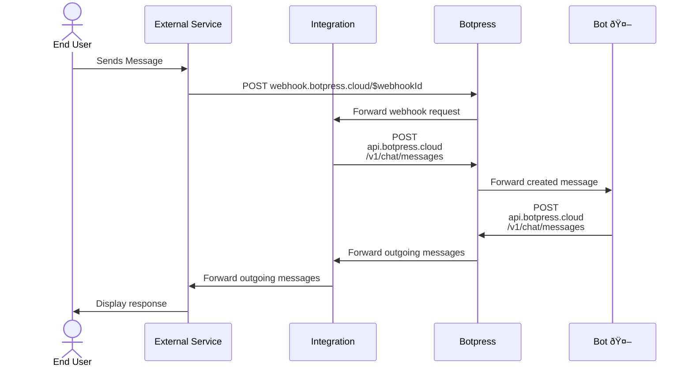

## How It Works

One of the most powerful features of Botpress Integrations is the ability to connect to external messaging channels. Without an integration, your bot cannot receive or send messages—every message must go through an Integration.

Here's a high-level overview of how messaging works in Botpress:



Here's a quick breakdown of the sequence:

1. The **end user** sends a message to an **external service** (e.g., WhatsApp, Messenger).
2. The **external service** forwards the message to **Botpress** via a webhook URL (e.g., `webhook.botpress.cloud/$webhookId`). Every integration has a unique way of providing the webhook URL to the external service. For example, Telegram does it using the API, while Slack requires you to set up a webhook URL in the Slack app settings. The webhook ID path parameter is a string that uniquely identifies the pair of an integration and a bot. This ID is different if you install the same integration in multiple different bots.
3. **Botpress** forwards the request to the **integration**, adding context like the bot ID.
4. The **integration** creates an incoming message using the [Botpress Runtime API](../../../api-reference/runtime-api/getting-started) at `api.botpress.cloud/v1/chat`.

<Note>
The Runtime API requires authentication as either a Bot or an Integration.
- Messages created by an **integration** are considered **incoming**.
- Messages created by a **bot** are considered **outgoing**.
</Note>

5. **Botpress** forwards the created message to the **bot**.
6. The **bot** processes the message and responds via the Runtime API.
7. **Botpress** forwards the **outgoing message** to the **integration**.
8. The **integration** then sends the response back to the **external service**, which displays it to the **user**.

## Connect Your Own Channels

If Botpress doesn’t yet provide an integration for your preferred messaging service, you can create your own using the `webhook-message` template.

Follow the [Getting Started](./getting-started) guide and select the `webhook-message` template instead of `hello-world`.

### Integration Definition

After initializing your project, you'll see the following integration definition:

{/* TODO(driftable): This script is subject to changes and should be auto-generated */}
```ts
// integrations.definition.ts
import { z, IntegrationDefinition } from '@botpress/sdk'

export default new IntegrationDefinition({
  name: "webhook-message",
  version: '0.0.1',
  configuration: {
    schema: z.object({
      webhookUrl: z.string().describe('The url to post the bot answers to.'),
    }),
  },
  channels: {
    webhook: {
      conversation: {
        tags: {
          id: { title: 'Conversation ID', description: 'The ID of the conversation in the external service' },
        },
      },
      messages: {
        // this channel only supports text messages
        text: {
          schema: z.object({
            text: z.string(),
          }),
        },
      },
    },
  },
  user: {
    tags: {
      id: { title: 'User ID', description: 'The ID of the user in the external service' },
    },
  },
})
```

Let's break down this data structure:

- **`configuration`**: Defines the settings bot developers must provide when installing the integration in the Studio. The configuration schema is used to display a configuration form. Here, only a `webhookUrl` is required to receive outgoing messages.
- **`channels`**: Specifies supported messaging channels. This example uses a single `webhook` channel, but you can define multiple. For example, Github allows conversing with your bot on issues and pull requests. Each channel can have its own set of tags and message types.
- **`channels["$CHANNEL_NAME"].conversation.tags`**: Defines available tags for the conversation. In this case, we are defining a single tag called `id` that identifies the conversation in the external service. This allows binding the botpress conversation to the external service conversation. When sending outgoing message response, this tag will be used to properly route the message to the external service.
- **`user.tags`**: Defines available tags for the user. Here, we define a single tag called `id` that identifies the user in the external service. This allows binding the botpress user to the external service user.
- **`messages`**: Defines available message types. In this case, we are defining a single message type called `text` that contains a single field called `text`. This allows sending text messages to the external service. You could define multiple message types, for example, `image`, `video`, etc. The SDK exports a record of default message types that are supported in most messaging channels.

### Integration Implementation

The integration implementation looks something like this:

{/* TODO(driftable): This script is subject to changes and should be auto-generated */}
```ts
import * as sdk from '@botpress/sdk'
import axios from 'axios'
import * as bp from '.botpress'

export default new bp.Integration({
  register: async () => {},
  unregister: async () => {},
  actions: {},
  channels: {
    webhook: {
      messages: {
        text: async (props) => {
          // This is the outgoing message handler. It is called when a bot sends a message to the user.
          const {
            ctx: {
              configuration: { webhookUrl },
            },
            conversation: {
              id: botpressConversationId,
              tags: { id: externalConversationId },
            },
            payload: { text },
          } = props

          props.logger.forBot().debug(`[${botpressConversationId}] sending message "${text}"`)

          const requestBody = {
            conversationId: externalConversationId,
            text,
          }

          await axios.post(webhookUrl, requestBody)
        },
      },
    },
  },
  handler: async (props) => {
    // This is the incoming request handler. It is called by the external service you are integrating with.
    const {
      client,
      req: { body },
    } = props

    if (!body) {
      return {
        status: 400,
        body: JSON.stringify({ error: 'No body' }),
      }
    }

    let parsedBody: unknown
    try {
      parsedBody = JSON.parse(body)
    } catch {
      return {
        status: 400,
        body: JSON.stringify({ error: 'Invalid JSON Body' }),
      }
    }

    const parseResult = sdk.z
      .object({
        userId: sdk.z.string(),
        conversationId: sdk.z.string(),
        text: sdk.z.string(),
      })
      .safeParse(parsedBody)

    if (!parseResult.success) {
      return {
        status: 400,
        body: JSON.stringify({ error: 'Invalid body' }),
      }
    }

    const { userId, conversationId, text } = parseResult.data

    const { conversation } = await client.getOrCreateConversation({
      channel: 'webhook',
      tags: {
        id: conversationId,
      },
    })

    const { user } = await client.getOrCreateUser({
      tags: {
        id: userId,
      },
    })

    const { message } = await client.createMessage({
      type: 'text',
      conversationId: conversation.id,
      userId: user.id,
      payload: {
        text,
      },
      tags: {},
    })

    const response = {
      message,
    }

    return {
      status: 200,
      body: JSON.stringify(response),
    }
  },
})
```

Let's break down this code:

The `handler` function is where the incoming request is handled. When you or an external service calls `webhook.botpress.cloud/$webhookId` this is where Botpress forwards the request to.

The first thing done in this handler is always to parse the HTTP request. Once the request is parsed and validated you can see three consecutive calls made to the runtime API, respectively `getOrCreateConversation`, `getOrCreateUser`, and `createMessage`. This is a very common pattern in Botpress integrations that integrate with a messaging channel.

The `getOrCreateConversation` and `getOrCreateUser` operations first check if a conversation or user already exist for the provided tags (here the external ids). If they do, the operations return the existing conversation and user. If they don't, the operations create a new conversation and user with the provided tags. This ensures that subsequent messages from the same user and conversation are routed to the same conversation and user in Botpress.

The `createMessage` operation creates a new message in Botpress with the provided payload. This message is then forwarded to the bot for processing.

The `channels["$CHANNEL_NAME"]` property (here the channel name is `webhook`) is where you define the outgoing message handlers; i.e. the logic executed when the bot sends a message to the user. In this case, we are defining a single handler for the `text` message type. Here we call the configured webhook with the conversation that was created in the incoming request. It is important here not to confuse the id tag and the conversation id. The id tag is the external id of the conversation in the external service that was provided in the incoming request.

## What's Next?

Still unsure how integration messaging works? Here are some helpful resources:

- 📦 [Botpress GitHub Repository](https://github.com/botpress/botpress) - Most of our integrations source code is open source and can be found there.
- 📚 [Runtime API Docs](../../../api-reference/runtime-api/getting-started) — This documentation should repeat a lot of information mentioned here but from the from the server-side perspective.
- 🧠 [Integration Concepts](./concepts) — Get deeper insight into integration concepts.

