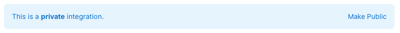
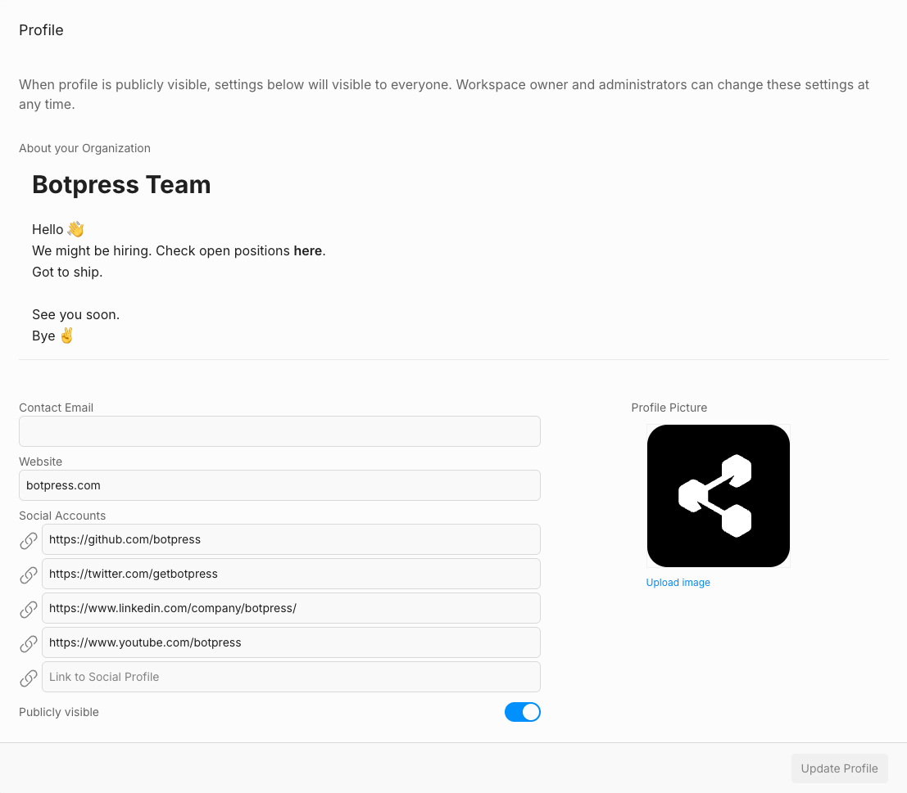
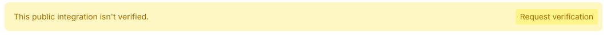

import { Img } from '/snippets/image.mdx'
import { Youtube } from '/snippets/youtube.mdx'

We're thrilled you want to publish your integration on the Botpress Hub! There is not much to do to make your integration publicly available to the other Botpress users, you're only a few steps away:

1. navigate to your integration's page on the dashboard
2. Whenever you integration is private, you'll see a blue banner with a **Make Public** button, just click on it.
3. Accept the hub terms and conditions and you're good to go.



# Getting your integration Verified

To ensure the quality of contributions on the Botpress Hub, the following verification process as been established. You can follow the instructions below or follow along the video. There are four things to do, follow along in the video:

1. Update your profile on Botpress Cloud.
2. Update your integration's display information.
3. Ensure your integration checks the configuration parameters if any.
4. Prepare an example bot with your integration configured an
5. Send it for approval

<Youtube url="https://www.youtube.com/embed/QJbqatyXfwI" />

## Your workspace profile on Botpress Hub

When a user installs your app, your workspace information will be viewable by the user. Please ensure:

1. [ ] Your Workspace has a url handle that represents you.
2. [ ] You have a way for users to contact you, like an email or a website.
3. [ ] Introduce yourself in the Workspace description (optional). This is the place for self-promotion.
4. [ ] Add an icon to your Workspace that represents you (optional).

We suggest you create a Workspace specifically for publishing integrations, as this will make it easier to add collaborators to your workspace, and keep your production and dev environments separate.



## Your integration's public information

<Warning>
  Do not include "Botpress" in your integration's title or use the Botpress logo in your icon. Also, self-promotion is not allowed in the Hub.
</Warning>

Now we need to ensure the integration has all the assets and information it needs to be displayed on the Hub.

Your integration's definition file `integration.definition.ts` file should contain:

1. [ ] **title**: The display title of your integration for the hub.
2. [ ] **description**: A succinct description of what your integration does.
3. [ ] **icon**: The path to your svg icon usually `icon.svg`.
4. [ ] **readme**: The path to your integration's readme usually `hub.md`.

Make sure to have an icon and a readme in the root of your integration folder:

1. [ ] **icon.svg**: Use a pertinent icon related to the problem you are solving.
2. [ ] **hub.md**: It should contain an explanation of what the integration is, how to configure it, and how to use it. Please also add a link to git repo if your integration is open source, this drastically increase your chances of getting approved.

## Your integration's logic

Finally, we need to ensure your integration is robust and user-friendly.

1. [ ] If your integration requires parameters to be configured: it should validate the parameters in the register method, and throw a `RuntimeError` if there is an issue.

```ts
import * as bpclient from "@botpress/client";

[...]

throw new RuntimeError(
	"Configuration Error! The Mixpanel token is not set. Please set it in your bot integration configuration."
);
```

This `RuntimeError` will be shown to the user in the Botpress Studio when they try to add your integration to their bot and there is an issue.

## Submitting your integration for verification

When you're done with above, we'd like to test your integration to ensure it works as expected, and that everything is in order. Whenever you're ready , just click the `Request Verification` button on the banner.



To speed up the process, you can do the following proactively

1. [ ] In your workspace, create a demonstration bot and configure your integration for it. We'll use this to try out the integration.
2. [ ] Add `hub-applications@botpress.com` to your workspace with Admin privileges.
