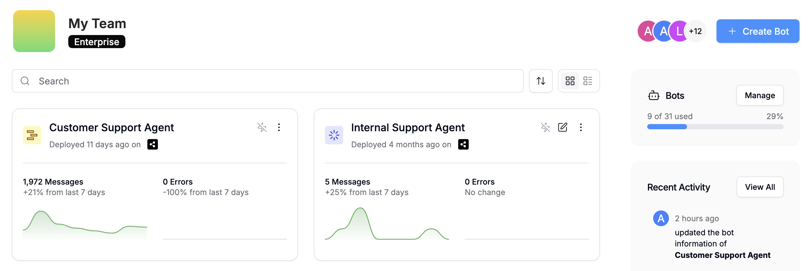
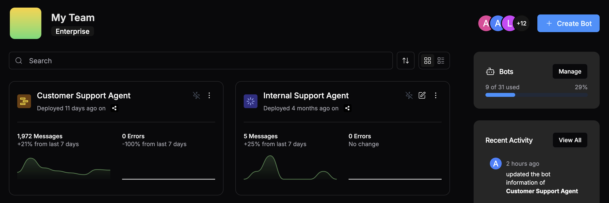
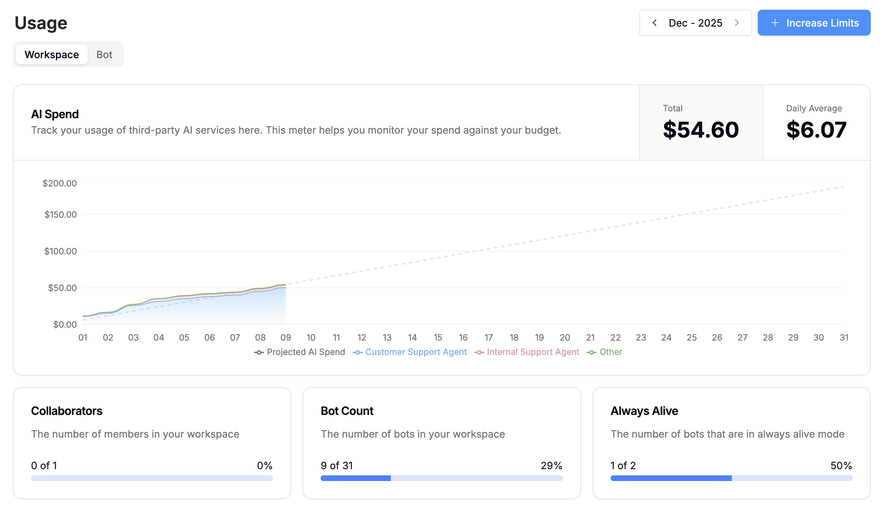
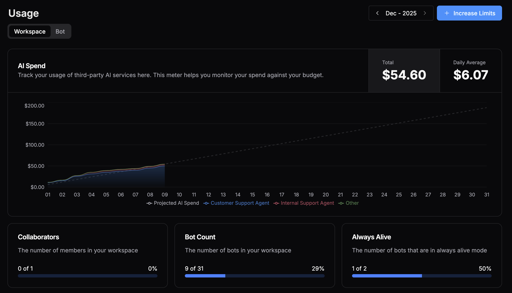

In Botpress, your workspace is the environment where you organize, manage, and collaborate on your agent projects.

Each Workspace can contain multiple agents, so you can keep them organized by customer, department, or use case. Within a workspace, you can manage permissions, usage, billing, and more.

## Using multiple workspaces

Any add-ons you purchase are distributed at the workspace level, meaning that they only apply to agents in the workspace where they were purchased.

This means you can use multiple workspaces within a single account, then subscribe to different plans and add-ons for each one.

To add a new workspace:

<Steps>
  <Step>
    Select the current workspace in the upper-left corner.
  </Step>
  <Step>
    Select **+ Create a workspace**.
  </Step>
  <Step>
    Enter a name for the new workspace, then select **Create**.
  </Step>
</Steps>

<Note>
  There is no limit to the number of workspaces you can create on one account.
</Note>

## Manage your agents

You can manage all your agents in your workspace's **<Icon icon="house"/> Home** menu:

<Frame>
  
  
</Frame>

### Create a new agent

You can create a new agent at any time by selecting **+ Create Bot** in the upper-right corner.

### Rename an agent

To rename an existing agent, select <Icon icon="ellipsis-vertical"/> then **<Icon icon="square-pen"/> Rename**.

### Enable Always Alive {<Tooltip tip="This feature requires a Botpress Plus plan or higher."><Badge stroke color="blue">Plus</Badge></Tooltip>}

You can enable [Always Alive](#always-alive) on any agent to keep it running continuously, even when no conversation is active. This allows for quicker response times when users first begin a conversation.

<Note>
  The number of agents you can enable Always Alive for depends on your [plan](https://botpress.com/pricing).
</Note>

### Copy an existing agent

You can copy an existing agent's configuration (including all settings and [Workflows](/studio/concepts/workflows)) for any other agent:

<Steps>
  <Step>
    Select <Icon icon="ellipsis-vertical"/> on the agent you want to copy the configuration *to*.
  </Step>
  <Step>
    Select **<Icon icon="copy"/> Copy to bot**, then select the agent you want to copy *from*.
  </Step>
  <Step>
    Select **Copy**.
  </Step>
</Steps>

### Delete an agent

To delete an agent, select <Icon icon="ellipsis-vertical"/> then **<Icon icon="trash-2"/> Delete**.

## View deployed integrations

You can manage any integrations you've built and deployed to your workspace in the **<Icon icon="boxes"/> Integrations** menu.

<Note>
If you just want to install third-party integrations, you can ignore this menu—instead, check out the official [integrations documentation](/integrations/get-started/introduction).
</Note>

To learn more about building and deploying your own integrations:

<Card title="SDK" icon="hammer" href="/for-developers/sdk/overview">
  Software development kit for building and deploying integrations on Botpress.
</Card>

## Track usage quotas

You can track information about usage across your workspace in the **<Icon icon="chart-pie"/> Usage** menu.

<Frame>
  
  
</Frame>

This page contains a breakdown of each type of usage quota.

<Note>
  You can always increase any limits in the [Billing menu](#billing).
</Note>

### AI Spend

Your **AI Spend** quota is the budget you allocate for your agent's usage of LLMs. This includes:

- Generating text
- Retrieving answers from Knowledge Bases
- Any other AI-powered actions

AI Spend cost is charged at cost, meaning you pay for the exact amount of tokens used by your agent without any additional markup. You can find detailed information about your agent's AI spend usage for each individual action in its [logs](/studio/concepts/debugger-logs-json#logs).

<Tip>
You can estimate your required AI Spend using our [AI Spend Calculator](https://botpress.com/ai-spend-calculator).
</Tip>

### File Storage

Your **File Storage** quota determines the storage in megabytes (MB) available across your workspace. Files included in this storage include photos, videos, and audio files that you've uploaded to be sent by your agent.

### Table Rows

Your **Table Rows** quota determines the total number of rows you can add to your agent's [Tables](/studio/concepts/tables).

### Vector DB Storage

Your **Vector DB Storage** quota determines the maximum storage available for Knowledge Base documents. It accounts for the total number of vectors in all of your [Knowledge Base](/studio/concepts/knowledge-base/introduction) documents, as well as searchable columns in your tables.

This value is expressed in MB for convenience, but the actual billing unit is a measure of vectorized storage, used for performing Retrieval Augmented Generation (RAG) on your Knowledge Bases.

### Incoming Messages & Events

Your **Incoming Messages & Events** quota determines the number of times your agent has been invoked in any channel and the maximum amount of times it can be invoked before it will stop responding. This includes:

- New conversations
- Conversations resumed after a [Timeout](/studio/concepts/bot-settings#inactivity-timeout)
- Conversations started by [Triggers](/studio/concepts/triggers).

### Collaborators

Your **Collaborators** quota determines the maximum amount of users that can collaborate in this Workspace.

### Bot Count

Your **Bot Count** quota determines the maximum number of bots this Workspace can hold. Once you reach the maximum number, you can purchase additional slots, or delete any unused bots to make room for new ones.

### Always Alive

Your **Always Alive** quota indicates how many remaining bots you can allocate the Always Alive status to.

<Accordion
  title="What's Always Alive?"
>
  Botpress agents are powered by remote, virtual compute instances. Every time your agent begins a new conversation, Botpress spins up a new instance for that agent. This is known as a *cold start*.

  During a cold start, the system must:

  - Allocate resources
  - Initialize the environment
  - Load necessary code
  - Perform any required configuration before the agent is ready to handle requests or tasks.

  Always Alive reserves an instance for your agent so that it can bypass this cold start and maintain a ready-to-use instance. The end result is that the first message sent and received from your agent are processed much faster.
</Accordion>

## Billing

You can update your billing preferences and manage your plan in the **<Icon icon="credit-card"/> Billing** menu.

<Card title="Pricing" external href="https://botpress.com/pricing">
  Learn more about pricing and plans.
</Card>

### Automatically purchase add-ons

If you often find yourself having to increase a specific quota, you can automatically increase it using Auto Recharge:

<Steps>
  <Step>
    Scroll to **Add-ons**, then find the add-on you'd like to automatically increase.
  </Step>
  <Step>
    Under **Auto Recharge**, select **Disabled <Icon icon="pencil"/>** to enable it for that add-on.
  </Step>
</Steps>

Now when your agent hits that specific quota, it'll adjust your plan automatically instead of notifying you.

### FAQs

<AccordionGroup>
  <Accordion title="I've changed my subscription but the changes don't seem to be reflected?">
    Because subscriptions are active throughout an entire month (or billing cycle), changes made to your subscription will appear when the next billing cycle begins.
  </Accordion>
  <Accordion title="If I purchase a plan or subscription upgrade in the middle of the month, when will I get charged?">
    Upgrades to your subscription are immediately pro-rated. If you purchase a Team plan in the middle of the month, you will pay half the value of the Team plan (for the remainder of that month), and then you will be billed as normal starting the 1st of the following month.
  </Accordion>
  <Accordion title="Where can I find Botpress invoices?">
    You can access invoices by selecting **Invoice History** in the **<Icon icon="credit-card"/> Billing** menu.
  </Accordion>
  <Accordion title="Where can I add my Tax ID?">
     You can access invoices by selecting **Billing Information** in the **<Icon icon="credit-card"/> Billing** menu.
  </Accordion>
  <Accordion title="Where can I change which email receives receipts and invoices?">
    You can adjust billing email preferences by selecting **Billing Information** in the **<Icon icon="credit-card"/> Billing** menu.
  </Accordion>
  <Accordion title="When does AI Spend get charged?">
    All usage-based billing, like AI Spend, is charged at the end of the billing period.
  </Accordion>
  <Accordion title="Can I make purchases on Botpress even though my payment has failed?">
    No, you can't upgrade a plan or subscription if your payment fails.
  </Accordion>
</AccordionGroup>

## Manage roles {<Tooltip tip="This feature requires a Botpress Team plan or higher."><Badge stroke color="green">Team</Badge></Tooltip>}

You can view and update roles for members of your workspace in **<Icon icon="settings"/> Settings** > **Members**.

Here's a breakdown of each role:

| Role | Permissions |
|------|-------------|
| **Viewer** | Can only view bots and Workspaces. Can't make any edits or changes |
| **Billing manager** | Can view and modify the Workspace's billing information |
| **Developer** | Can create, view, and update bots in the Workspace. Can only delete bots they have created |
| **Manager** | Can create, view, and update bots in the Workspace. Can view audit records |
| **Developer** | Can add and remove Workspace collaborators, and manage all bots in the Workspace |
| **Owner** | The user who creates a Workspace is automatically its owner, and has the privileges of all roles |

## View workspace activity

You can view a list of all activity that's occurred in your workspace in **<Icon icon="settings"/> Settings** > **Audits**.
