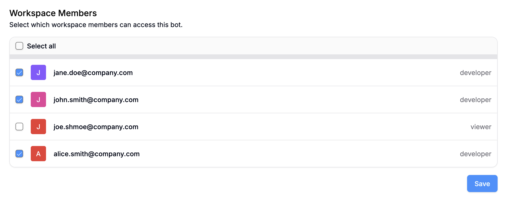
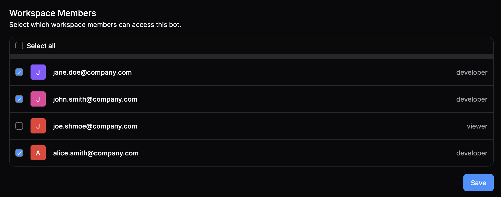

If you're an owner or administrator in your workspace, you can restrict who in your Workspace has access to your agent.

<Info>
  Access control requires a [Team plan](https://botpress.com/pricing) or higher.
</Info>

<Steps>
  <Step>
    Go to **<Icon icon="settings"/> Settings** in your agent's menu.
  </Step>
  <Step>
    Select **Access Control**.
  </Step>
</Steps>

Here, you can select which members of your Workspace have access to your agent:

<Frame>
  
  
</Frame>

When you're done, select **Save**.

## Access control vs. roles

Access control is an *agent-level setting*—it doesn't change the workspace member's access to any other agents or their overall role in the workspace. You can configure workspace-level roles in your [Workspace settings](/get-started/configure-your-workspace#manage-roles).

<Note>
  Workspace owners and administrators always have access to all bots in a workspace.
</Note>
