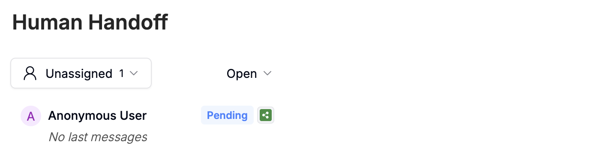
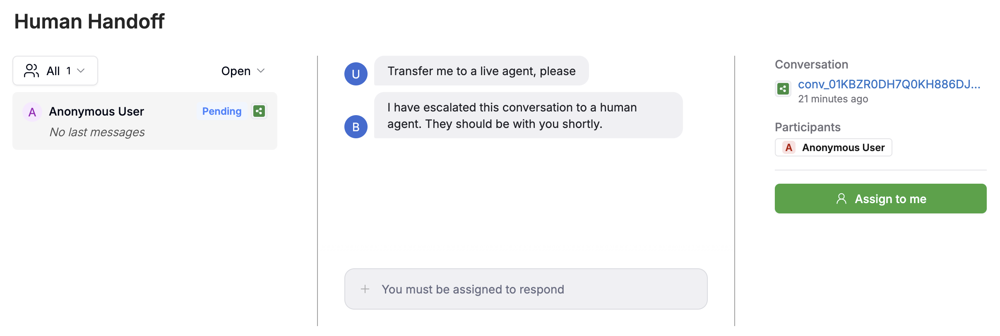
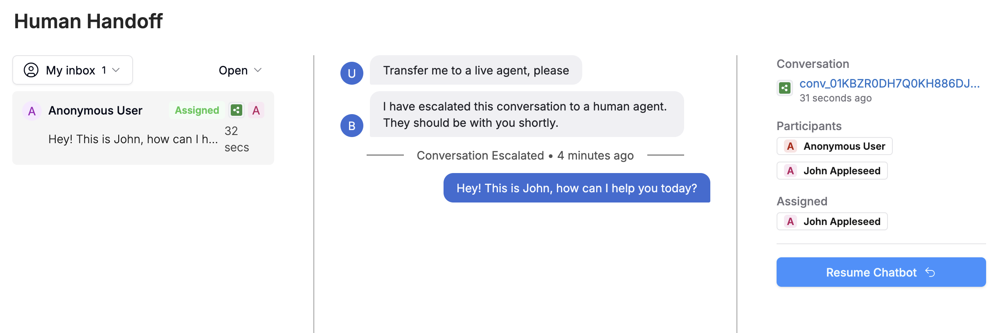
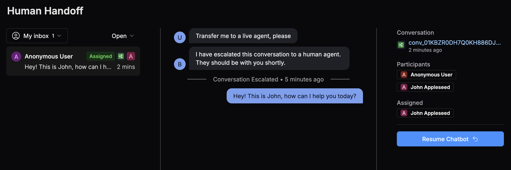
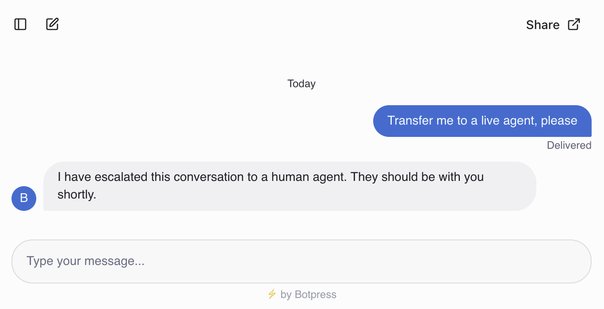
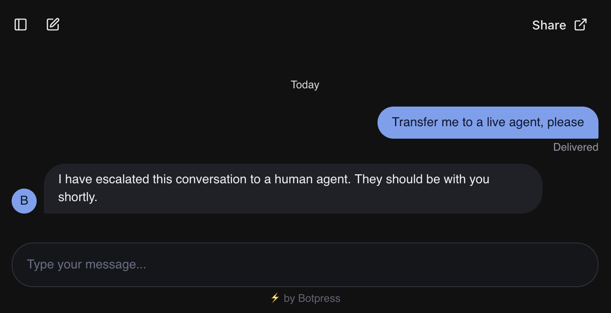

If you want to allow a live agent to join your agent's conversations, you can configure this in the **<Icon icon="message-square-reply"/> Human Handoff** section of your bot's menu.

## Setup

To get started using Human Handoff, you need to install and configure the official Human-in-the-Loop (HITL) integration:

<Card title="Configure HITL" href="/integrations/integration-guides/hitl" icon="plug" horizontal>
  Install and configure the official integration <Tooltip tip="This feature requires a Botpress Plus plan or higher."><Badge stroke color="blue">Plus</Badge></Tooltip>
</Card>

When you've finished setting up the integration, you'll have access to the Human Handoff **Dashboard**.

{/* You can assign members of your Workspace to join conversations that have triggered Human Handoff, and they can directly assist your users. */}

---

## Dashboard

When you've finished setting up the integration, you'll have access to the Human Handoff **Dashboard**. Here's how it works:

### View your tickets

When a user triggers Human Handoff, a ticket is opened. You can view your tickets in the left sidebar:

<Frame>
  
  
</Frame>

Select any ticket to view the conversation with the user.

<Tip>
  You can use the drop-down menus to filter your tickets by their status.
</Tip>

### Assign a ticket

You can assign a ticket to anyone in your Workspace, including yourself. For example, select **<Icon icon="user-round"/> Assign to me**:

<Frame>
  
  
</Frame>

Now you can chat directly with the user:

<Frame>
  
  
</Frame>

### Close a ticket

{/* vale Vale.Spelling = NO */}
When you've resolved the conversation with the user, select **Resume Chatbot <Icon icon="undo-2"/>**. This removes you from the conversation and lets the user keep chatting with your agent.
{/* vale Vale.Spelling = YES */}

## Testing

You can test Human Handoff by using your agent's preview to simulate an escalation.

<Steps>
  <Step>Open your agent's [preview](/get-started/manage-your-agent/preview).</Step>
  <Step>
    Chat with your agent until it triggers Human Handoff:

    <Frame>
      
      
    </Frame>
  </Step>
  <Step>
    Navigate to the Dashboard, then go to the bot's **<Icon icon="message-square-reply"/> Human Handoff** menu. From there, you can assign and interact with the ticket.
  </Step>
</Steps>
