You can inspect your agent's behaviour in the **<Icon icon="bug"/> Inspect** section of your agent's menu. Here's a breakdown of each sub-section:

## Logs

You can view logs from all your agent's conversations in the **Logs** sub-section. This includes system logs that provide updates on your agent's status, as well as logs from any integrations you have installed:

<Frame>
  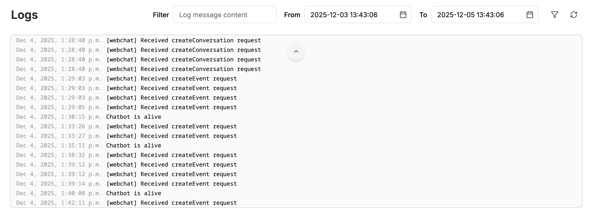
  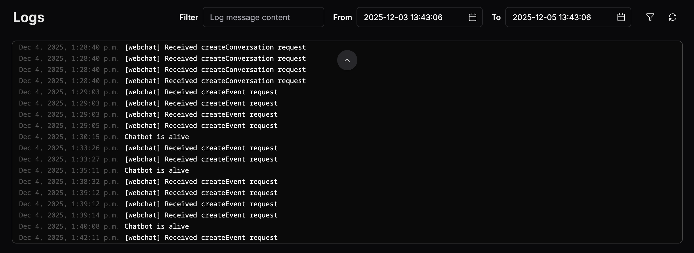
</Frame>

You can filter logs by date and time to narrow down your search for a specific event or conversation.

### Custom logs

You can add custom logs when [writing code in Studio](/studio/guides/advanced/use-code)—just use JavaScript's `console.log`:

```js
console.log('An error occured.')
```

Once you’ve published your changes, your bot will print that statement to its logs every time the code executes.

---

## Events

Events represent anything that happens within the bot, such as messages from users, bot replies, and system-level occurrences. You can view all incoming events processed by your agent in the **Events** section:

<Frame>
  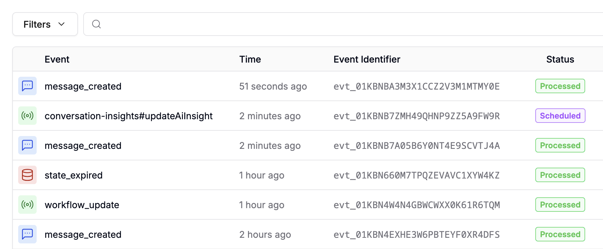
  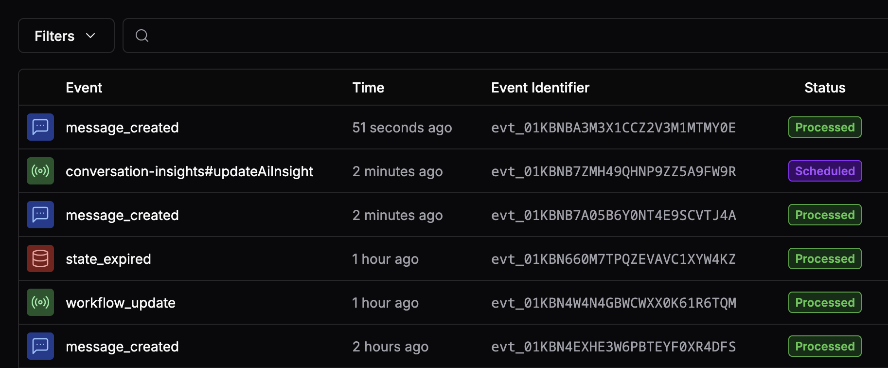
</Frame>

### Event data

Select any event to view a detailed JSON representation of all its associated data:

<Frame>
  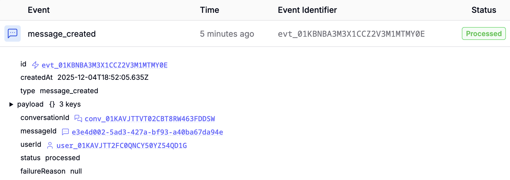
  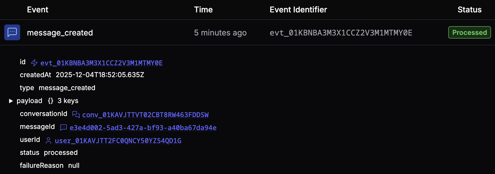
</Frame>

### Quota

Incoming events count towards your plan's Incoming Messages & Events quota. If you need to increase this quota, go to the [Billing](todo) section.

---

## Files

You can view all files uploaded to your agent in the **Files** section. This includes:

- [Files uploaded by users](/webchat/get-started/configure-your-webchat#features)
- Files indexed as part of a [Knowledge Base](/get-started/manage-your-agent/knowledge#knowledge-bases)
- System files
- Files you've uploaded yourself using the [Files API](/api-reference/files-api/getting-started)

### Inspect file data

Select any file to view a detailed JSON representation of all its associated data:

<Frame>
  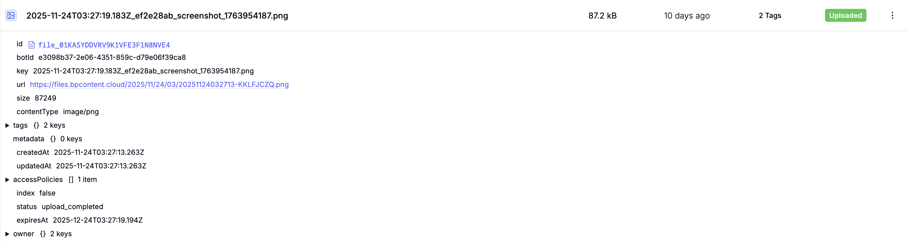
  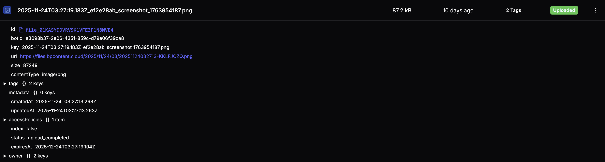
</Frame>

### View a file

To view a file, select it and open its URL.

### Download a file

To download a file, select <Icon icon="ellipsis-vertical"/> to open additional options, then <Icon icon="download"/> **Download**.

### Delete a file

To delete a file,  select <Icon icon="ellipsis-vertical"/> to open additional options, then <Icon icon="trash-2"/> **Delete**.

### Quota

Any files you store count against your File Storage quota. You can increase your quota in your dashboard's [Billing](todo) menu.

---

## Issues

You can view any problems or errors your agent encountered in the **Issues** sub-section:

<Frame>
  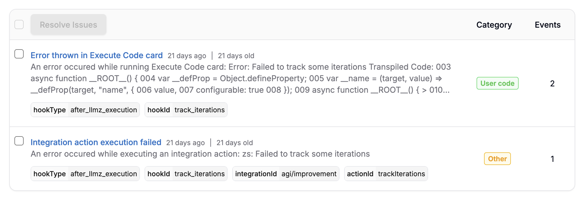
  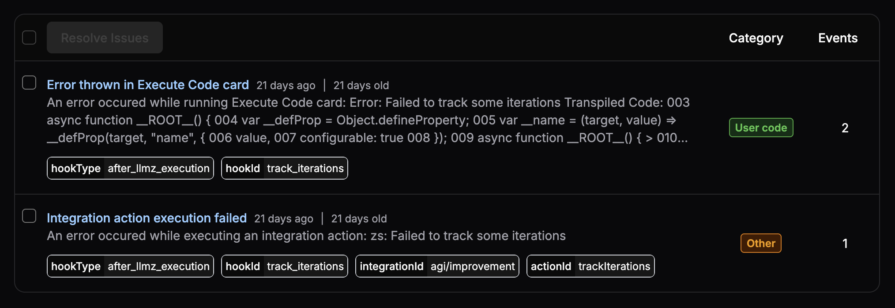
</Frame>

The **Category** field tells you where the issue came from, while the **Events** field tells you how many times it occurred. Select any issue to view a list of all occurrences:

<Frame>
  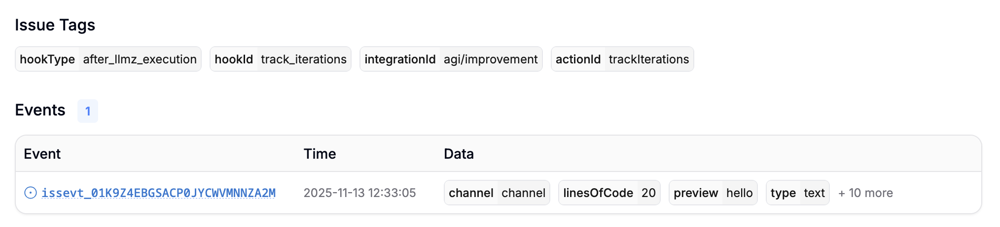
  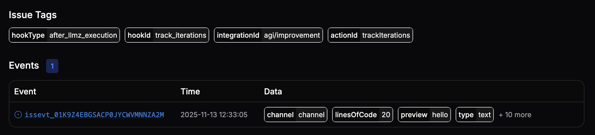
</Frame>

This gives you detailed information about each occurrence, like:

- Its payload
- The associated user and conversation IDs
- The channel or integration on which it occurred
