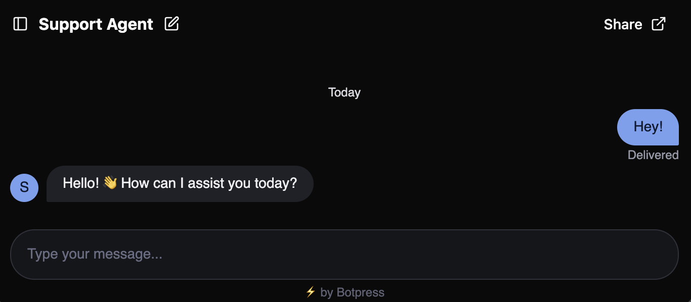

You can chat with a preview of your published agent at any time:

<Steps>
    <Step>Go to the **<Icon icon="layout-panel-left"/> Overview** section in your agent's menu.</Step>
  <Step>
    Select **<Icon icon="external-link"/> Preview** to open the preview.
  </Step>
</Steps>

## Test your agent

Start a conversation with your agent and test its behaviour:

<Frame>
  
  
</Frame>

## Styling

The preview is generated using [Webchat](/webchat/get-started/introduction), Botpress' custom frontend. It shows how your agent will appear to users when you add it to your website.

For more information about styling your agent:

<Card title="Style your agent" icon="settings-2" href="/webchat/get-started/configure-your-webchat" horizontal>
Configure your agent's appearance using Webchat.
</Card>

