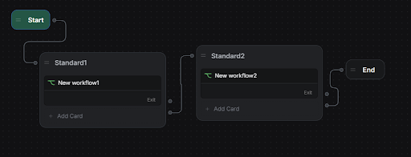
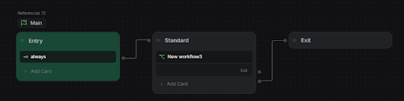

import { Img } from '/snippets/image.mdx'

## **Overview**

Efficient state management is crucial for optimizing chatbot performance in Botpress. This guide outlines best practices to avoid performance degradation and errors caused by exceeding the **128 KB state size limit**, ensuring your bot operates seamlessly.

***

## **Understanding State Size Limits**

Botpress enforces a **state size limit of 128 KB** to maintain optimal performance. Poorly managed state variables, especially in nested workflows, can lead to:

* **State bloat**: Accumulation of unnecessary or oversized variables.

* **Performance issues**: Slower bot responses as state size grows.

* **Errors**: Logs showing state size limit exceedance.

***

## **Avoiding Common Workflow Design Pitfalls**

### **Workflow Structure and State Retention**

How workflows are designed impacts the state management. Consider two scenarios:

### **Scenario 1: Proper Workflow Exit**

* **Workflow 1** ends completely before transitioning to **Workflow 2**.

* Variables from Workflow 1 are cleared upon exit, keeping the state clean.

**Example:**

Workflow 1 → **End** → Workflow 2 → **End**

### **Scenario 2: Improper Workflow Exit**

* **Workflow 1** transitions directly into **Workflow 2** without exiting.

* Variables from Workflow 1 persist until **Workflow 3** finishes, causing state size to increase unnecessarily.

**Example:**

Workflow 1 → Workflow 2 → Workflow 3 → **End**

***

## **Best Practices for State Management**

### **1. Design Workflows with Proper Exits**

Ensure that each workflow completes before initiating the next. This prevents unused variables from lingering in the state.

**Best Practice Workflow Design:**

Workflow 1 → End

Workflow 2 → End

### **2. Manually Clear Unused Variables**

In scenarios where restructuring workflows is impractical, manually clear state variables to manage size effectively.

**Implementation Tips:**

* Remove variables that are no longer needed by setting it to null value or by reusing it.

### **3. Minimize Use of Large Variables in Main Workflow**

Avoid storing large data structures (e.g., arrays, objects) in the main workflow (`wf-main`). Instead, limit variables to essentials for transitions or core logic.

**Best Practices:**

* Move non-essential or large variables to sub-workflows.

* Use modular workflows for better management.

### **4. Monitor and Audit State Size**

Regularly inspect and optimize state size to identify potential issues early.

**Tools and Techniques:**

* Use Botpress debugging tools to examine `variable_values`.

* Audit workflow designs periodically to ensure compliance with best practices.

***

## **Optimizing Nested Workflow Designs**

Nested workflows can be efficient but require careful handling to avoid state retention issues. Follow these strategies:

1. **Plan Transitions Carefully**: Design clear entry and exit points for each workflow.

2. **Use Modular Sub-Workflows**: Break workflows into smaller, task-specific components.

3. **Limit Parent Variable Retention**: Clear parent workflow variables when transitioning to nested workflows.

***

## **Conclusion**

Adhering to these state management best practices ensures your bot performs optimally, avoids the **128 KB state size limit**, and maintains clean and efficient workflows:

1. Design workflows with proper exits.

2. Manually clear unused variables when needed.

3. Minimize use of large variables in the main workflow.

4. Regularly monitor and audit state size.

By implementing these guidelines, you’ll enhance chatbot performance, reduce errors, and provide a better user experience.
