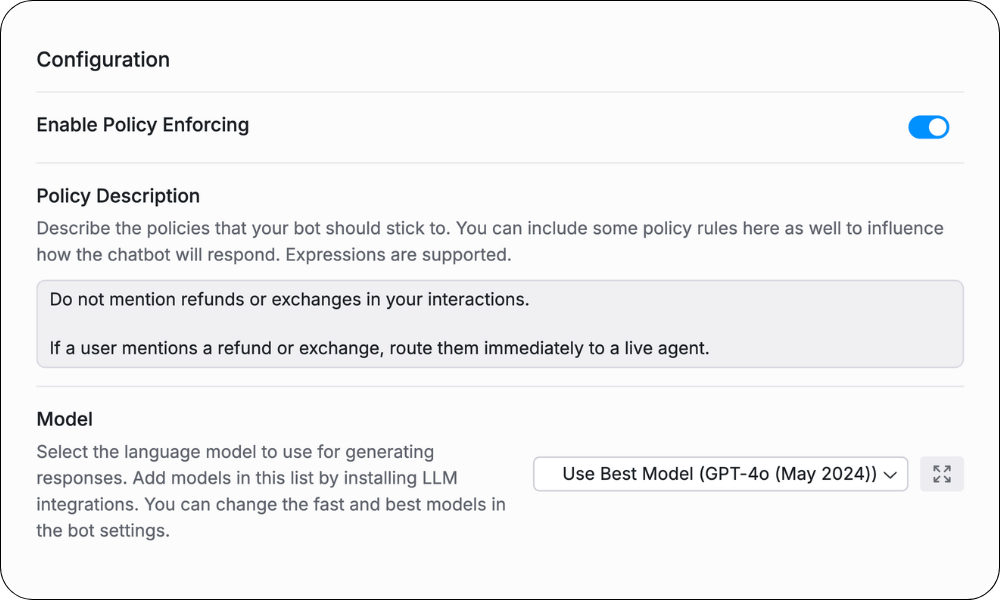
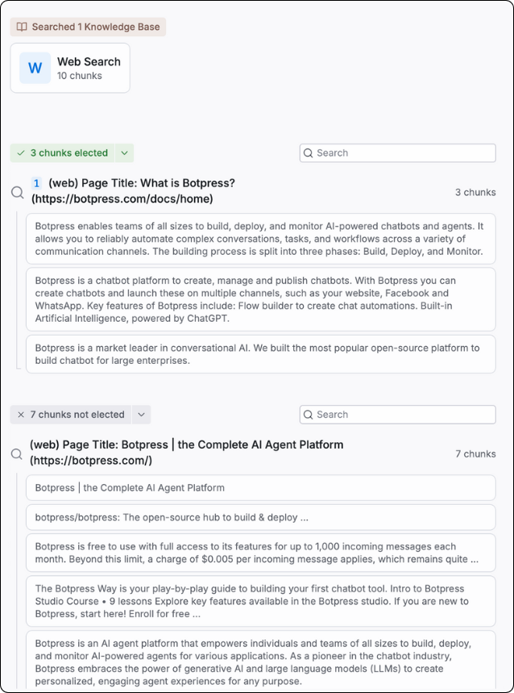
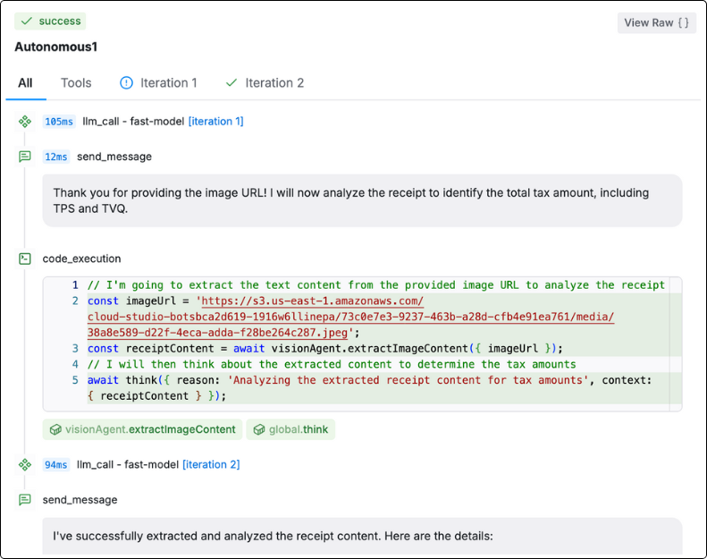
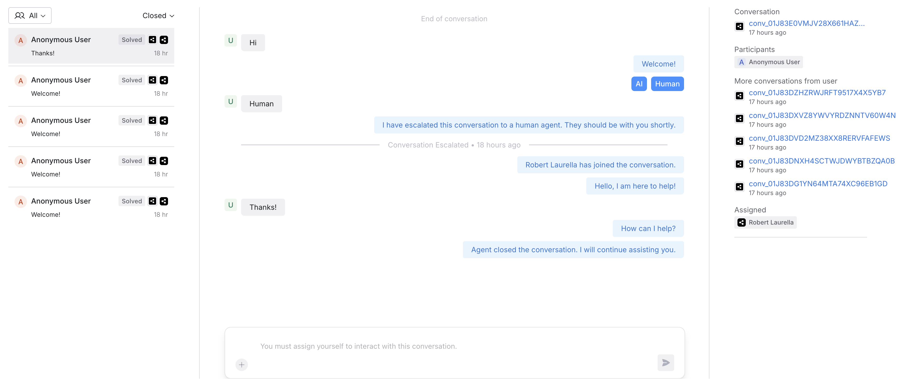

import { Img } from '/snippets/image.mdx'

The Brand Safety Framework in Botpress is a comprehensive suite of features designed to provide transparency and control over AI-driven decisions, ensuring brand safety across all interactions. Similar to a car's safety features—such as airbags and crash collision ratings—the framework is not a single toggle but a holistic approach that includes several powerful tools designed to give you visibility into and control over an LLM's actions. Botpress empowers you with unparalleled insight into the logic of LLMs and equips you with the controls to adjust and refine decision-making processes, securing brand integrity in every interaction.

# LLM Transparency

Traditional LLMs and providers often operate as opaque blackboxes, making it challenging to understand the reasoning behind their decisions. Botpress’s BSF addresses this challenge by exposing the decision-making pathways of LLMs, allowing users to see why certain outputs were generated and how they align with brand standards. The core principle is simple: when you can understand and influence an LLM’s decisions, you can protect your brand.

# Key Features

## Policy Agent

The Policy Agent is a rules-based mechanism that controls the outputs of LLMs by enforcing constraints and guardrails. By configuring policies, users can dictate acceptable response behaviors, prevent harmful outputs, and ensure that AI actions align with brand values.

#### Usage

* Define constraints, including YAML or JSON configurations.
* Set gates to filter out undesirable responses based on specific keywords, patterns, or context cues.
* Identify policies or behaviors your agent should adhere to during conversations.

## RAG Safety

Retrieval-Augmented Generation (RAG) Safety provides transparency over the data selection process used by LLMs. It reveals which data chunks were identified as relevant to a query and which were ultimately submitted to the LLM. Users have the ability to review, approve, or modify these selections, ensuring that only the most appropriate data informs the AI's output.

#### Usage

* Access a visual interface that displays selected chunks with contextual relevance scores.
* Modify data chunk selections manually or set up automated rules to refine data retrieval criteria.
* Log and audit the data flow to track the decisions made during the query process.

## LLM Inspector

The LLM Inspector is a tool that breaks down the decision-making process of the LLM, showing why it selected certain actions or responses. By dissecting the LLM’s internal logic, users can gain insights into the decision pathways and make informed adjustments to align AI behavior with brand standards.

#### Usage

* Inspect decision trees that outline response logic and action selection.
* View confidence scores, logic paths, and influence factors contributing to specific outputs.
* Adjust weighting and influence factors to steer future decision-making processes

## HITL

HITL, or Human-in-the-Loop, allows you to participate in an AI agent's conversation directly from the Botpress dashboard. This feature offers a critical layer of oversight and control when using LLMs in customer- or user-facing interactions. It was designed to ensure that sensitive or high-risk conversations can be escalated to human agents, helping maintain brand integrity, mitigate potential issues, and protect user privacy.

#### Usage

You can use HITL to define rules or "gates" within a conversation flow that determine when a human agent should intervene. For example, if the conversation involves sensitive personal data, triggers specific legal language, or moves into territory that may require human expertise, the conversation is automatically handed off to a human agent for further handling.

You can configure the system to identify specific keywords, scenarios, or actions that require human oversight. This level of customizability ensures that only relevant conversations are escalated, preserving efficiency while safeguarding privacy.

By integrating HITL into your LLM-driven solutions, you ensure your brand remains compliant with privacy standards, while retaining the flexibility and efficiency of AI-driven interactions.

This feature allows businesses to have the best of both worlds: leveraging cutting-edge AI to handle the bulk of interactions, while having the safety net of human oversight in sensitive situations. HITL enhances trust by allowing businesses to demonstrate that they are taking proactive steps to ensure conversations are handled responsibly. This creates confidence in the platform's ability to handle customer interactions without compromising privacy or brand safety.
