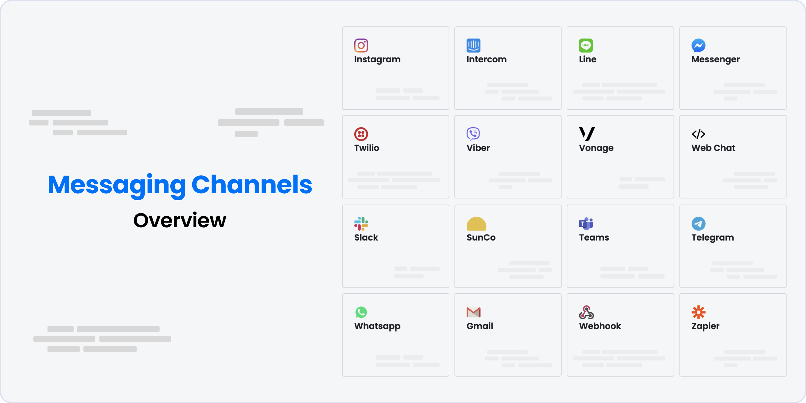

import { Img } from '/snippets/image.mdx'

Botpress allows you to easily integrate your chatbot with various messaging channels, so that you can reach your users on their preferred platforms. Here are the steps to integrate your chatbot with a messaging channel:

* Publish your Chatbot from the Botpress Studio for enabling your bot to be able to connect with different messaging channels.
* Navigate to the Channels tab in your Botpress Admin's Chatbot Settings.
* Select the Messaging Channel that you want to integrate with from the list of available options. For example, if you want to integrate with Facebook Messenger, click on the Messenger.
* Follow the instructions provided for the selected channel to set up the integration. This will typically involve creating an account on the channel's platform, generating an access token or API key, and configuring the integration settings in Botpress.

Click on the following links to know more about each channel integration.

1. [Messenger](/guides/integrations/integration-guides/messenger)
2. [Slack](/guides/integrations/integration-guides/slack)
3. [SunCo](/guides/integrations/integration-guides/sunshine-conversations/introduction)
4. [Teams](/guides/integrations/integration-guides/microsoft-teams)
5. [Telegram](/guides/integrations/integration-guides/telegram)
6. [Twilio](/guides/integrations/integration-guides/twilio)
7. [Vonage](/guides/integrations/integration-guides/vonage)
8. [WhatsApp](/guides/integrations/integration-guides/whatsapp)
9. [LINE](/guides/integrations/integration-guides/line)
10. [Viber](/guides/integrations/integration-guides/viber)
11. [Instagram](/guides/integrations/integration-guides/instagram/)

By integrating your chatbot with multiple messaging channels, you can expand your reach and engage with your users wherever they are. This can help you to provide a more convenient and personalized experience for your users, which can lead to increased satisfaction and loyalty.
