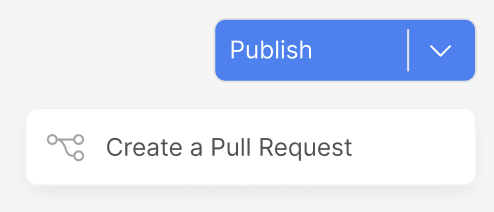

<Info>
Premium Feature

Only Enterprise customers have access to dedicated Git version control.

This guide helps Botpress users manage their bot with Git. It enables team collaboration and tracks code changes, replacing the need to use the publish button in Botpress studio.
</Info>

### Connect your bot to Git

1. In the Botpress Studio, navigate to your `Bot Settings`
2. Click on the `Connect with Repository` button to connect your bot to a Git Repository

3. Select the repository you want to connect to in `Git` or `Github`

4. By connecting your bot to a Git Repository, you can `Create a Pull Request` from the Botpress Studio to your Git Repository under the `Publish` button dropdown.

<Note>
If you want to prevent the `publish` from Botpress Studio, you can disable the `Publish` button in the bot settings by clicking on the `Disable` button on your bot settings page.
</Note>

