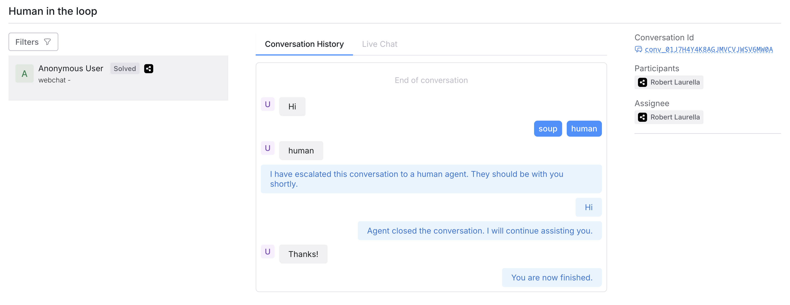

import { Img } from '/snippets/image.mdx'

The Human-in-the-Loop (HITL) integration is designed to bring human oversight and intervention into AI-driven workflows. This integration allows human operators to step in and manage specific interactions, tasks, or decisions, enhancing your bot's ability to handle complex or sensitive scenarios.

Use live agent handoff to enable your service or support agents to interact directly with your end users.

## Key Features

### Real-Time Escalation

The HITL Agent can seamlessly transfer conversations to a human agent when predefined conditions are met. This allows for immediate intervention in cases where the AI model detects uncertainty, user frustration, or when a high-stakes decision is required.

### Decision Gates

Incorporate human decision points into workflows, allowing for human review and approval of AI-generated outputs before final actions are taken. This ensures compliance with business rules and reduces the risk of errors in critical processes.

### Audit Trail and Logging

The HITL Agent maintains a detailed record of all human interventions, providing transparency and accountability. This feature is essential for industries requiring regulatory compliance or quality assurance, allowing teams to review the history of human interactions with the AI.

### Customizable Triggers

Users can define specific triggers for human intervention based on various criteria, such as conversation sentiment, keyword detection, or task complexity. This ensures that human involvement is precisely targeted where it adds the most value.

HITL is a critical component of Botpress’s commitment to providing flexible, powerful, and safe AI solutions. It allows organizations to confidently deploy AI while maintaining the necessary level of human oversight and control.

# Usage

<Note>
Note

HITL through the Botpress dashboard is only available to Team and Enterprise subscribers.
</Note>

To get started with HITL, enable the HITL integration from the integration hub. Make sure you've also enabled the HITL agent.

At this point, the 'Escalate to a Human' card will be available for use in the card tray.

Dragging this into a node will stop the flow of the conversation and escalate the conversation to the 'HITL' tab of the bot's dashboard.

Once the conversation appears in the HITL tab, it can be assigned to a user in the Workspace. You can also assign a conversation to yourself.

From this tab, the agent can view the conversation history prior to the escalation, as well as participate in the conversation by using the 'Live Chat' tab.

When the conversation has been successfully resolved by the live agent, clicking 'End Conversation' will return control of the workflow over to the bot. From here, your bot can resume its flow, or end the conversation altogether.
