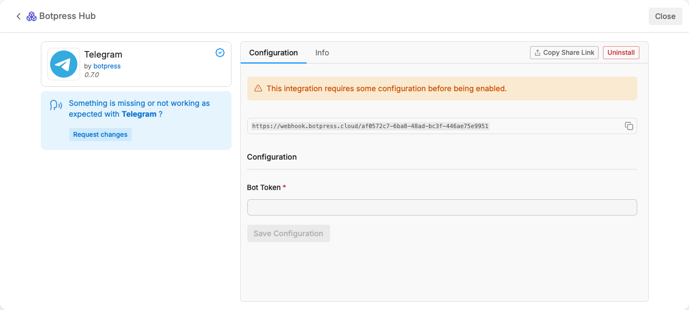

import { Img } from '/snippets/image.mdx'

<Info>
You will need:

* A [published Botpress bot](/guides/getting-started)
* A [Telegram account](https://web.telegram.org/a/)
</Info>

<Tip>
Visual learner?

Check out our [Telegram guide](https://www.youtube.com/watch?v=w0-UGm4mu74) on YouTube for a step-by-step video guide.
</Tip>

# Step 1: Create a bot in Telegram

To add your bot, you need to create a corresponding bot in Telegram. You can do this using Telegram's BotFather:

1. Log into [Telegram](https://web.telegram.org/a/).
2. Start a conversation with [BotFather](https://telegram.me/BotFather) and follow the prompts to create your bot.
3. Copy your bot's access token.

# Step 2: Install the Telegram integration in Botpress

Next, install the Telegram integration for your Botpress bot.

1. In Botpress Studio, select **Explore Hub** in the upper-right corner.
2. Search for the Telegram integration, then select **Install Integration**.

The **Configuration** menu should open:

# Step 3: Configure your integration

Now, you can connect your Botpress bot and your Telegram bot.

1. Paste your Telegram bot's access token into the **Bot Token** field.
2. Select **Save Configuration.**

<Check>
Done!

You can now chat with your Botpress bot on Telegram.
</Check>
