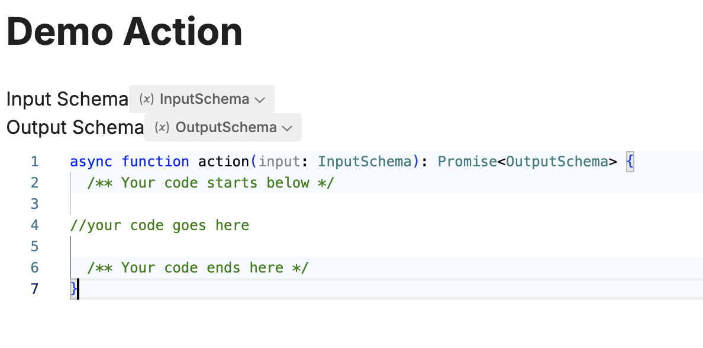

import { Img } from '/snippets/image.mdx'

Actions are reusable custom code components that you can add to your agent.

You can use Actions in Autonomous Nodes execute a specific action or piece of code, for things like processing data or making API calls.

# Creating Actions

Your Actions can be accessed from the Actions menu in the sidebar, where you can create new Actions or manage existing ones.

# Using Actions

When creating an Action, you should define an input and output schema, which determine the kind of information the Action has access to when it begins, and what the structure of the data it should output after execution.

After defining your schemas, you can write the code you'd like this specific Action to execute.

Once completed, Actions are available for use in Autonomous Nodes via the Card Tray.
