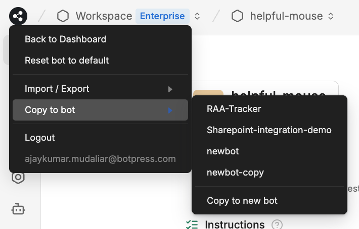

import { Img } from '/snippets/image.mdx'

### Use Cases

This feature is useful in couple scenarios:

**Development, Staging, and Production Environments**:

* Maintain separate bots for development, staging, and production. This allows you to experiment freely in the development bot and test changes without compromising the settings or data of your staging or production bots.

**Managing Multiple Client Bots:**

* If you maintain a single master bot and deploy multiple copies as production bots for different clients, this feature helps keep them synchronized while ensuring each remains isolated.

***

### How to Copy a Bot

1. In **Botpress Studio**, navigate to the left panel and click the **Botpress icon**.
2. Hover over **Copy to Bot** and select the bot you want to copy to (or create a new bot).
3. A confirmation dialog will appear, warning that this action will modify the target bot. Click **Confirm** to proceed.
4. The copy process will begin. Once complete, a dialog will appear with details about the updates made to the target bot.
5. From here, you can choose to open the target bot or close the dialog and continue editing the source bot.

***

### How it works

When a user requests to copy a bot to another bot, the following actions are performed:

**Workflows, Variables and Hooks are copied**

* All workflows, variables and hooks from the source bot will be copied to the target bot.
* Existing workflows and variables in the target bot will be overwritten.

**Integrations are synced**

* New or outdated integrations from the source bot will be installed in the target bot. These will need to be configured in the target bot’s studio.
* Existing integrations in the target bot will be preserved with their configuration.
* Integrations that exist only in the target bot will remain unchanged.

**Tables are synced**

* New tables from the source bot will be added to the target bot.
* New columns in existing tables will be added to the corresponding tables in the target bot. If there was existing data, the new column will be null for each entry.
* Deleted columns in existing tables will be removed from the target bot’s equivalent tables. If there was existing data, only the data for that column will be lost—other data remains intact.
* Tables that exist only in the target bot will remain unchanged.

**Knowledge Base (KB) Files are synced**

* New files from the source bot will be duplicated in the target bot.
* If a file is updated in the source bot, the corresponding file in the target bot will be overwritten.
* Files that exist only in the target bot will remain unchanged.
