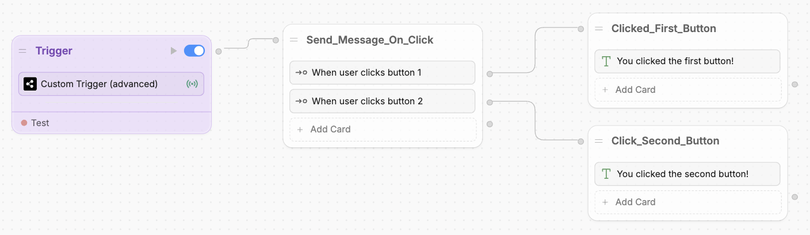
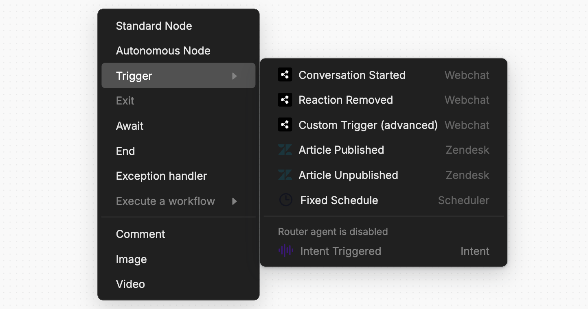

---
Nodes that execute when a certain event fires
---

Triggers are a special kind of [Node](/guides/studio/interface/nodes) that only **execute when a certain event occurs**. You can recognize Triggers by their distinctive purple colour:

<Frame>

</Frame>

Triggers are useful if you want your bot to:

- [Send a welcome message](#conversation-started)
- [Do something at a specific date/time](#fixed-schedule)
- [Respond to changes on your website](#custom-trigger)

<Warning>
    Triggers won't work in the Studio's emulator, even when the event they're expecting occurs. Instead, you can [test them](#test-a-trigger) before publishing.
</Warning>

## Triggers vs. Nodes

Triggers are different from regular Nodes in a few ways:

- You **can't transition** from a regular Node to a Trigger. Any Triggers in your Workflow will only execute when the event they listen for occurs.
- Unlike other Nodes, **you can't add or remove [Cards](/guides/studio/cards)** from a Trigger. Each Trigger is built around a single Card that determines when it executes.

## Add a Trigger

To add a Trigger, just right-click anywhere in a Workflow:

<Frame>

</Frame>

## Test a Trigger

Triggers won't work in the Studio's emulator, even when the event they're expecting occurs. Instead, you can use a previously sent event to test your Trigger.

For example, to test the [Conversation Started](#conversation-started) Trigger:

<Steps>
    <Step title="Add the Trigger to your Workflow">
        Right-click anywhere in your Workflow. Select **Triggers**, then **Conversation Started**:

        <Frame>
            
        </Frame>
    </Step>
    <Step title="step 2">
        
    </Step>
</Steps>

## Webchat Triggers

Studio comes with some built-in Triggers that let your bot react to certain events in Webchat:

### Conversation Started

<Tip>
    For a step-by-step guide to the **Conversation Started** Trigger, check out the [Webchat documentation](/webchat/interact/start-trigger).
</Tip>

The **Conversation Started** Trigger only executes when a user starts a new conversation in Webchat. You can use it to make your bot do something as soon as a user starts a new conversation. 

For example, sending a welcome message:

<Frame>

</Frame>

### Custom Trigger

<Tip>
    For a step-by-step guide to using **Custom Triggers**, check out the [Webchat documentation](/webchat/interact/send-custom-events/to-webchat).
</Tip>

You can use **Custom Triggers** to make Webchat react to custom events from your website. This is useful if you want to make your bot more responsive to the rest of your user experience.

For example, if you want your bot to respond when a user clicks a button:

<Frame>

</Frame>

## Fixed Schedule

<Tip>
   Check out our step-by-step guide on [using the Fixed Schedule Trigger](/guides/studio/cards/fixed-schedule).
</Tip>

You can use the **Fixed Schedule** Trigger to execute some part of your Workflow at a specific time. This is useful if you want to send reminders, notifications, or other time-sensitive messages to users.

## Integrations

<Tip>
    Check out the [integrations section](/integrations/) for information about integration-specific Triggers.
</Tip>

Some integrations include their own Triggers. When you install an integration that has Triggers, they'll become available in the Triggers menu.

For example, the [Zendesk integration](/integrations/integration-guides/zendesk) comes with two Triggers — **Article Published** and **Article Unpublished**:

<Frame>

</Frame>