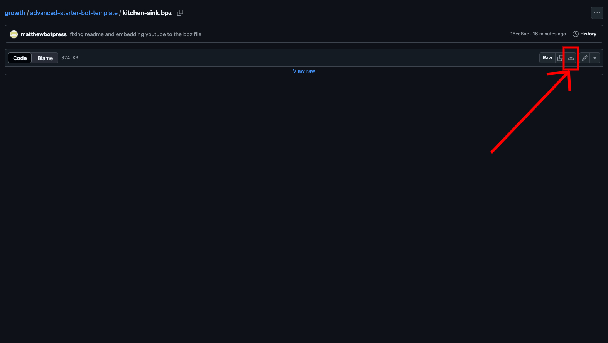
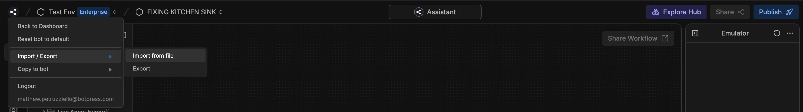

import { Youtube } from '/snippets/youtube.mdx'
import { Img } from '/snippets/image.mdx'

## Import Guide

1. Go to the [Advanced Starter Template](https://github.com/botpress/growth/tree/master/advanced-starter-bot-template) located on the Botpress Growth Team's Github!
2. Scroll down to the "How to use" section and click the download link for the [kitchen-sink.bpz](https://github.com/botpress/growth/blob/master/advanced-starter-bot-template/kitchen-sink.bpz) file.
3. Click on the download icon on the right side of the screen (see screenshot below).

4. Go to your [Botpress studio](https://studio.botpress.cloud)
5. Click on the Botpress icon at the top left of your screen
6. Click "Import / Export" and then click on "Import from file" (see screenshot below).

7. Select this template!
8. Enjoy!!! Please make sure to read the rest of this documentation and watch the video below!

## Purpose

This comprehensive template covers the core features and capabilities of Botpress, serving as both a learning resource and a foundation for your chatbot projects.

Whether you are new to Botpress or looking to explore our features, this template provides practical, real-world examples you can learn from and adapt to your needs. Follow along with our youtube tutorial below for a detailed walkthrough of all the features.

<Youtube url="https://www.youtube.com/embed/-N4OoKg_w4I?si=0OrPkHzFgHqbAmvF" />

## Core Functionalities

1. **Initial User Data Loading**
   - Capture platform-specific user data (Messenger ID, WhatsApp number, webchat data, etc...)
   - Handle different integration sources
2. **Event Tracking**
   - Custom analytics platform integration
   - Support for Google Analytics, Mixpanel, and Segment
   - Botpress' built-in analytics Agent.
3. **Proactive Greeting**
   - Bot-initiated conversations (embedded webchat and shareable link only)
4. **Workflow Routing System**
   - Using a central routing node to route to other workflows.
   - Helps solve the question "How to transition outside of an autonomous node?"
   - Two routing options:
     1. Autonomous node-based routing (AI option)
     2. Button-based routing (non-AI option)
5. **Requiring Information from the User to Send to an External Tool**
   - Required field collection (e.g. requiring a valid email)
   - External tool to send tickets or information to
   - Botpress table integration (to send information as rows)
6. **Querying Knowledge Base and Saving Search Results**
   - Question and answer tracking
   - Prevent AI hallucinations by telling the user that no answer was found if the information does not exist within the knowledge base. This bot covers fallback handling for unanswered questions.
   - Track the exact chunk, knowledge base, and citation for where the information came from within your knowledge base.
7. **Live Agent Handoff**
   - Assigning a ticket to a live agent, causing the conversation with the bot to be temporarily paused until the live agent is done solving the ticket.
   - The human can "talk through" the bot to the user.
8. **CSAT (Customer Satisfaction) System**
   - End-of-conversation survey
   - Conversation summary generation and storage in Conversation Ratings Table
9. **Table Search and Filtering**
   - Querying from a Botpress table to fetch row(s) based on user input parameters.
10. **Management of Multiple Sub-Bots within a Single Bot for Multi-Client Purposes**
   - Client-specific knowledge base segmentation
   - Customer tag and identity management
   - Dynamic knowledge base selection
   - Multi-client support within a single bot instance
