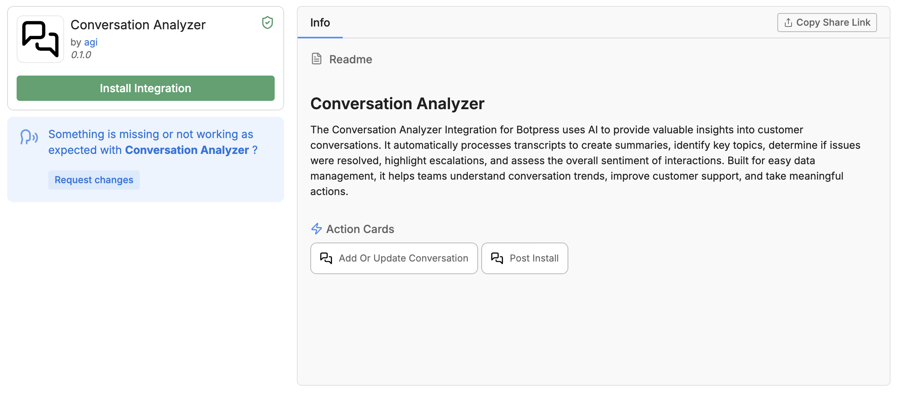
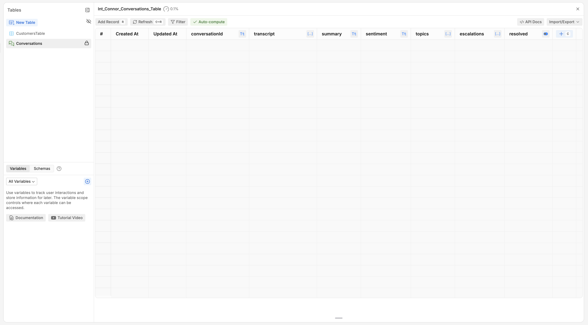

<Warning>
Early Beta

The Conversation Analyzer is in beta and should not be used in production or critical workflows. We encourage testing in non-production environments and welcome your feedback to improve its stability and functionality.

Each stored conversation uses your Workspace's Table Rows quota, and may demonstrate increased usage.
</Warning>

# How to use

## Install

Start by installing the Conversation Analyzer integration from the integration hub.

[Link to integration](https://studio.botpress.cloud?exploreHub=1\&hubItemId=intver_01JFQPN3KKAX01TM7JQX171C58)

## Analyze

After installing the integration, all of your bot's production conversations will be stored in the automatically created "Conversations" table.

This table is automatically populated every time a conversation ends. Each conversation takes up its own record, and stores information like sentiment analysis, topics covered, and an AI-generated summary of the conversation.

## Reinforcement Learning

Botpress tables include built-in reinforcement learning mechanisms designed to continuously improve the accuracy and effectiveness of your bots. When you use the Conversation Analyzer, the computed columns in the Conversations table enable feedback loops that refine your bot's understanding of conversation patterns over time.

### How It Works

The "Conversations" table contains computed columns that analyze and interpret key aspects of each conversation, such as sentiment, topics, and AI-generated summaries. These columns act as the foundation for reinforcement learning by creating structured data that can be evaluated and improved.

You can manually review and adjust the computed data (e.g., correct a misidentified topic or adjust the sentiment). These adjustments provide feedback that the system uses to update its underlying models. The more corrections you make, the better the bot becomes at accurately interpreting similar conversations in the future.

Based on the feedback provided, Botpress dynamically retrains the relevant models. For example:

**Topic Classification:** Retrains the model to better associate keywords, phrases, or intents with specific topics.

**Sentiment Analysis:** Adjusts the sentiment detection algorithms to align more closely with your specific use case.

**Summarization:** Enhances the AI's ability to create concise, accurate summaries by learning from your manual edits.

### Continuous Improvement

Over time, this process leads to a self-improving system. As the volume of analyzed conversations grows, the bot becomes more adept at handling various conversation scenarios, understanding user inputs, and producing meaningful insights.
