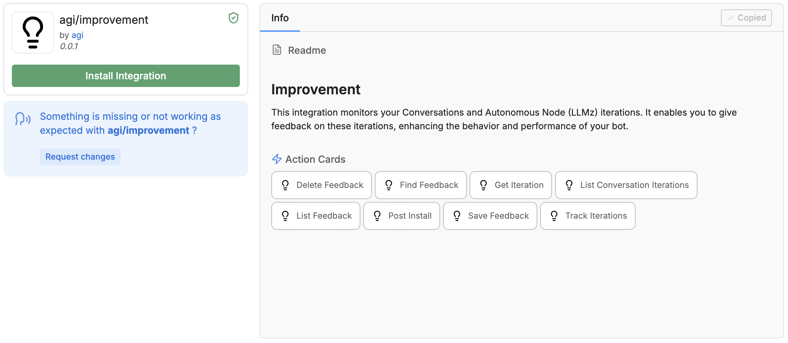
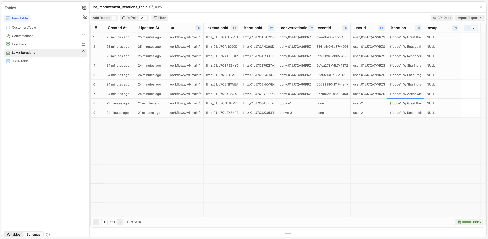
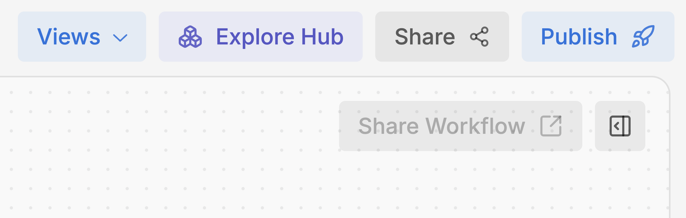
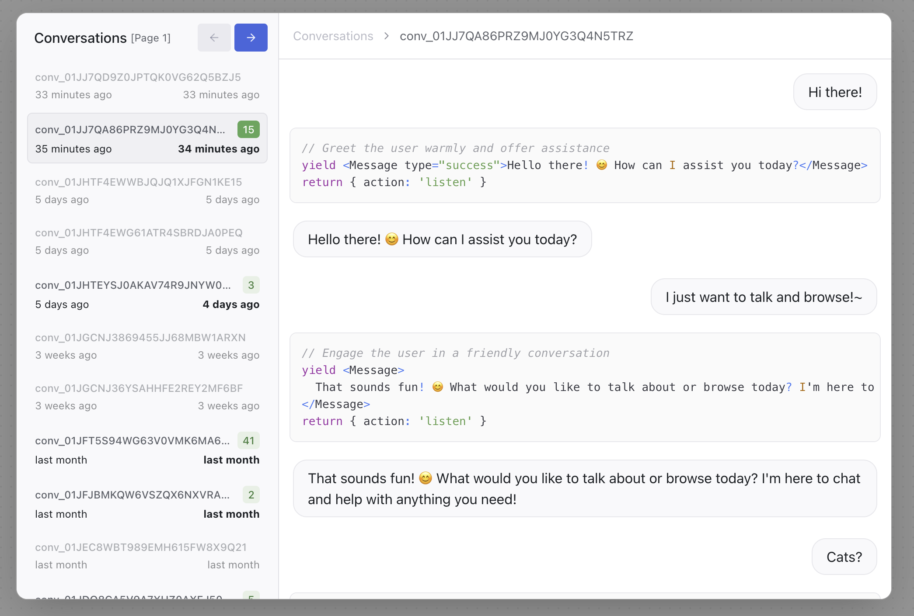
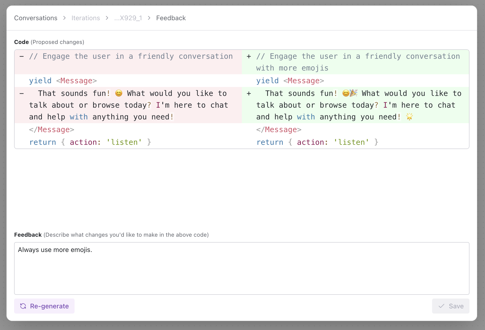
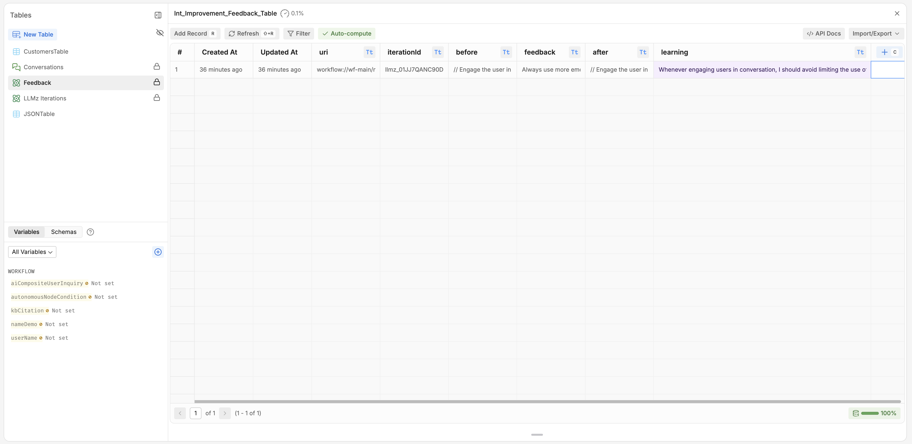

<Warning>
Early Beta

The Improvement integration is in beta and shouldn't be used in production or critical Workflows. We encourage testing in non-production environments and welcome your feedback to improve its stability and functionality.

Each stored iteration uses your Workspace's Table Rows quota, and may demonstrate increased usage.
</Warning>

## Install

Start by installing the [Improvement integration](https://studio.botpress.cloud/home?exploreHub=1&hubItemId=intver_01JTPD08AXCWVWBCTJQSPGBSB1&search=Conversation+Analyzer) from the integration hub.

## Store Iterations

After installing the integration, all of the iterations produced by LLMz via an Autonomous Node will be stored in the automatically-created "LLMz iterations" Table. Iterations are produced at the message level, meaning a single conversation will typically have multiple iterations.

This table is automatically populated every time an iteration ends. Each iteration takes up its own record, and stores specific data like the conversation or event ID, along with the iteration itself.

## Provide Feedback

Once you've installed the Improvement integration, you can access the "Improvement" window through the "Views" button on the top-right corner of the Studio.

You can access the Improvements UI from this menu.

The Improvements UI shows all of your bot's conversations, along with each individual LLMz iteration. This iteration is the code your bot generated to take an action and/or respond to the user.

Hovering over a specific iteration will let you access the Feedback window, in which you can suggest improvements to future iterations of similar tasks.

Clicking "Re-generate" will produce a new iteration for your review. Once you're satisfied with the new iteration, clicking "Save" will store this to your bot's "Feedback" Table.

Your bot uses the information stored in its "Feedback" Table to inform future LLMz iterations.

