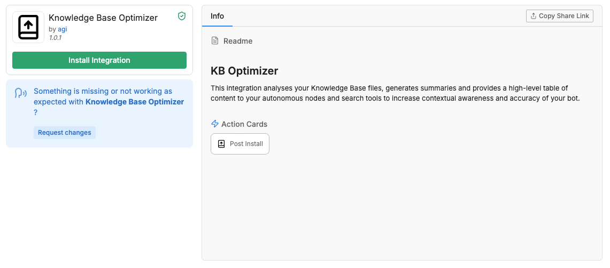
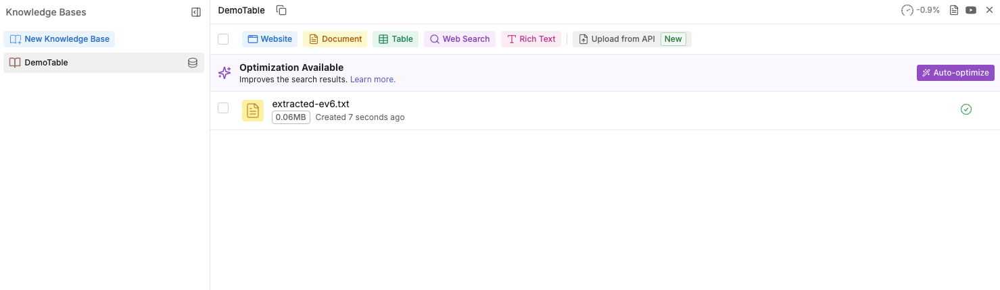
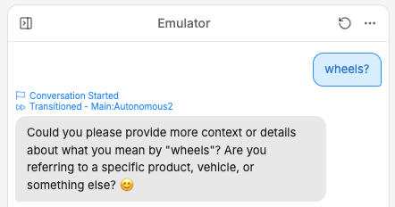
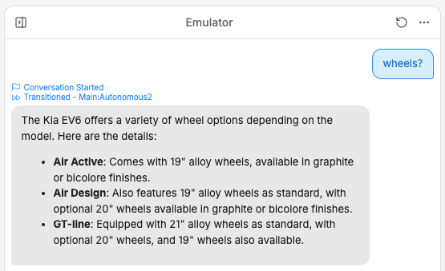

<Warning>
Early Beta

The Knowledge Base Optimization feature is in beta and should not be used in production or critical workflows. We encourage testing in non-production environments and welcome your feedback to improve its stability and functionality.

While in early beta, optimization is a manual process.

Each optimization can cost up to 2x the total number of tokens present in each document and consumes a portion of your [AI Spend quota](/learn/get-started/dashboard/workspace/usage).

Optimization uses your default "Best Model", configured through your LLM settings in the Studio.
</Warning>

You can use the Knowledge Base Optimization feature to improve your bot's ability to respond to questions with information contained in your knowledge base.

# How to use

## Install

Start by installing the [Knowledge Base Optimizer integration](https://studio.botpress.cloud/home?exploreHub=1&hubItemId=intver_01JSPMN283VH8Y25171DMMGYGS&search=Knowledge+Base+Optimizer) from the integration hub.

## Optimize

After installing the integration, you can use the "Auto-optimize" feature that now appears on your knowledge bases.

Optimizing improves your bot's ability to respond to queries with the information contained in your knowledge bases.

## Test

### Before optimizing

In the example below, the bot is unable to parse the user's question, and does not understand that the user is trying to query the information contained in the knowledge base.

### After optimizing

After optimizing the same example, the bot is able to take the same input and recognize that it is being asked a question that pertains to the information contained in its knowledge base.

