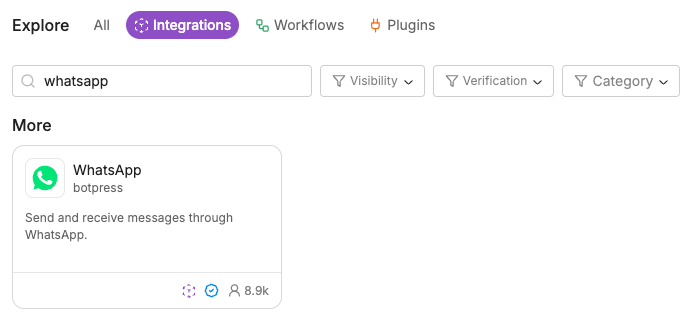
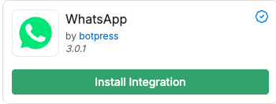
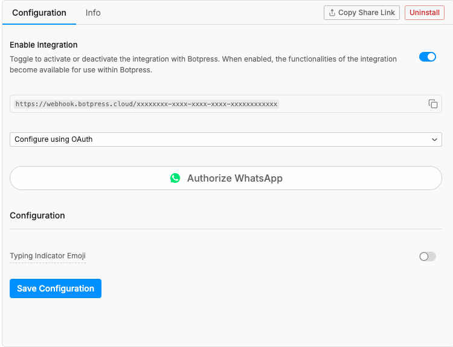

Botpress Hub is a **marketplace for integrations**. You can browse the Hub to find:

- Pre-built integrations by Botpress
- Third-party integrations
- Useful Workflows and plugins for your bot

<Note>
    Want to build your own integration and publish it on Botpress Hub? Check out the [For Developers](/integrations/sdk/overview) section.
</Note>

## Access Botpress Hub

To access Botpress Hub, select <Icon icon="boxes"/> **Explore Hub** in the upper-right corner of the [Studio](/studio/introduction).
## Install an integration

Use the search bar or filters to find an integration:

Then, select **Install Integration** to install it to your bot:

## Configure your integration

After installing an integration, you usually need to configure it before you can start using it:

The exact configuration steps will vary depending on which integration you're trying to setup.
