import { integrationVersions } from '/snippets/integrations/versions.mdx'

*Version: {integrationVersions.gsheets}*

The Google Sheets Integration for Botpress enables your bot to access and update Google Sheets data in real-time, automating tasks like CRM updates, inventory management, and survey tracking directly within chat.

## Setting up Google Cloud

**Register Cloud Project**

1. First, you need to access: [https://console.developers.google.com/](https://console.developers.google.com/)
2. Log in with your Google account
3. Next to the Google logo, click on the dropdown list


In this image, the name is listed as Botpress Google Sheet because it's an integration that was already set up previously.

4. After clicking on the dropdown list in the image, a modal will open, and you should click on **New Project**

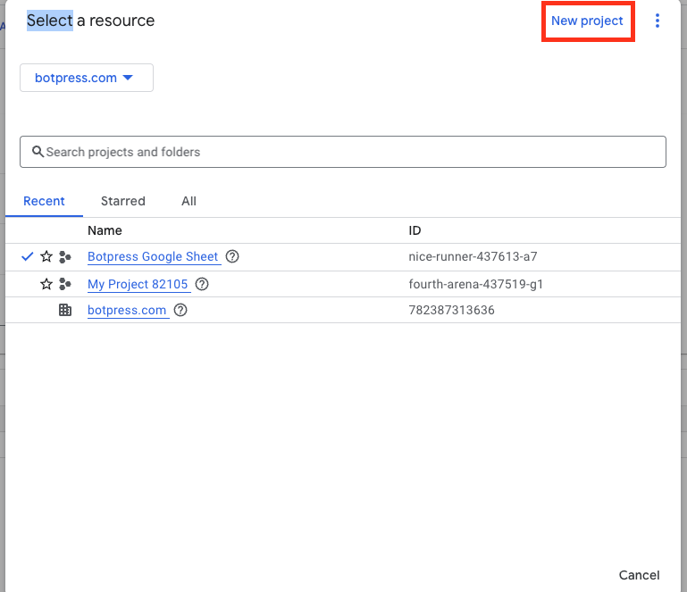

5. You will need to enter your project information such as:
  * Project name
  * Organization
  * Location

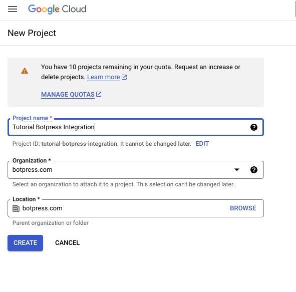

In this case, the name of my project is Tutorial Botpress Integration, but feel free to choose your own name.

6. Then click on the create button
7. To make sure you are in the correct project, check the project name next to the Google logo

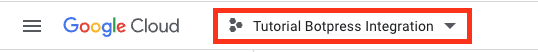

**Create Project Credentials**

8. The next step is to click on Menu → API & Services → Credentials

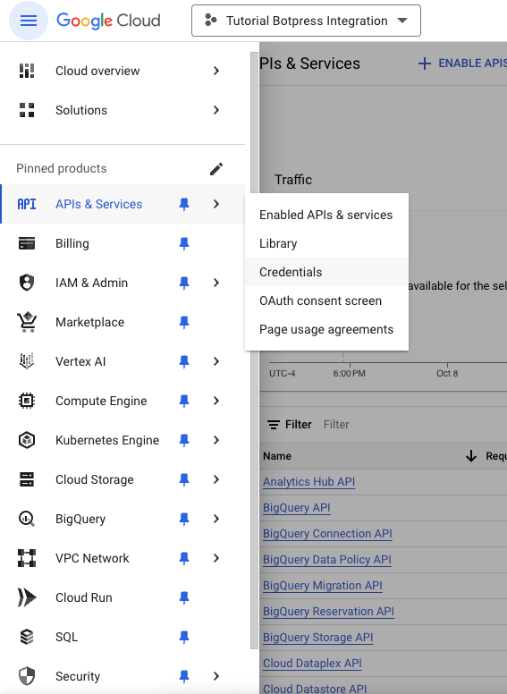

9. Click on Create Credentials → API Key to create an API key

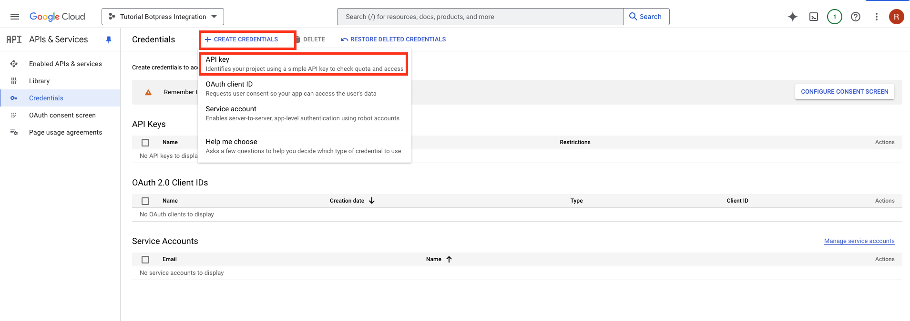

**Enable Google Sheet API**

10. The next step is to click on library and in the screen that opens, search for Sheet and enable the Google Sheet API

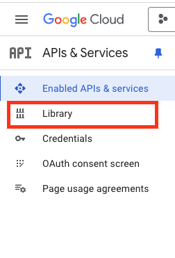

<br />

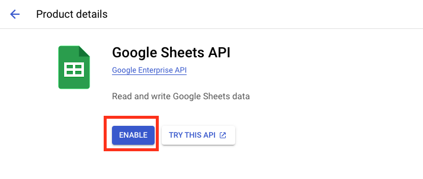

**Register Service Account**

11. The next step is to create a Service Account

12. Still in the Menu → API & Services → Credentials

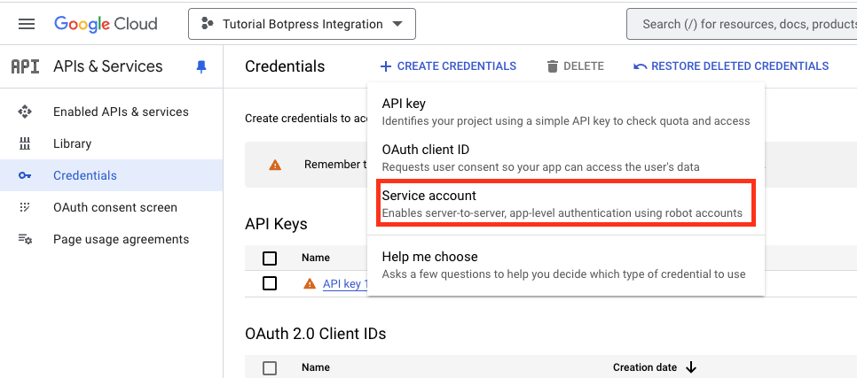

13. Fill in the information. When the service account name is filled, the Service Account ID will be automatically generated

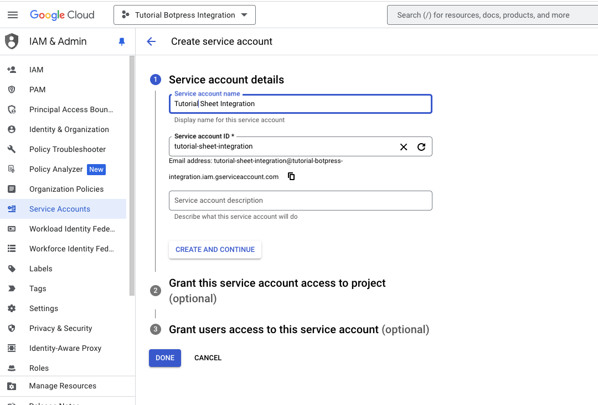

14. The other fields are optional and don't need to be filled in, so after defining the Service Account Name, just click on **Done**

**Create and Download JSON Key**

15. After the Service Account is created, you should go to the KEYS tab

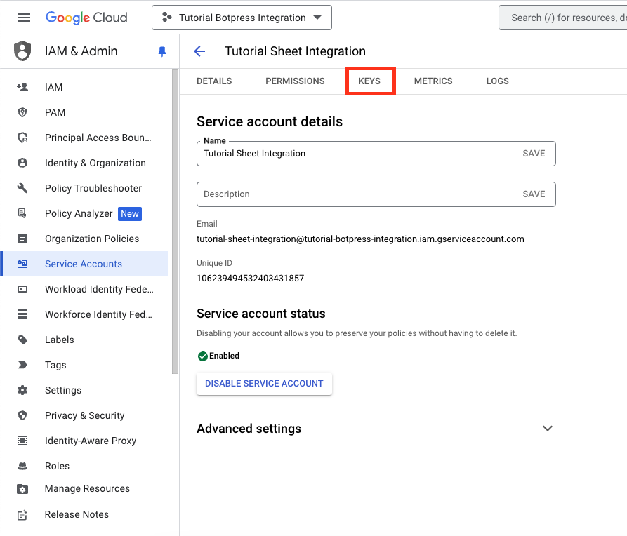

16. You will need to create a Key, for this click on Add Key → Create new key

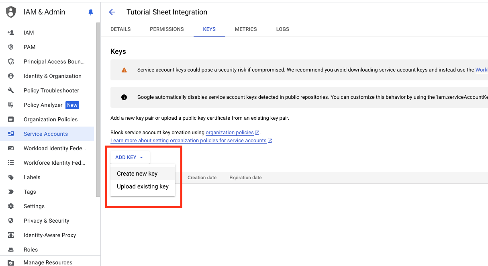

17. A modal will open where you will select JSON → Create

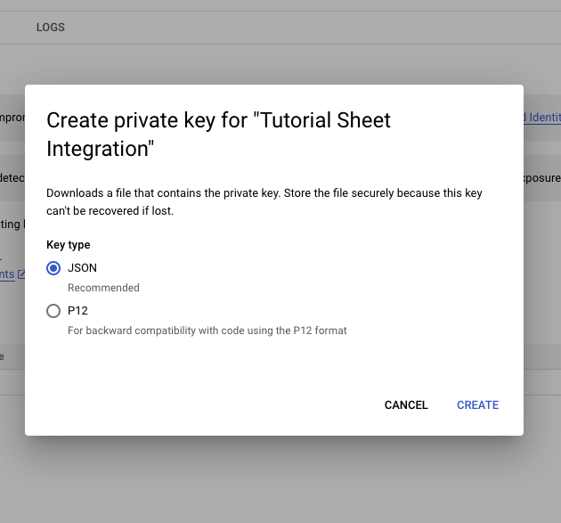

A JSON file will be downloaded to your machine and we will use this information in our integration with the Botpress bot

Your JSON should look like this, in this case I omitted the values because it's sensitive information:

```jsx
{
  "type": "",
  "project_id": "",
  "private_key_id": "",
  "private_key": "",
  "client_email": "",
  "client_id": "",
  "auth_uri": "",
  "token_uri": "",
  "auth_provider_x509_cert_url": "",
  "client_x509_cert_url": "",
  "universe_domain": ""
}
```

18. With the configurations in the Google Console done, now we need to share the Sheet that the bot will view. To do this, you should:

- Open the JSON that was downloaded, you can use any text editor for this
- Copy the client\_email
- Use this email as a way of sharing, as this will be the email that the bot will need and will use to connect to your spreadsheet

## Setting up Sheet

19. To share your spreadsheet in Google Sheet:
  * In the upper right corner you will see this image and click on it

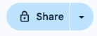

20. You should change the access and set it to allow anyone with the link

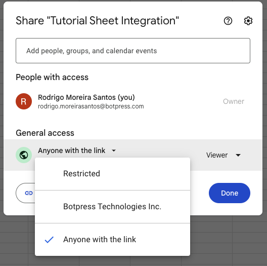

21. And add the email generated by your JSON as if you were inviting the bot to have access to your spreadsheet

Now it's time to configure the integration in Botpress Studio

22. In your Studio, activate the integration with Google Sheet

## Setting up Botpress Studio

23. Complete the required information in your Botpress Studio:

* SpreadSheetID: This will be the id of your Sheet and to find the ID you should go to your Sheet and copy only the ID that your spreadsheet uses as shown in the image below

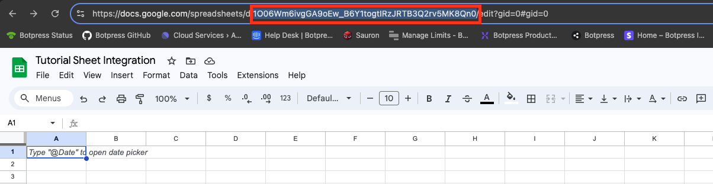

It’s important to remember to copy only the ID and not the entire URL.

* Private Key: This will be the value generated in your JSON file where the parameter name will be private\_key. Important note: you should copy everything that's in the line for this value except the quotation marks ""

* Client Email: This will be the value generated in your JSON file where the parameter name will be client\_email

* Now in your Botpress Studio

* Select the integration tab as shown in the image below

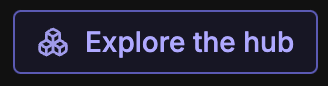

* Search for Sheet and install the integration

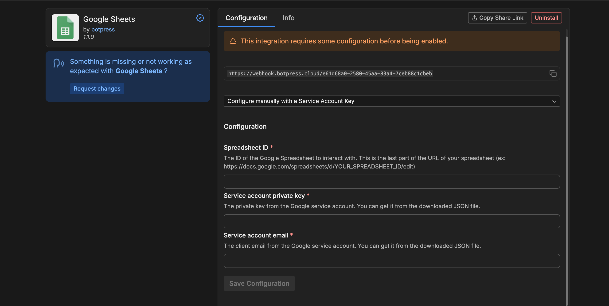

* Private Key: This will be the value generated in your JSON file where the parameter name will be private\_key. Important note: you should copy everything that's in the line for this value except the quotation marks ""

* Client Email: This will be the value generated in your JSON file where the parameter name will be client\_email

After everything is done, just save the settings and your bot is integrated with Google Sheet

<Check>
Done!

You can now use Botpress with Google Sheet.
</Check>
