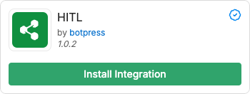
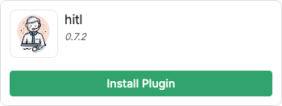
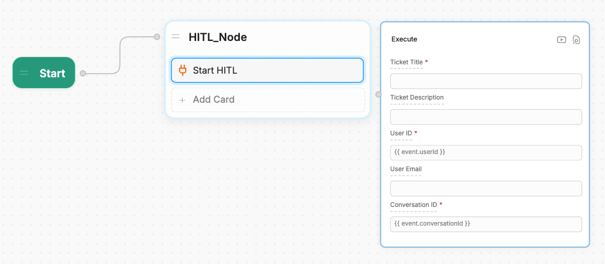
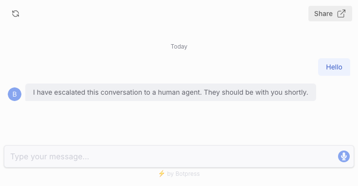
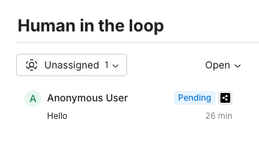
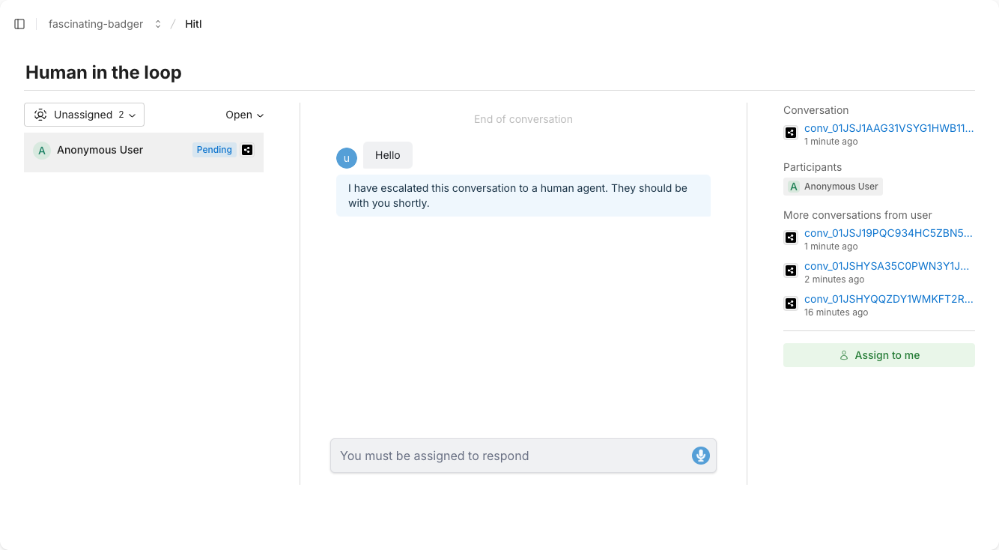
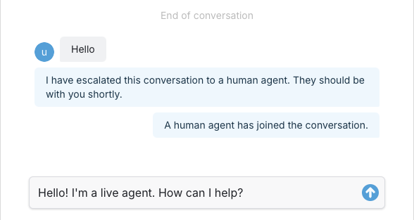

{/* vale off */}

import integrationVersions from '/snippets/integrations/versions.mdx'
import { OpenInHub } from '/snippets/integrations/open-in-hub.jsx'
import Cards from '/snippets/integrations/cards/botpress/hitl.mdx'
import Triggers from '/snippets/integrations/triggers/botpress/hitl.mdx'

{/* vale on */}

<OpenInHub integration={integrationVersions.hitl}/>

The Human-in-the-Loop (HITL) integration brings human oversight and intervention into AI-driven Workflows. It allows members of your Workspace to:

- Chat directly with users
- Approve AI-generated outputs before they're sent
- Handle complex or sensitive scenarios

## Setup

<Info>
  You will need:

  - A [Botpress Plus plan](https://botpress.com/pricing) or higher
</Info>

<Steps titleSize='h3'>
  <Step title="Install the HITL integration to your bot">

    First, install the official HITL integration. This will allow you to respond to users directly within Botpress.

    1. In the Studio, select **Explore Hub** in the upper-right corner.
    2. Search for the HITL integration. Select it, then select **Install Integration**:

    

  </Step>
  <Step title="Install the HITL plugin">

    Next, install the official HITL plugin. This will allow you to start HITL from any point in your Workflow.

    1. Navigate back to Botpress Hub and search for the HITL plugin.
    2. Select it, then select **Install Plugin**:

    

    3. In the **Configuration** menu, open the dropdown under **HITL integration**.

    <Note>
      This dropdown will display all HITL-compatible integrations you've installed. Since this is a guide to the official Botpress HITL integration, we'll select that one for now.
    </Note>

    4. Select **HITL**.
    5. Scroll down and select **Save**.

    <Tip>
      The **Configuration** section contains many optional fields. You can use these to customize your HITL experience.
    </Tip>

  </Step>
  <Step title="Add the Start HITL card to your Workflow">

    Now, you can bring a live agent into the conversation anywhere in your Workflow:

    1. Open a Workflow in Studio and create (or select) a Node.
    2. Add the **Start HITL** Card:

    

    3. Fill in the required fields:

    | Fields              | Description
    | :----------------- | :---------- |
    | **Ticket Title**    | The name of the ticket created for the live agent.                                                                 |
    | **User ID**         | The user ID associated with the ticket. Enter the `{{event.userId}}` variable to use the current user's ID.       |
    | **Conversation ID** | The conversation ID associated with the ticket. Enter the `{{event.conversationId}}` variable to use the current conversation's ID. |

  </Step>
</Steps>

<Check>
  Done! HITL will begin whenever the **Start HITL** card executes.
</Check>

## Respond to users

Now that you've set up HITL, you can assign someone in your Workspace to respond to users.

<Note>

  This guide shows you how respond to users with the official Botpress HITL integration. However, you can also use a compatible third-party integration like [Zendesk](./zendesk).

</Note>

<Steps titleSize='h3'>
  <Step title="Publish and test your bot">

    First, let's simulate a user escalation.

    <Warning>
      HITL won't work in the Emulator—you'll need to test it using Webchat.
    </Warning>

    1. Publish your bot and open the Webchat preview window.
    2. Chat with your bot until it begins HITL:

    
  </Step>
  <Step title="Assign the conversation">
    1. Navigate to your Dashboard, then select **Human-in-the-loop** under your bot's navigation bar.
    2. Select the conversation you just started:

      

    This will open the conversation with the user. From here, you can either assign the conversation to yourself or to another member in your Workspace.

    3. Try assigning the conversation to yourself. Select **Assign to me**:

    

    Now you can chat directly with the user:

    

  </Step>
</Steps>

<Check>
  Done! Now you can chat with your users directly using HITL.
</Check>

## Key Features

There are many advantages to incorporating HITL in your Workflow:

<AccordionGroup>
  <Accordion
    title="Real-Time Escalation"
  >
    The HITL Agent can seamlessly transfer conversations to a human agent when predefined conditions are met. This allows for immediate intervention in cases where the AI model detects uncertainty, user frustration, or when a high-stakes decision is required.
  </Accordion>
  <Accordion
    title="Decision Gates"
  >
    Incorporate human decision points into Workflows, allowing for human review and approval of AI-generated outputs before final actions are taken. This ensures compliance with business rules and reduces the risk of errors in critical processes.
  </Accordion>
  <Accordion
    title="Audit Trail and Logging"
  >
    The HITL Agent maintains a detailed record of all human interventions, providing transparency and accountability. This feature is essential for industries requiring regulatory compliance or quality assurance, allowing teams to review the history of human interactions with the AI.
  </Accordion>
  <Accordion
    title="Customizable Triggers"
  >
    Users can define specific triggers for human intervention based on various criteria, such as conversation sentiment, keyword detection, or task complexity. This ensures that human involvement is precisely targeted where it adds the most value.
  </Accordion>
</AccordionGroup>

---

## Cards

<Cards />

---

## Triggers

<Triggers />
