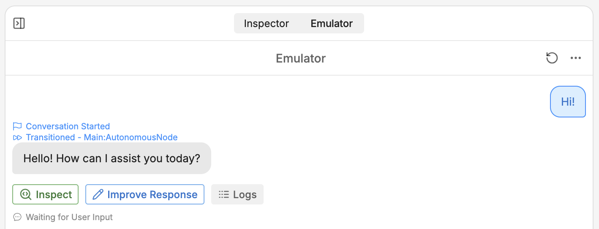
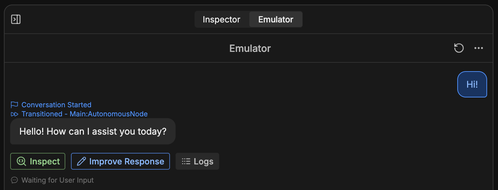
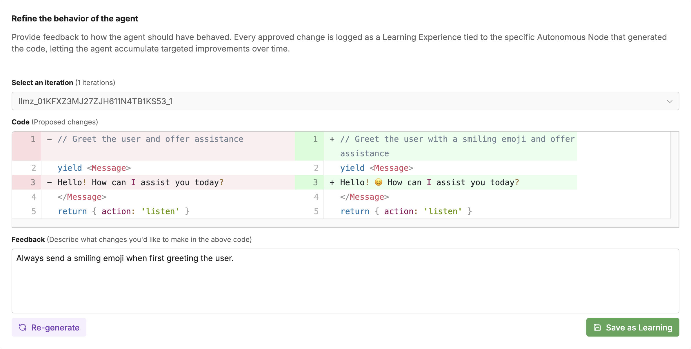
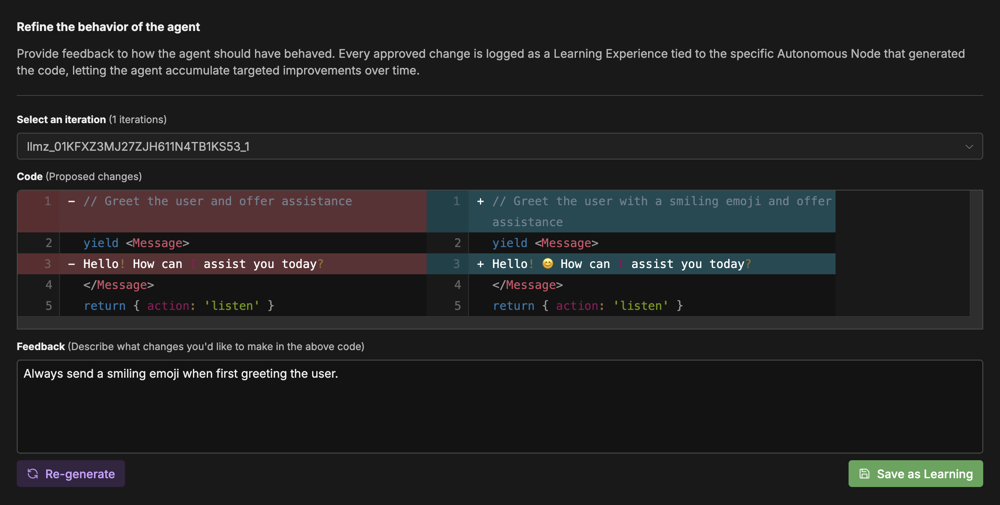
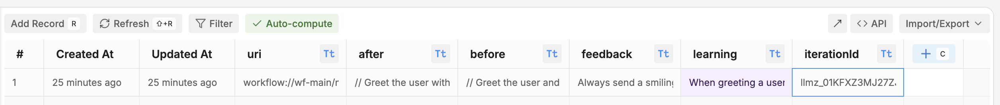
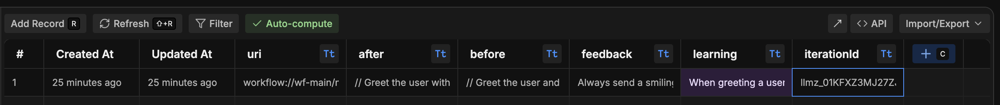

The official Improvement integration lets you provide feedback on your bot's responses in the [emulator](/studio/concepts/emulator). Your bot can then use that feedback when generating future responses.

## Setup

The Improvement integration comes pre-installed on every bot. If you need to install it manually:

<Info>
  You will need:

  - A [published bot](/get-started/quick-start)
</Info>

<Steps>
  <Step>In Botpress Studio, select **Explore Hub** in the upper-right corner.</Step>
  <Step>Search for the **Improvement** integration, then select **Install Integration**.</Step>
  <Step>In the **Configuration** menu, select **Save Configuration**.</Step>
</Steps>

## Suggesting improvements

You can suggest improvements when chatting with your bot in the emulator:

<Steps>
  <Step>
    Select <Icon icon="pencil"/> **Improve Response** on any message:

    <Frame>
      
      
    </Frame>
  </Step>

  <Step>
    Enter your feedback and select <Icon icon="refresh-ccw"/ > **Re-generate**., This will show you a preview of an updated response based on your feedback:

    <Frame>
      
      
    </Frame>

    The **Code** section shows you exactly how your bot's execution will be different after the feedback is applied.
  </Step>
  <Step>
    If you're happy with the updated response, select <Icon icon="save"/> **Save as learning**.
  </Step>
</Steps>

## Managing feedback

Any time you save feedback, it gets added to the **Feedback** [Table](/studio/concepts/tables) as a row:

<Frame>
  
  
</Frame>

Your bot reads directly from this table when applying your feedback. This means you can modify the table's rows and columns to modify how feedback is applied.

You can also delete a specific piece of feedback by deleting its associated table row.
