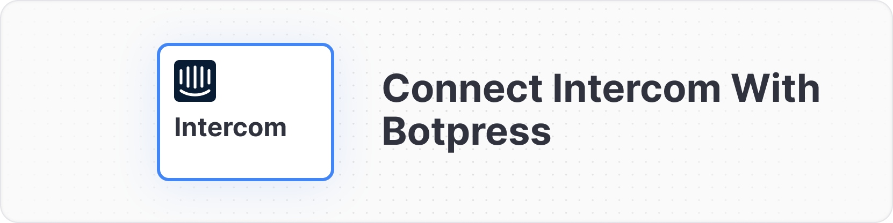
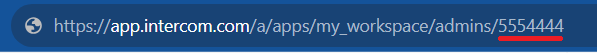

# Introduction

Intercom is a Conversational Relationship Platform (CRP) that helps businesses build better customer relationships through personalized, messenger-based experiences across the customer journey. By integrating it with Botpress you can leverage AI to automate your customer support and sales processes.

# Prerequisites

* An [Intercom account](https://www.intercom.com/)
* Administrator or Developer access to a Intercom workspace

# Setting up the Intercom integration in Botpress

1. Go to the [Integration Hub](https://app.botpress.cloud/hub) in Botpress Cloud (if you don't have the integration installed yet).
2. Find and open the Intercom integration then click on the "Install to Bot" button, now go back to your bot settings.

The Intercom integration has the following settings:

* **Enabled**: Whether Botpress will communicate with Intercom
* **Webhook URL**: The URL for receiving data in Botpress
* **Access Token**: The access token for the Intercom app
* **Admin Id**: The admin id for the Intercom app

# Setting up Intercom

<Info>
Info

In this tutorial we are going to be using a standard production workspace, but you can also create a [Test workspace](https://www.intercom.com/help/en/articles/188-create-a-test-workspace-in-intercom) to test the integration before deploying it to production.

To do that, open the Settings of a production workspace, go to the General settings tab and look for the "Enable a test workspace" and click "Save". Now you just need to use this workspace in the steps below.

After verifying that the integration works, you will need to repeat the steps below using the production workspace! Don't create the app again, just go to the app settings (Test and publish > Your workspaces) and install it to the production workspace.
</Info>

## Creating an App

In order to communicate with Botpress, you need to create a developer app in Intercom.

1. Go to the [Developer Hub](https://developers.intercom.com/) in Intercom then click "Your Apps"
2. Click "New App", give it a name like `Botpress connector`, then select the desired workspace and click "Create App"
3. You will be redirected to the app's Authentication settings page. Copy the Access Token and paste it in the Botpress integration settings.

## Getting the Admin Id

1. Open Intercom and hover over your avatar in the bottom left corner, then click your avatar again to see your profile
2. Copy the last number in the URL (as shown below), this is your Admin Id. Paste it in the Botpress integration settings



## Setting up the Webhook

1. Copy the Webhook URL provided in the Botpress integration settings
2. Go back to the Intercom app settings and open the "Webhooks" tab
3. Paste the URL in the "Endpoint URL" section
4. Click the "Select a topic" dropdown under the "Topics" section, a list is going to show up
5. Search for `user` and and click the options `conversation.user.created` and `conversation.user.replied`. Now exit the list and a "Topic" section should appear with the selected topics. Click "Save" to finalize the webhook configuration

## Adding a Default conversation Assignee

1. Go back to the Intercom app settings and open the "Inbox" tab
2. Click "Inbox settings" then "Workload management"
3. In the "Default assignee" section select yourself or another user to receive the conversations from the bot (it needs to be the same user as the Admin Id)

[For more information](https://www.intercom.com/help/en/articles/6561699-assign-conversations-to-teammates-and-teams)

## Finalizing the configuration

Now you just need to **Enable** the integration in the Botpress settings and click "Save configuration".

That's it, you may now start chatting with your bot on Intercom!

## Extra

### Get User Email:

#### Access the user’s email from the event object:

`event.tags.user['intercom:email']`

#### Fetch User Profile Information:

Using the user email, you can retrieve detailed profile information from Intercom:

```ts
const email = event.tags.user['intercom:email'];
await axios.post('https://api.intercom.io/contacts/search', {
    query: {
      field: 'email',
      operator: '=',
      value: email
    }
  }, {
    headers: {
      Authorization: `Bearer $\{intercomToken}`
    }
  })
  .then((response) => {
    response.data.data.forEach((key) => {
      //Contact details
    });
  });
```

#### Unassign a Conversation:

To unassign a conversation in Intercom (i.e., make it "unassigned"):

```ts
const intercomApiUrl = `https://api.intercom.io/conversations/${intercomConvoId}/parts`;

const headers = {
  Authorization: `Bearer ${intercomApiToken}`,
  'Content-Type': 'application/json'
};

await axios.post(
  intercomApiUrl,   {
    admin_id: adminId,
    type: 'admin',
    assignee_id: '0',
    message_type: 'assignment'
  },
  { headers }
);
```
