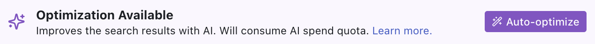
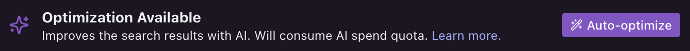

The official Knowledge Base Optimizer integration improves your bot's ability to respond to questions using information contained in your Knowledge Base.

## Setup

<Info>
  You will need:

  - A [published bot](/get-started/quick-start)
</Info>

<Steps>
  <Step>In Botpress Studio, select **Explore Hub** in the upper-right corner.</Step>
  <Step>Search for the **Knowledge Base Optimizer** integration, then select **Install Integration**.</Step>
  <Step>In the **Configuration** menu, select **Save Configuration**.</Step>
</Steps>

## Optimize

Now you can select <Icon icon="wand-sparkles"/> **Auto-optimize** on any of your Knowledge Bases:

<Frame>
  
  
</Frame>

This improves your bot's ability to respond to queries with the information contained in your Knowledge Bases.

## How it works

The Knowledge Base Optimizer analyzes each document in your Knowledge Base with AI. It then automatically generates smart summaries for every file and creates an overall summary for the entire Knowledge Base.

When your bot gets a question, it uses these summaries—along with the full content—to quickly find and deliver more relevant, accurate answers from your Knowledge Base.
