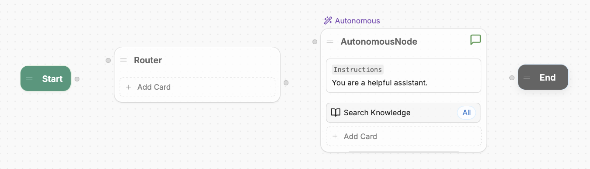
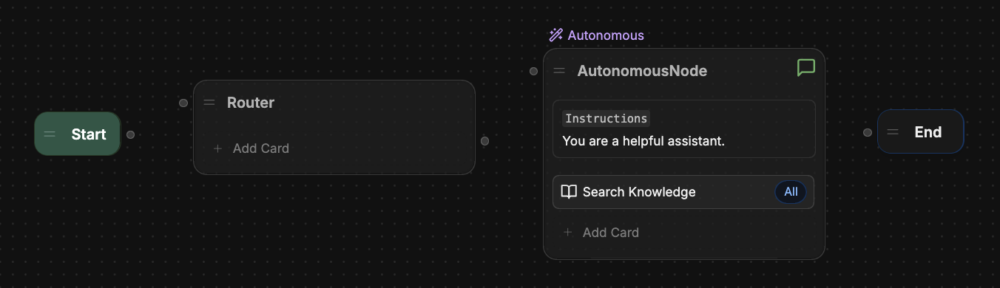
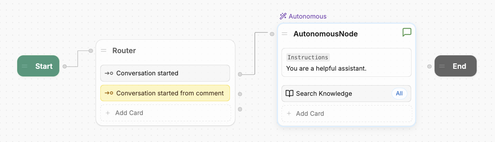
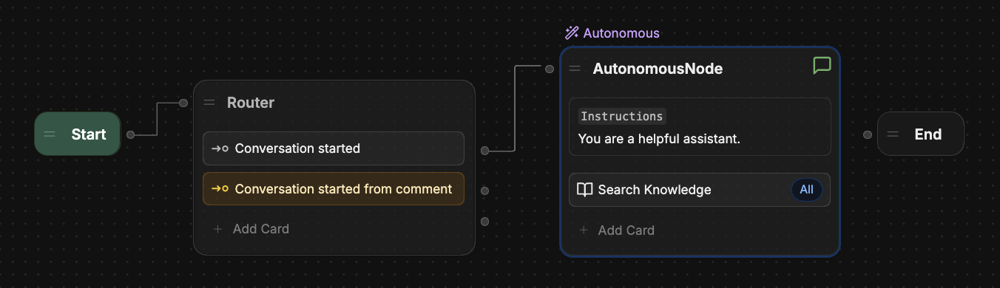
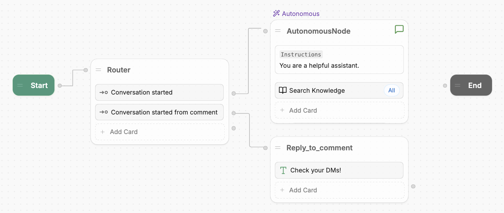
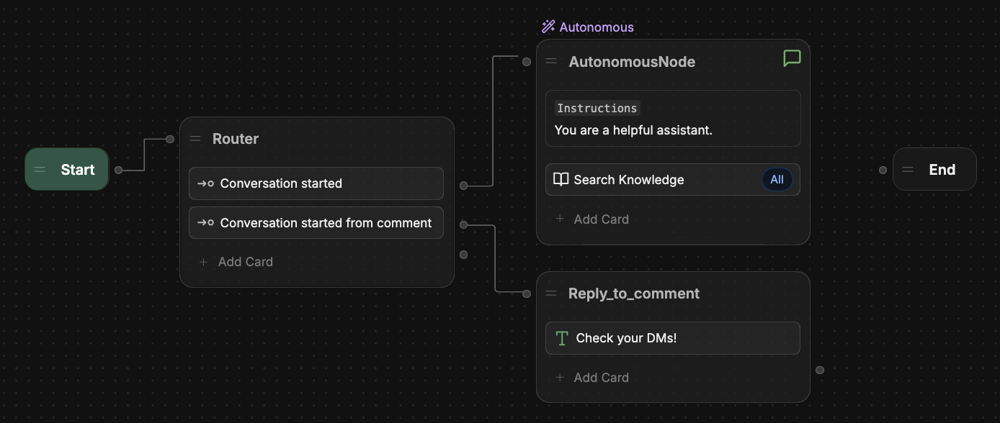
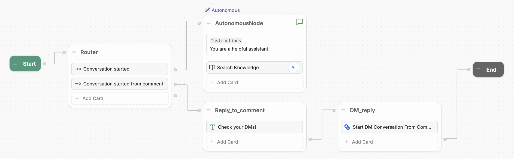
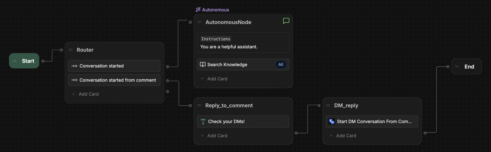

import { AiIcon } from '/snippets/ai-icon.jsx'

{/* vale off */}

import integrationVersions from '/snippets/integrations/versions.mdx'
import { OpenInHub } from '/snippets/integrations/open-in-hub.jsx'
import Cards from '/snippets/integrations/cards/botpress/messenger.mdx'

<OpenInHub integration={integrationVersions.messenger}/>

{/* vale on */}

The official Messenger and Facebook integration allows users to chat with your bot by messaging a Facebook page.

## Setup

<Tabs>
  <Tab title="Basic configuration">

  <Info>
    You will need:

    - A [published bot](/get-started/quick-start)
    - A [Facebook page](https://www.facebook.com/pages/create/)
  </Info>

  1. In Botpress Studio, select **<Icon icon="boxes"/> Explore Hub** in the upper-right corner.
  2. Search for the **Messenger** integration, then select **Install Integration**.
  3. In the **Configuration** menu, select **Authorize Messenger**.
  4. Follow the instructions to connect Botpress to your Messenger account.

  </Tab>
  <Tab title="Manual configuration">
    For advanced use cases, you can use your own Meta app with our integration.

    <Info>
      You will need:

      - A [published bot](/get-started/quick-start)
      - A [Facebook page](https://www.facebook.com/pages/create/)
      - A [Meta developer app](https://developers.facebook.com/apps/creation/). Check out the [Meta developer documentation](https://developers.facebook.com/docs/development/create-an-app) to learn more about the setup process.
    </Info>

    ### Get your Meta app ready

    Before setting up the integration in Botpress, you need to get your Meta app ready:

      <Steps>
        <Step title="Add the Messenger API">
          To configure your integration, you need to access the Messenger API:

          1. Log in to your [Meta developer account](https://developers.facebook.com/apps/).
          2. Select the app you want to use with the integration.
          3. Scroll to **Add products to your app**.
          4. Under the **Messenger** section, select **Set up**.
        </Step>
        <Step title="Add your Facebook page">
          To add your Facebook page to the Messenger API configuration:

          1. In your Meta app's left sidebar, go to **Messenger > Messenger API Settings**.
          2. Scroll to **Generate access tokens**, then select **Connect**.
          3. Follow the on-screen instructions to add your Facebook page.
        </Step>
        <Step title="Check your API version">
          Next, check that your API version is 15.0 or higher:

          1. In your Meta app's left sidebar, go to **App settings > Advanced**.
          2. In the **Upgrade API version** section, make sure the version is 15.0 or higher.
          3. If you updated the version, select **Save changes** in the bottom-right corner.
        </Step>
      </Steps>

    ### Set up the integration in Botpress

    [Once your Meta app is ready](#get-your-meta-app-ready), you can set up the integration in Botpress:

    <Steps>
      <Step title="Install the integration">

          1. In Botpress Studio, select **<Icon icon="boxes"/> Explore Hub** in the upper-right corner.
          2. Search for the **Messenger and Facebook** integration, then select **Install Integration**.
          3. In the **Configuration** menu, select the drop-down menu, then select **Configure by manually supplying the Meta app details**.

        </Step>
        <Step title="Configure the integration">
          To configure the integration, you need to create a webhook endpoint for the Messenger integration. To do this, fill in the integration's configuration fields using information from your Meta app:

          <AccordionGroup>
            <Accordion
              title="Client ID"
            >
              To get your Meta app's client ID:

              1. In your Meta app's left sidebar, go to **App settings > Basic**.
              2. Copy the **App ID**, then paste it in the **Client ID** field in Botpress.
            </Accordion>
            <Accordion
              title="Client Secret (Optional)"
            >

              <Note>
                The client secret is used to check the webhook's signature. You can leave this field empty to disable signature check.
              </Note>

              To get your Meta app's client secret:

              1. In your Meta app's left sidebar, go to **App settings > Basic**.
              2. Copy the **App secret**, then paste it in the **Client Secret** field in Botpress.
            </Accordion>
            <Accordion
              title="Verify Token"
            >
              Used by Meta to verify that you’re the real owner of the provided webhook. Can be any alphanumeric string.
            </Accordion>
            <Accordion
              title="Access Token"
            >
              To get your Meta app's access token:

              1. In your Meta app's left sidebar, go to **Messenger > Messenger API Settings**.
              2. Scroll to **Generate access tokens**, then find your Facebook page.
              3. Select **Generate**, then copy the token.
              4. Paste it into the **Access Token** field in Botpress.
            </Accordion>
            <Accordion
              title="Page ID"
            >
              To get your Meta app's page ID:

              1. In your Meta app's left sidebar, go to **Messenger > Messenger API Settings**.
              2. Scroll to **Generate access tokens**, then find your Facebook page.
              3. Copy the number under your page's name, then paste it into the **Page ID** field in Botpress.
            </Accordion>
          </AccordionGroup>

          When you’ve filled in all the fields, select **Save Configuration**. This will automatically enable your integration.
        </Step>
    </Steps>

    ### Finalize the integration

    Now that your Botpress webhook endpoint is ready, you can add it to your Meta app:

    <Steps>
    <Step title="Get the webhook URL and Verify Token">
      In Botpress, copy:
        - The integration's webhook URL. It should start with `https://webhook.botpress.cloud/`
        - The **Verify Token** you created
      </Step>
      <Step title="Configure the webhook in Meta">
        1. Go back to your Meta app. In the left sidebar, go to **Messenger > Messenger API Settings**.
        2. Scroll to **Configure webhooks**
        3. Paste:
            - Your webhook URL into the **Callback URL** field.
            - Your **Verify Token** into the **Verify token** field.
        4. Select **Verify and save**.

        <Note>
          Make sure you saved your integration's configuration after [configuring it in Botpress](#set-up-the-integration-in-botpress)—otherwise, the webhook validation will fail.
        </Note>
      </Step>
      <Step title="Subscribe to webhook fields">
        Under **Webhook fields**, subscribe to:

        - `messages`
        - `messaging_postbacks`
        - `feed`
      </Step>
    </Steps>

    ### Submit app for review

    The integration is configured, but will only work for admins, developers, and testers. To make it available for public use, make sure you [submit it for review by Meta](https://developers.facebook.com/docs/resp-plat-initiatives/individual-processes/app-review/submission-guide).

    <Check>
      You've manually configured your Messenger integration.
    </Check>

  </Tab>
  <Tab title="Playground">
    If you want to test your bot's behaviour in Messenger before going through the actual setup process, you can use the Messenger integration playground.

    <Info>
      You will need:

      - A [published bot](/get-started/quick-start)
      - A [Facebook account](https://www.facebook.com/r.php?entry_point=login)
    </Info>

    1. In Botpress Studio, select **<Icon icon="boxes"/> Explore Hub** in the upper-right corner.
    2. Search for the **Messenger** integration, then select **Install Integration**.
    3. Select **Test your agent on Messenger**.
    4. Follow the instructions to set up the playground.
  </Tab>
</Tabs>

---

## Options

The Messenger integration's **Configuration** menu offers a few additional options:

### Get user profile

When this option is enabled (default), the integration will update the Botpress user's name and picture URL with data from Messenger.

<Note>
  This option is only available with [manual configuration](#manual-configuration).
</Note>

### Download media

When enabled, this option automatically downloads media files using the [Files API](/api-reference/files-api/getting-started). When disabled, media files are displayed using their Messenger media URL.

### Downloaded media expiry

Expiry time (in hours) for downloaded media files. An expiry time of 0 means the files will never expire. Defaults to 24 hours.

---

## Replying to comments in DM

You can configure your bot to reply to user comments in a direct message (DM).

### Step 1: Check where the conversation started

First, add a router Node that checks whether the conversation originated from a user's comment.

<Steps>
  <Step>
    In Botpress Studio, enter your [Main Workflow](/studio/concepts/workflows#main).
  </Step>
  <Step>
    [Add a new Node](/studio/concepts/nodes/introduction#add-a-node) to the Workflow.
  </Step>
  <Step>
    Rename the Node to `Router`, then move it between the [Start Node](/studio/concepts/nodes/introduction) and any other existing Nodes:

    <Frame>
      
      
    </Frame>
  </Step>
  <Step>
    Add two [Expression Cards](/studio/concepts/cards/flow-logic#expression) to the `Router` Node.
  </Step>
  <Step>
    Open the second Expression Card's [inspector](/studio/concepts/cards/introduction#configure-a-card). Next to the **Condition** field, toggle <AiIcon /> to disable generative AI.
  </Step>
  <Step>
    Configure this Card for conversations started normally:

  - In the **Label** field, paste in: `Conversation started`
  - In the **Condition** field, paste in: `{{event.channel == 'channel'}}`
  </Step>
  <Step>
    Open the first Expression Card's [inspector](/studio/concepts/cards/introduction#configure-a-card). Next to the **Condition** field, toggle <AiIcon /> to disable generative AI.
  </Step>
  <Step>
    Configure this Card for conversations started from a comment reply:

  - In the **Label** field, paste in: `Conversation started from comment`
  - In the **Condition** field, paste in: `{{event.channel == 'commentReplies'}}`
  </Step>
  <Step>
    Attach the Start Node to the `Router` Node. Then, attach the `Conversation started` Expression Card to your regular conversation logic:

    <Frame>
      
      
    </Frame>
  </Step>
</Steps>

### Step 2: Reply to the user's comment

Next, add logic to reply to the user's comment. This lets them know that the bot will continue the conversation in a DM.

<Steps>
  <Step>
    Add a new Node to your Workflow and rename it to `Reply_to_comment`.
  </Step>
  <Step>
   Add a [Text Card](/studio/concepts/cards/send-messages#text) to the new Node.
  </Step>
  <Step>
    Open the Text Card's inspector.

    In the **Message to send** field, enter the message you want to reply to the user's comment. For example: `Check your DMs!`.
  </Step>
  <Step>
    Attach the `Conversation started from comment` Expression Card to the `Reply_to_comment` Node:

    <Frame>
      
      
    </Frame>
  </Step>
</Steps>


### Step 3: Start a DM conversation from the comment

Finally, add logic to start a DM conversation whenever a user leaves a comment.

<Steps>
  <Step>
    Add a new Node to your Workflow and rename it to `DM_reply`.
  </Step>
  <Step>
    Add the [Start DM Conversation from Comment](#start-dm-conversation-from-comment) Card to the new Node.
  </Step>
  <Step>
    Open the Start DM Conversation from Comment Card's inspector.

    - In the **Comment ID** field, paste in: `{{event.payload.commentId}}`
    - In the **Message** field, enter the first message you want to send the user in a DM. For example: `Hey! Received your comment.`

    <Note>
      If you want to send the user's original comment back to them, you can add `{{event.payload.text}}` to the **Message** field.
    </Note>
  </Step>
  <Step>
    Attach the `Reply_to_comment` Node to the `DM_reply` Node. Then, attach the `DM_reply` Node to the [End Node](/studio/concepts/nodes/introduction#end):

    <Frame>
      
      
    </Frame>
  </Step>
</Steps>

<Check>
  When a user comments on a post, your bot will now:

  - Reply to their comment, letting them know to check their DMs
  - Continue the conversation in a DM

  You can further modify your Workflow depending on your desired behaviour.
</Check>

---

## Cards

<Cards />

---

## Tags

You can read [event tags](/studio/guides/advanced/event-properties#param-tags) to get information about an active Messenger conversation:

### Message ID

To get the Messenger ID of a message:

```js
event.tags.message["messenger:id"]
```

### Recipient ID

To get the Messenger ID of the recipient:

```js
event.tags.message["messenger:recipientId"]
```

### Sender ID

To get the Messenger ID of the sender:

```js
event.tags.message["messenger:senderId"]
```

### Conversation ID

To get the Messenger ID of the conversation:

```js
event.tags.conversation["messenger:id"]
```

### User ID

To get the Messenger ID of the user:

```js
event.tags.user["messenger:id"]
```
