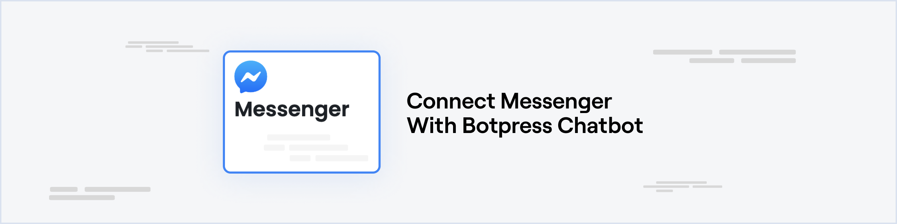

{/* vale off */}

import integrationVersions from '/snippets/integrations/versions.mdx'
import { OpenInHub } from '/snippets/integrations/open-in-hub.jsx'

<OpenInHub integration={integrationVersions.messenger}/>

import { YouTube } from '/snippets/youtube.mdx'

{/* vale on */}

 

<YouTube url="https://www.youtube.com/embed/pOIrLMpZZqc?si=98JjAEk6hnSEiKZ2" />

## Prerequisites

* A [Meta developer app](https://developers.facebook.com/apps/create/) that will serve as the primary platform for managing connection between Messenger and Botpress, including the configuration of webhooks and access tokens.
* A [Facebook page](https://www.facebook.com/pages/create/) that you own or has the developer role, this is needed to use the Messenger API.
* A [Botpress Cloud account](https://sso.botpress.cloud) and a [Botpress Bot](/learn/get-started/quick-start)

## Setting up the Messenger integration in Botpress

1. Go to the [Integration Hub](https://app.botpress.cloud/hub) in Botpress Cloud (if you don't have the integration installed yet).
2. Find and open the Messenger integration then click on the "Install to Bot" button, now go back to your bot settings.

The Messenger integration has the following settings:

* **Enabled**: Whether Botpress will communicate with Messenger
* **Webhook URL**: The URL for receiving data in Botpress
* **App ID**: The ID of your Meta App
* **App Secret**: The secret of your Meta App
* **Verify Token**: The token used to verify the webhook requests
* **Page ID**: The ID of your Facebook page
* **Access Token**: The access token used to send messages to the Messenger API

## Setting up Messenger

### Create a Facebook Page

If you don't already have a Facebook page, you'll need to [create one](https://www.facebook.com/pages/create/). To link your bot to a preexisting page, you must have an administrator or developer role.

### Messenger API version

Botpress can only interact with the version 15.0 or higher of the Messenger API. It isn't the default version in the app settings so it must be changed.

1. Go to your Meta app start page
2. In the left sidebar, expand the **Settings** menu and select **Advanced**
3. In the **Upgrade API version** section, select v15.0 or higher as the API version
4. Click on **Save changes**

### Add Messenger Product

Messenger isn't added by default in your Meta app, so it must be added manually

1. In the left sidebar, click on **Add Product**
2. In the Facebook Messenger section click **Set Up**

### App ID and Secret

1. In the left sidebar, expand the **Settings** menu and select **Basic**. Here you can find the App ID and App Secret
2. Click on the **Show** button in the **App Secret** text box. Copy the App ID and App Secret to your channel configuration

### Verify Token

The verify token is used by Facebook to verify that you are the real owner of the provided webhook

You can generate any random alphanumerical string for this configuration. Paste it in your **Verify Token** channel configuration

### Page ID and Access Token

1. In the left sidebar, expand the **Messenger** menu and select **Messenger API Settings**
2. In the **Access Tokens** section, click **Add or remove Pages** and add your Facebook page
3. Copy the number under your page name and paste it in your **Page ID** channel configuration
4. Click on **Generate token**. Copy this token and paste it in the **Access Token** channel configuration

### Save Configuration

Channel configuration is completed—you can now click **Save**. It's important to save your configuration in Botpress before updating the webhook in the Meta app settings; otherwise, Meta will be unable to validate the webhook URL.

## Webhook Configuration

To receive messages from Messenger in your Botpress bot, you will need to set up a webhook.

1. Go to your Meta app.
2. In the left sidebar, expand the **Messenger** menu and select **Messenger API Settings**
3. In the **Webhooks** section, click **Add Callback URL**
4. Copy paste the **Webhook URL** provided in the integration configuration page in Botpress.
5. Copy and paste the **Verify Token** that you generated earlier in the integration configuration page in Botpress.
6. Click on **Verify and save**. Make sure your channel configuration was saved before doing this step; otherwise, the webhook validation will fail
7. Click on **Add Subscriptions**, then select `messages` and `messaging_postbacks`. Then click **Save**.

You may now start chatting with your bot on Messenger!

<Note>
Note

If the bot doesn't answer to some people, that's probably because your app hasn't been reviewed by Meta yet (see [this section](/integrations/integration-guides/instagram#submit-your-app-for-meta-review)). But don't worry, this isn't mandatory to test your bot.
</Note>

## Submit your App for Meta Review

When your app is in Development Mode, your bot will work for admins, developers, and testers of the app only. After your app is approved and made public, it will work for the general public.

Read more about the App Review process on [the official documentation](https://developers.facebook.com/docs/app-review/submission-guide) and find some help if necessary [in this GitHub issue](https://github.com/microsoft/botframework-sdk/issues/1465).

You can find some troubleshooting [in this documentation](https://developers.facebook.com/docs/app-review/support/rejection-guides/messenger) in case you app get rejected.

## Send Greeting/Welcome Message

You can create a customized greeting from your Page that will appear in Facebook messages and in the Messenger app when someone begins a conversation with your Page for the first time. Your Page's greeting will appear before any messages are sent.

Read more about the [Messenger Greeting/Welcome Message](https://www.facebook.com/help/1698046970464236)
