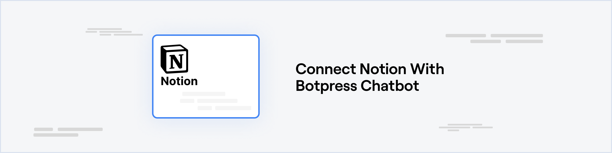
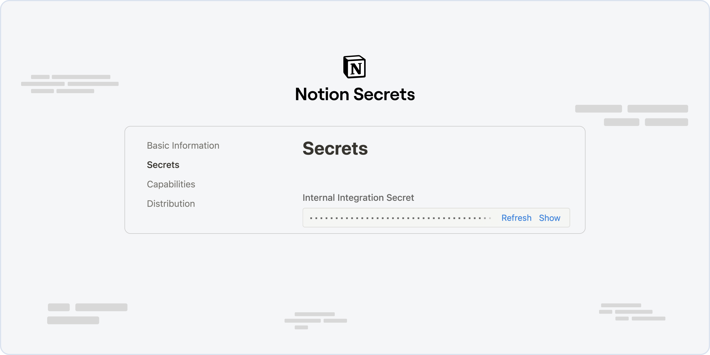
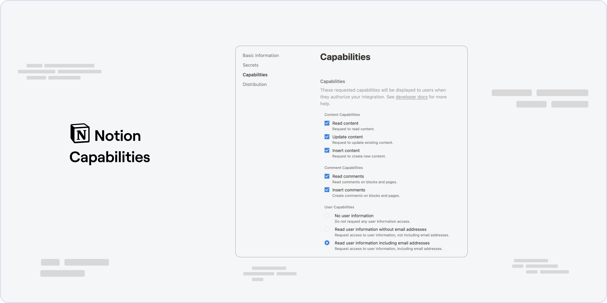

{/* vale off */}

import integrationVersions from '/snippets/integrations/versions.mdx'
import { OpenInHub } from '/snippets/integrations/open-in-hub.jsx'
import Cards from '/snippets/integrations/cards/botpress/notion.mdx'
import Triggers from '/snippets/integrations/triggers/botpress/notion.mdx'

{/* vale on */}

<OpenInHub integration={integrationVersions.notion}/>

The Notion Integration with Botpress enables seamless integration to boost productivity, allowing interactions such as commenting on discussions or pages and database manipulations right from your Botpress bot.

Enhance your Workflows and experience a streamlined interaction between Botpress and Notion.

## Prerequisites

* A [Notion Account](https://www.notion.so/signup) and a [Notion Workspace](https://www.notion.so/onboarding)
* A [Botpress Cloud account](https://sso.botpress.cloud) and a [Botpress Bot](/learn/get-started/quick-start)

## Setup in Botpress

1. Go to the [Integration Hub](https://app.botpress.cloud/hub) in Botpress Cloud (if you don't have the integration installed yet).
2. Find and open the Notion integration then click on the "Install to Bot" button, now go back to your bot settings.

The Notion integration has the following settings:

* **Enabled**: Whether Botpress will communicate with Telegram
* **Webhook URL**: The URL for receiving data in Botpress
* **Auth Token**: The token for authenticating requests from Notion

## Setup up Notion

1. To get the **Auth Token**, visit [My Integrations](https://www.notion.so/my-integrations) in Notion. Initiate a new integration, associate it with a workspace, and note down the `Internal Integration Secret`. Insert this secret in the `Auth Token` field under the **Integrations** tab of your bot.

2. Enable Notion Comment Capabilities under the **Capabilities** tab of your bot.

That's it! Now the Notion integration is operational and ready for use within your bot.

<Info>
Info

To execute certain actions, identification of Notion entities like pages or databases is essential. These IDs can be derived from the URL while viewing the entity or by choosing "Copy Link" from the options menu. For more details, refer to [Get a Database ID - NotionDevelopers](https://developers.notion.com/docs/create-a-notion-integration#step-3-save-the-database-id).
</Info>

---

## Cards

<Cards />

---

## Triggers

<Triggers />
