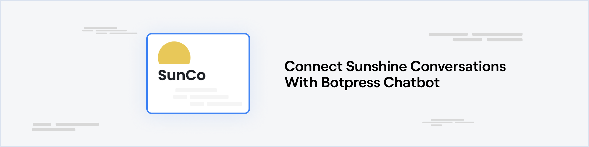
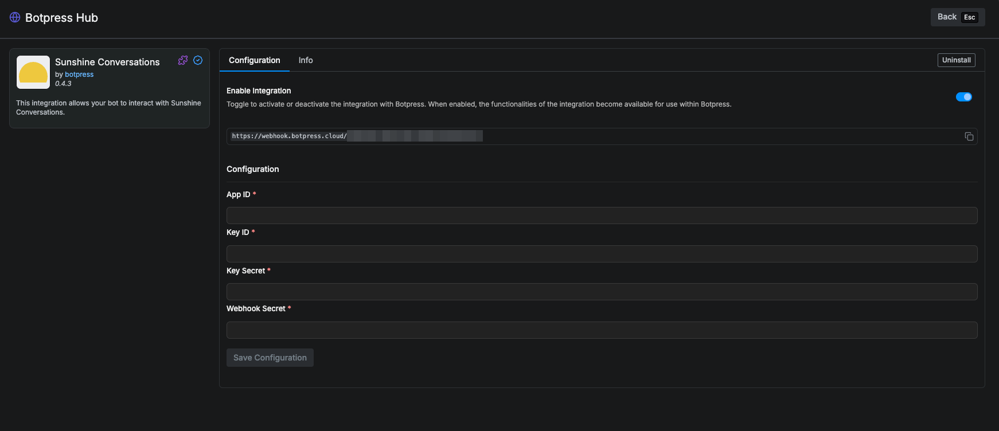
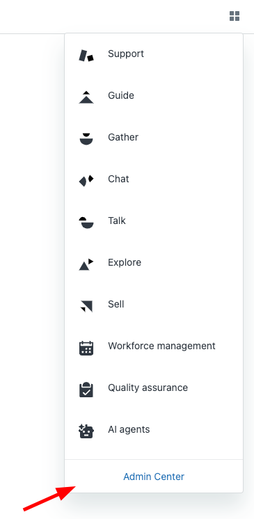
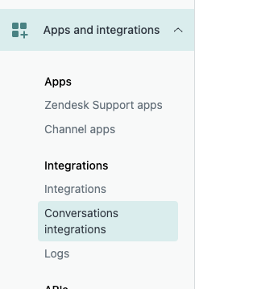
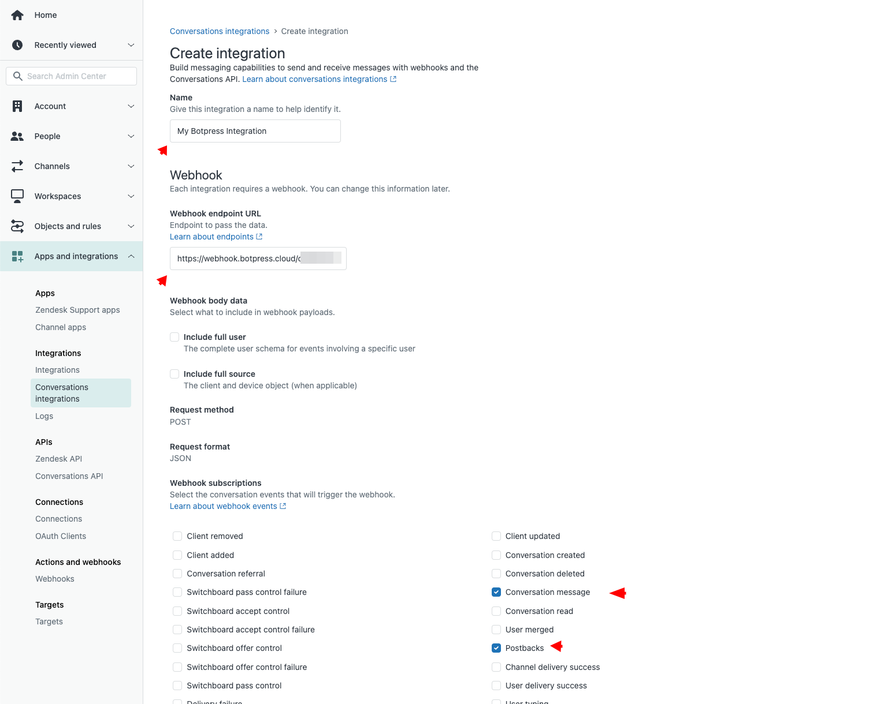
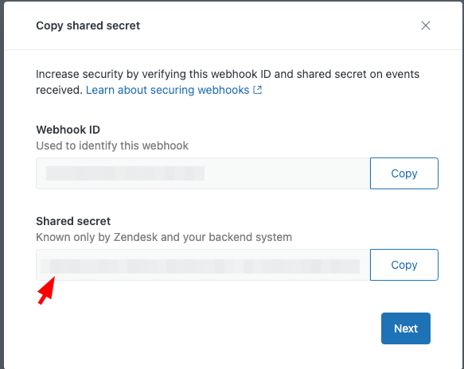
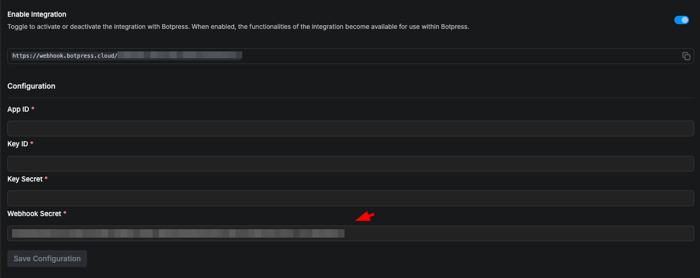
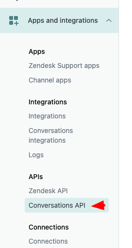
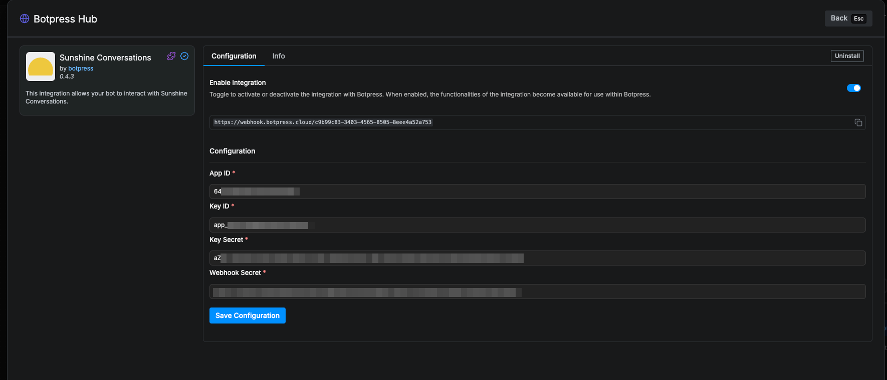
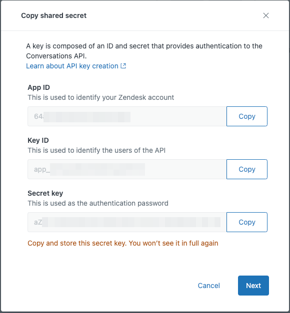

# Prerequisites

* A [Zendesk Support Professional plan account](https://www.zendesk.com.br/pricing/support) with Zendesk Messaging enabled to the desired channels
* A [Botpress Cloud account](https://sso.botpress.cloud) and a [Botpress Bot](/learn/get-started/quick-start)

# Setting up the Sunshine Conversations integration in Botpress

1. Go to the [Integration Hub](https://app.botpress.cloud/hub) in Botpress Cloud (if you don't have the integration installed yet).
2. Find and open the Sunshine Conversations integration then click on the "Install to Bot" button, now go back to your bot settings.

The Sunshine Conversations integration has the following settings:

* **Enabled**: Whether Botpress will communicate with this channel
* **Webhook URL**: The URL for receiving data in Botpress (Copy this)
* **App Id**: The App Id of your Zendesk Conversation API Credentials
* **Key Id**: The Key Id of your Zendesk Conversation API Credentials
* **Key Secret**: The Key Secret of your Zendesk Conversation API Credentials
* **Webhook Secret**: The Webhook Secret of your Zendesk Conversation Integration Webhook

# Setting up Zendesk Messaging

## Configure the Webhook

1. Open your Zendesk Admin Center.

2. Click on **Apps and Integrations** and **Conversations Integrations**

3. Give any name and put the **webhook URL** that you copied from Botpress.

4. Also select **Conversation message** and **Postbacks** on **Webhook subscriptions**.
5. Click **Save** at the bottom right corner.
6. Copy the **Shared Secret** and past on the Botpress Integration Configuration page at **Webhook Secret**

 

## Configure the API Credentials

1. Click on **Apps and Integrations** view and **Conversation API**

2. Click on **Create API key** and give it any name, then **Next**.
3. Copy **App Id**, **Key ID**, **Secret key** and put them on the associated field on the integration configuration.

 

## Save Configuration

Channel configuration is complete, you can now click **Save**

That's it, you may now start chatting with your bot on any channel from Zendesk Channels!

OBS: Please ensure that you enabled Zendesk Messaging for the required Zendesk Channel.
