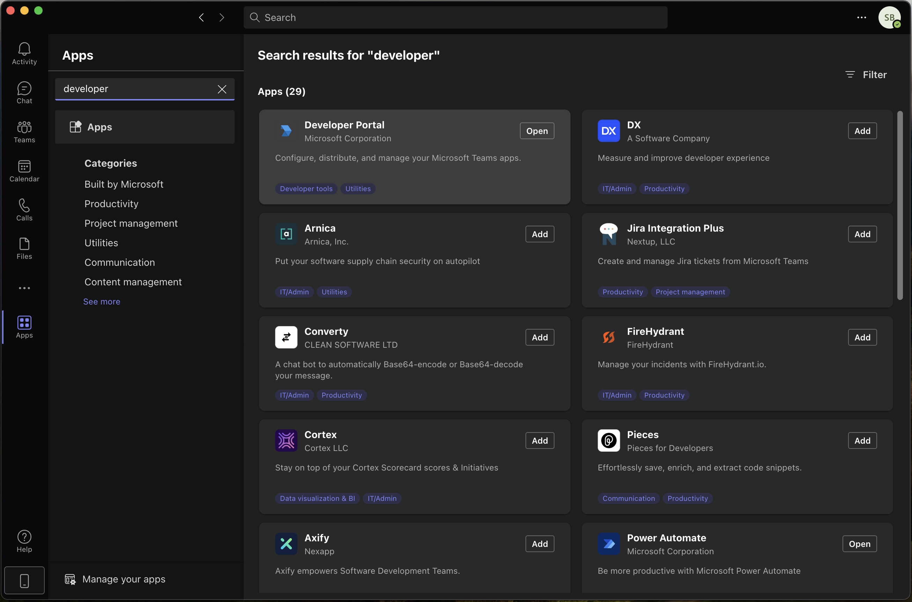
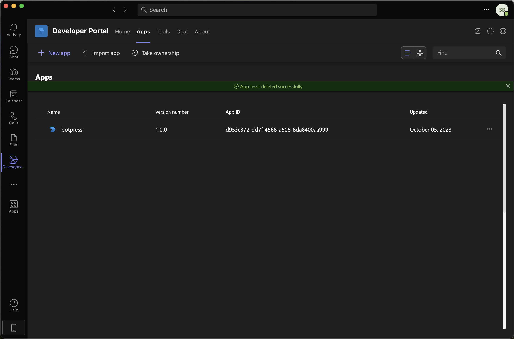
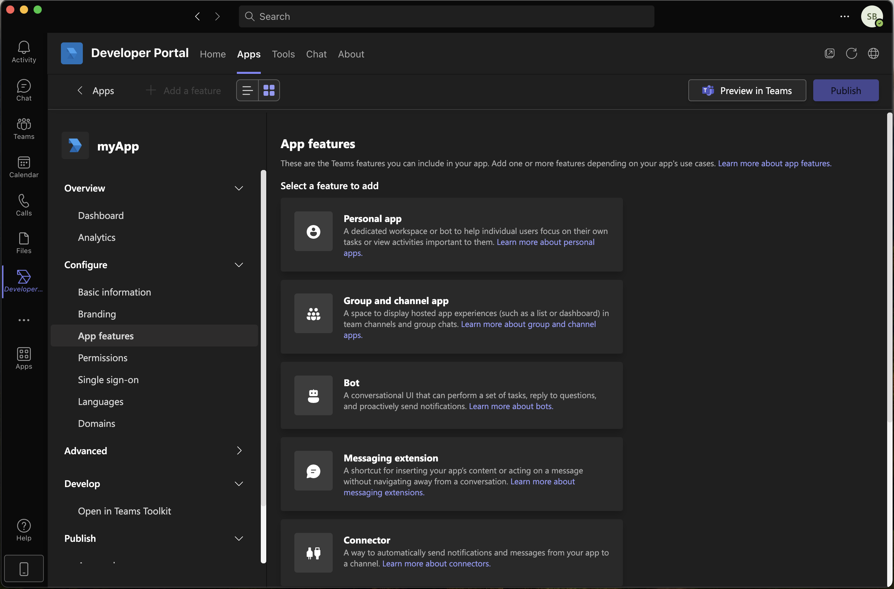
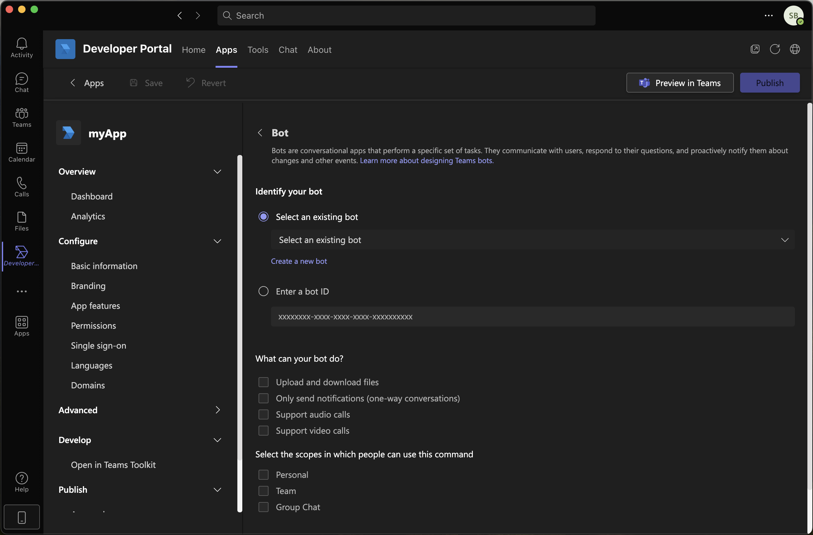
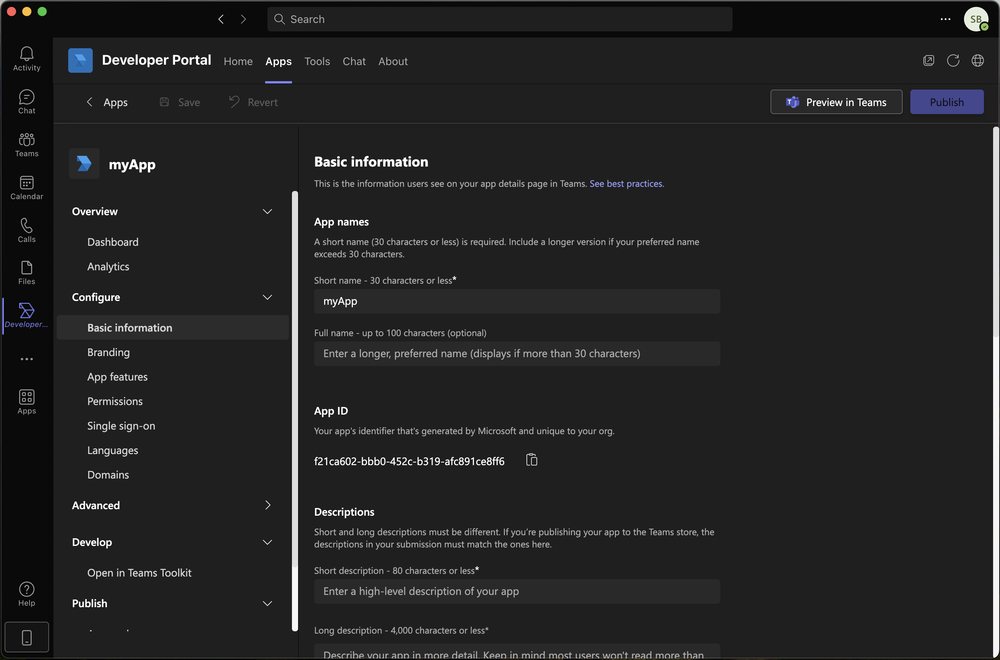
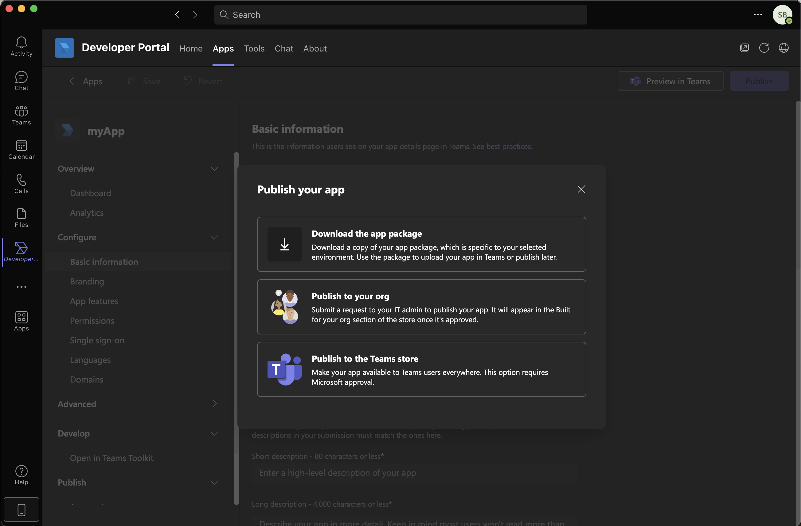
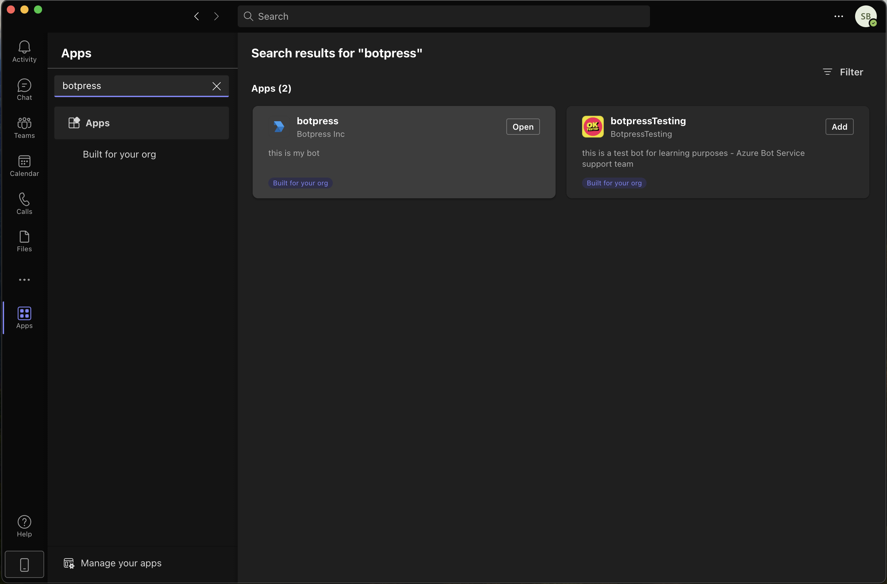
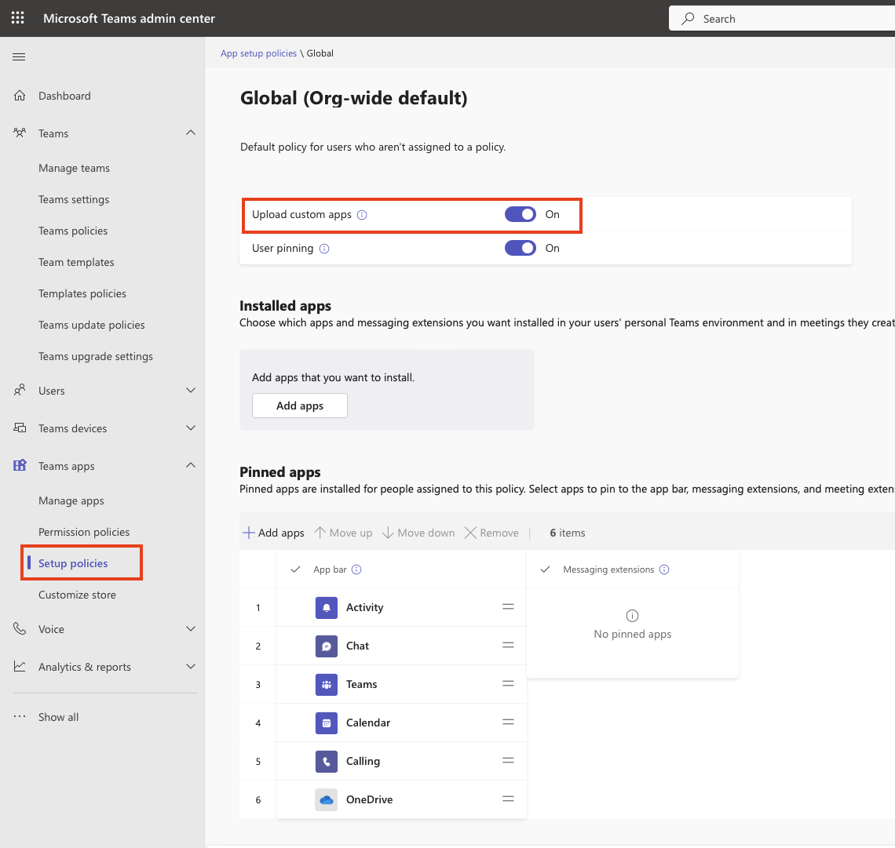

{/* vale off */}

import integrationVersions from '/snippets/integrations/versions.mdx'
import { OpenInHub } from '/snippets/integrations/open-in-hub.jsx'
import Cards from '/snippets/integrations/cards/botpress/teams.mdx'

{/* vale on */}

<OpenInHub integration={integrationVersions.teams}/>

The Microsoft Teams integration allows your bot to chat with members of your Teams workspace.

## Setup

<Info>
  You will need:

  - A [published bot](/learn/get-started/quick-start)
  - A [Microsoft 365](https://www.office.com/) business account
  - A [Microsoft Azure](https://azure.microsoft.com/en-ca) account that uses the same email address as your Microsoft 365 account
</Info>

<Steps>
  <Step title="Create an Azure app">
    First, create an Azure app:

    1. Log in to your  [Azure portal](https://portal.azure.com/).
    2. Using the search bar, go to the [App registrations](https://portal.azure.com/#view/Microsoft_AAD_RegisteredApps/ApplicationsListBlade) page.
    3. Select **New registration** and fill in the required fields.

      <Note>
        In the **Supported account types** section, choose the account type that's most appropriate for your use case—we support both [single tenant](https://learn.microsoft.com/en-us/security/zero-trust/develop/identity-supported-account-types#accounts-in-this-organizational-directory-only---single-tenant) (app available for your organization only) and [multitenant](https://learn.microsoft.com/en-us/security/zero-trust/develop/identity-supported-account-types#accounts-in-any-organizational-directory-only---multitenant) (public app) accounts.
      </Note>

    4. When you're done filling in the fields, select **Register**.
  </Step>
  <Step title="Install the integration in Botpress">
    Next, install the integration to your bot:

    1. In Botpress Studio, select **<Icon icon="boxes"/> Explore Hub** in the upper-right corner.
    2. Search for the **Microsoft Teams** integration, then select **Install Integration**..
  </Step>
  <Step title="Configure the integration in Botpress">
    To configure the integration, you need to create a webhook endpoint for the Teams integration. To do this, fill in the integration's **Configuration** fields using information from your Azure app:

    <AccordionGroup>
      <Accordion
        title="App ID"
      >
        In the **Overview** section of your Azure app, copy the **Application (client) ID**. Then, paste it in the **App ID** field in Botpress.
      </Accordion>
      <Accordion
        title="App Password"
      >
        1. In your Azure app's left sidebar, go to **Manage > Certificates & secrets**.
        2. Select **New client secret**.
        3. Set a description and expiry date for your secret.
        4. Copy the **Value** of the generated secret.
        5. Paste it in the **App Password** field in Botpress.
      </Accordion>
      <Accordion
        title="Tenant ID"
      >
        In the **Overview** section of your Azure app, copy the **Directory (tenant) ID**. Then, paste it in the **Tenant ID** field in Botpress.
      </Accordion>
    </AccordionGroup>

    When you’ve filled in all the fields, select **Save Configuration**. This will automatically enable your integration.
  </Step>
  <Step title="Create a Microsoft bot">
    Now, you need to create a Microsoft bot. This bot communicates with your Botpress webhook URL to chat with members of your Teams workspace.

    1. In your Azure portal homepage, select **Create a resource**.
    2. Search for **Azure Bot**, then select **Create**.
    3. Scroll to the **Creation type** section, then select **Use existing app registration**.
    4. Fill in the **App ID** and **App tenant ID** fields with the same app ID and tenant ID you used to configure the integration in Botpress.
    5. Fill in the other required fields as necessary.
    6. Select **Review + Create**, then **Create**.
  </Step>
  <Step title="Connect your Botpress webhook">
    Now that you've created a Microsoft bot, you can use the integration's webhook to connect it to your Botpress bot:

    {/* in botpress copy the webook URL */}

    1. Wait for the bot's deployment to complete, then select **Go to resource**.
    2. In the left sidebar, go to **Settings > Configuration**.
    3. Paste the Botpress webhook URL (starting with `https://webhook.botpress.cloud/`) into the **Messaging endpoint** field.
    4. Select **Apply**.
    5. In the left sidebar, go to **Settings > Channels**.
    6. Scroll down and select **Microsoft Teams**.

      <Tip>
        Make sure you actually select the **Microsoft Teams** text, or the channel configuration menu won't open.
      </Tip>

    7. Agree to the terms of service, then select **Apply**.
  </Step>
  <Step title="Access your bot in Teams">
    Now, you can access your bot in Teams:

    1. Select **Close** to return to the **Channels** page.
    2. Next to **Microsoft Teams**, select **Open in Teams**.
  </Step>
</Steps>

---

## Prerequisites

* A [Microsoft 365 Business account](https://www.microsoft.com/en-us/microsoft-365/business/)
* A [Botpress Cloud account](https://sso.botpress.cloud) and a [Botpress bot](/learn/get-started/quick-start)

## Setup in Botpress

1. Go to the [Integration Hub](https://app.botpress.cloud/hub) in Botpress Cloud (if you don't have the integration installed yet).
2. Find and open the Microsoft Teams integration then click on the "Install to Bot" button, now go back to your bot settings.

The Microsoft Teams integration has the following settings:

* **Enabled**: Whether Botpress will communicate with Microsoft Teams
* **Webhook URL**: The URL for receiving data in Botpress.
* **App ID**: The App ID of your bot in Azure
* **App Password**: The App Secret of your bot in Azure

## Setup in Microsoft Teams

### Register App

1. In the Azure portal, open the [App registrations](https://portal.azure.com#blade/Microsoft_AAD_RegisteredApps/ApplicationsListBlade) page
2. Click **New registration**, then choose a name for your application
3. In the section **Supported account types**, choose the type that's most appropriate for your use case. We support Single and Multi Tenant accounts. Check out [this article](https://learn.microsoft.com/en-us/security/zero-trust/develop/identity-supported-account-types) to learn more (in short, Single Tenant means the app will be available for your org only, and Multi Tenant will make it public). After selecting, click **Register**
4. Copy/paste the value of `Application (client) ID` to the **App ID** channel configuration in Botpress

### App Password

5. Find the **Certificates & secrets** page in the sidebar, click **New client secret**, then fill in the required fields
6. Copy the value from the **Value** column and paste it in the **App Secret** channel configuration in Botpress
7. Save the settings by clicking the "Save configuration" button

### Create Your Microsoft Bot

1. Navigate to the [Bot Framework Creation page](https://dev.botframework.com/bots/new)
2. Fill the **Display name** and **Bot handle** fields with whatever value
3. Copy/paste your app ID to the **App ID** field
4. Copy the Webhook URL provided in Botpress to the **Messaging endpoint** field
5. Choose a tenant for the **App type**. Follow the same type you chose in the **Register App** section
6. Paste the App ID from the Azure bot in the **Microsoft App ID** field
7. Read and agree to the terms then click **Register**
8. On the next page (**Connect to channels**), under the section, **Add a featured channel**, click **Configure Microsoft Teams Channel**, then click **Save**

### Accessing the Bot in MS Teams

1. Navigate to the [My Bots page](https://dev.botframework.com/bots/)
2. Click on your bot's name
3. Under the **Connect to channels** section, click on **Microsoft Teams**
4. The bot should open in your MS Teams

That's it, you may now start chatting with your bot on Microsoft Teams!

<Note>
The bot will only be available to you if you have a Microsoft 365 Business account and if you are logged in to MS Teams with that account.
</Note>

## Making the bot available in your Organization

1. Add the Developer Portal App to your Teams (or do it via the website)

2. Click the **Developer Portal App** tab in the sidebar, then **Apps**. Now click the **New app** button

3. In the left-side menu of the App, go to the **App Features** page under the **Configure** section then click "Bot"

4. Select your existing bot from BotFramework in the dropdown. Check the desired scopes (at least **Personal** for 1:1 conversations)

5. Fill out all the required fields in the Basic Information page of the Configure section

6. Click **Publish**, then **Publish to your Org**

7. Go to your Team App store, search for your app, then add it

8. The bot is now available in the **App** section to all members of your organization!

<Info>
Info

In order to update your bot's behavior, just **Publish** the new version in Botpress. The changes will then be reflected in MS Teams, there's no need to change any settings in the Microsoft apps.
</Info>

<Note>
Note

Botpress verifies the signature of the requests coming to the Webhook URL so that only Microsoft Teams can send data to your bot. Requests made from Postman or any other means will be rejected.
</Note>

## Setting up policies

If you're unable to send message to the bot (App), make sure you've enabled the policy to upload custom apps.\
Go to Setup Policies -> Turn on **Upload custom apps**

---

## Cards

<Cards />
