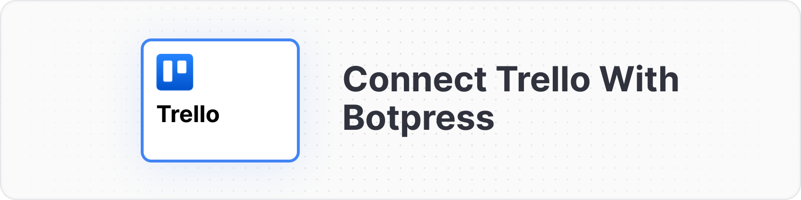
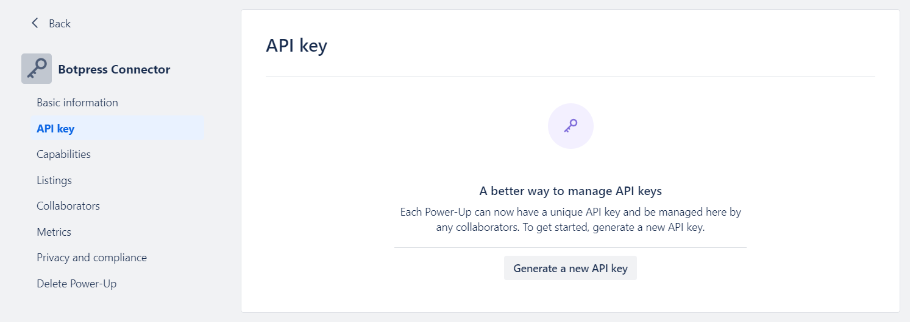
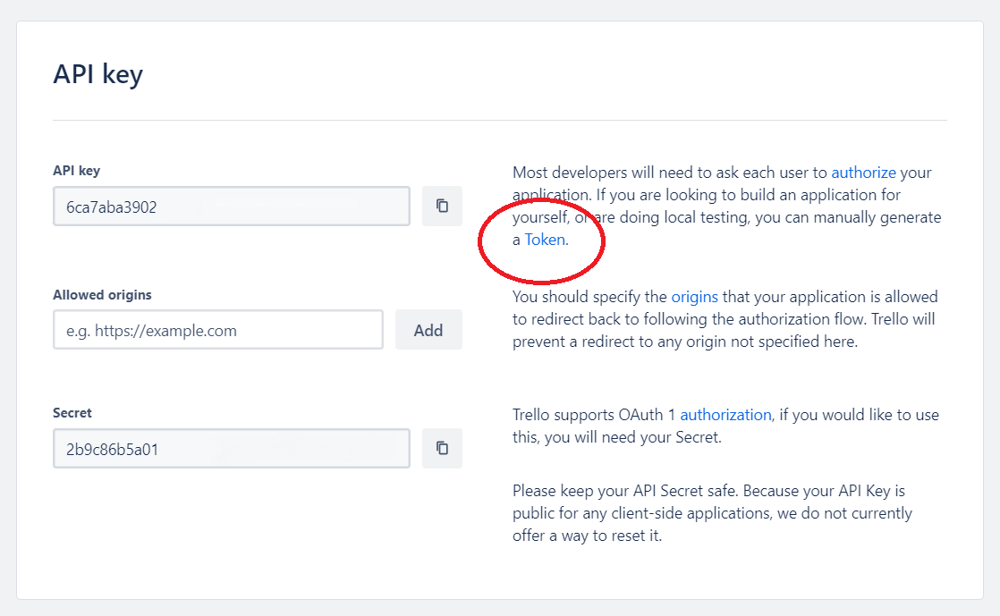

{/* vale off */}

import integrationVersions from '/snippets/integrations/versions.mdx'
import { OpenInHub } from '/snippets/integrations/open-in-hub.jsx'
import Cards from '/snippets/integrations/cards/botpress/trello.mdx'
import Triggers from '/snippets/integrations/triggers/botpress/trello.mdx'

{/* vale on */}

<OpenInHub integration={integrationVersions.trello}/>

This integration allows you to connect your Botpress bot with Trello, a leading project management platform. With this integration, you can easily manage your boards, lists and cards directly from your bot.

## Prerequisites

* A [Trello account](https://trello.com/)
* A board in Trello, with at least one list
* The ID of the list where cards will be created. Refer to [this article](https://community.atlassian.com/t5/Trello-questions/How-do-I-find-the-LIST-ID/qaq-p/2272862) to locate it.
* A [Botpress Cloud account](https://sso.botpress.cloud) and a [Botpress Bot](/get-started/quick-start)

## Setup in Botpress

1. Go to the [Integration Hub](https://app.botpress.cloud/hub) in Botpress Cloud (if you don't have the integration installed yet).
2. Find and open the Trello integration then click on the "Install to Bot" button, now go back to your bot settings.

The Trello integration has the following settings:

* **Enabled**: Whether Botpress will communicate with Trello
* **Webhook URL**: The URL for receiving data in Botpress
* **API Key**: The API key for the Trello Power-Up
* **Token**: The token for the Trello Power-Up

## Setup in Trello

1. Visit the [Power-Ups Admin Page](https://trello.com/power-ups/admin) and click the **New** button to obtain the API key. Name the Power-Up as "Botpress Connector", fill in the email and author fields, then click **Create**.
2. Once the Power-Up is created, you will be redirected to API Key settings page, displayed below. Generate a new API key, then copy and paste this key into the **API Key** field in Botpress.

3. Click on the "Token" link (marked in the image below) and authorize the Power-Up access to your Trello account by selecting **Allow**.

4. After authorization, copy the displayed token and paste it into the **Token** field in Botpress.
5. Make sure the integration is enabled then press the button "Save configuration".

That's it! Now the Trello integration is operational and ready for use within your bot.

---

## Cards

<Cards />

---

## Triggers

<Triggers />
