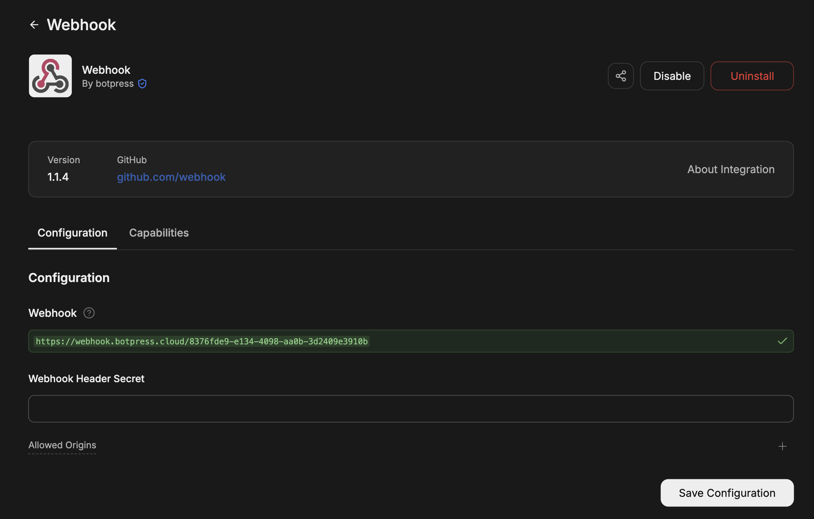
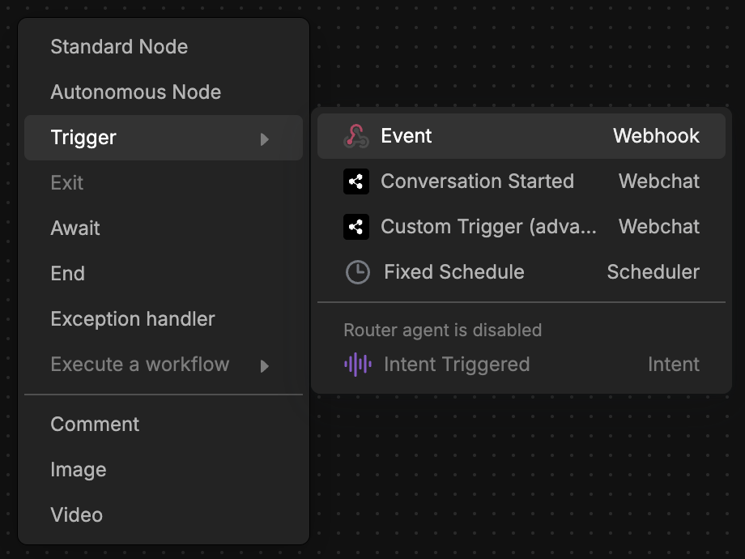
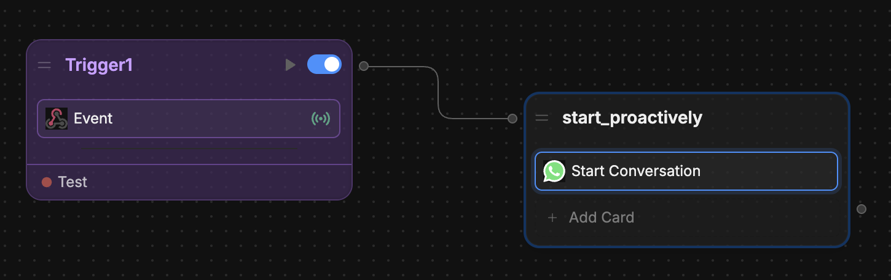
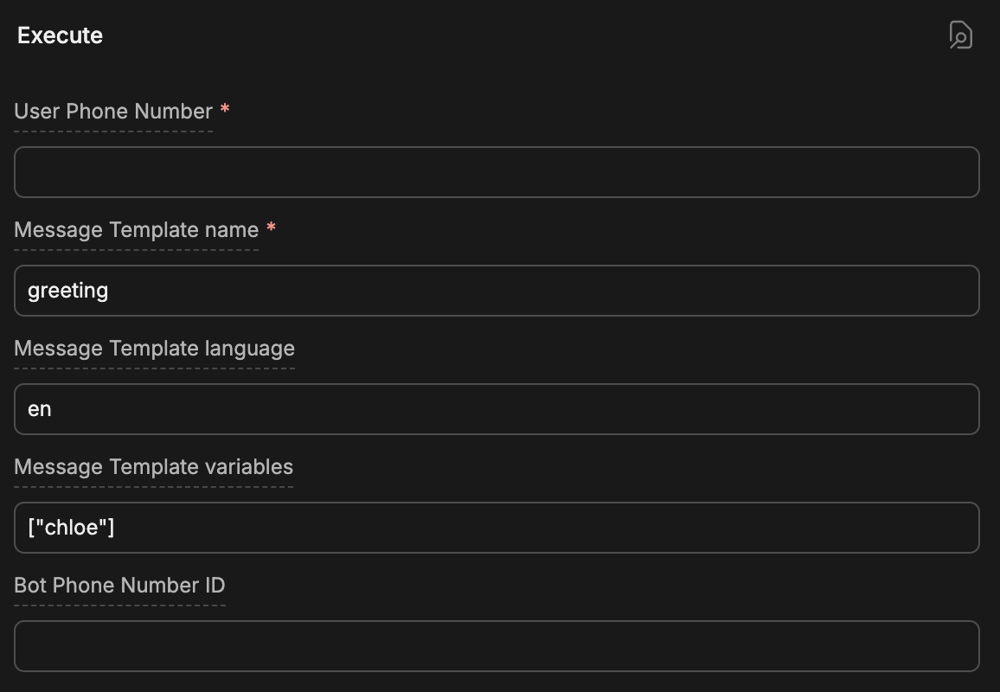
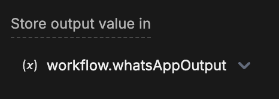
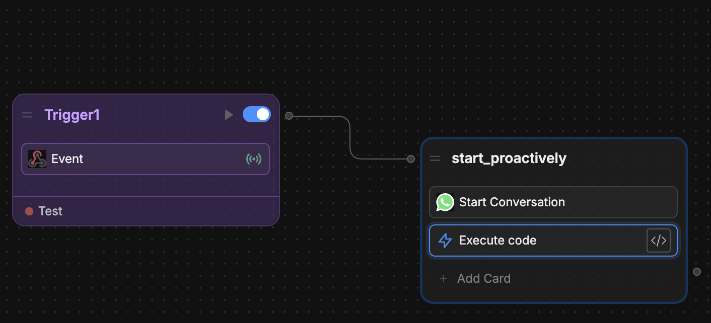
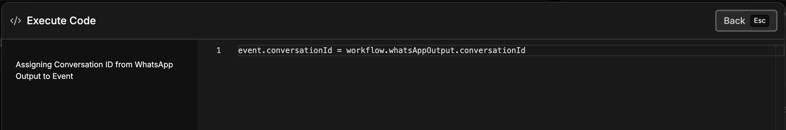
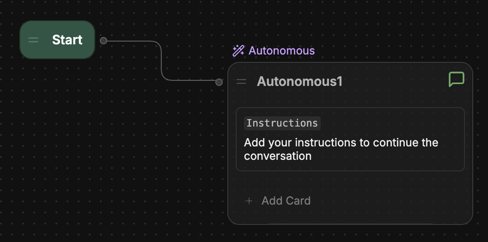

## Prerequisites

<Info>
  You will need:

  - A [configured WhatsApp integration](./introduction.mdx)
  - A [WhatsApp Message Template](https://developers.facebook.com/docs/whatsapp/message-templates/guidelines/) (required for starting conversations proactively)
</Info>

This guide walks you through starting a WhatsApp conversation when an external system sends a request to your bot's webhook. Use this when you want to initiate a chat from your backend, CRM, or another service (for example, when a support ticket is created or a user signs up).

## 1. Install and configure the Webhook integration

<Steps titleSize="h3">
  <Step title="Install the Webhook integration">
    In Botpress Studio, select **Explore Hub** in the upper-right corner. Search for **Webhook**, then select **Install Integration**.
  </Step>
  <Step title="Copy your webhook URL">
    Open the integration's **Configuration** page. Copy the webhook URL shown there (it starts with `https://webhook.botpress.cloud/`).

    
  </Step>
  <Step title="Send requests to the webhook">
    From your external system, send a POST request to this URL with the payload you need (for example, the user's phone number and template variables). Ensure the request body is JSON and that you use the same URL when testing in Studio.
  </Step>
</Steps>

<Note>
  If you configured a **Secret** for the integration, include it in the request as the `x-bp-secret` header. For more details, see [Send data to your webhook](/integrations/integration-guides/webhook#send-data-to-your-webhook).
</Note>

## 2. Add the webhook trigger and Start Conversation in Studio

<Steps titleSize="h3">
  <Step title="Add the Event trigger">
    Open the [Workflow](/studio/concepts/workflows) where you want to handle the webhook. Right-click on the canvas and select **Trigger**, then choose the **Event** trigger from the Webhook integration.

    
  </Step>
  <Step title="Add the Start Conversation Card">
    Add a Node after the trigger and add the **Start Conversation** Card to it.

    

    Configure the Card:

    - **User Phone**: Use the phone number from your webhook payload (for example, `event.payload.body.userPhone` if you send `{ "userPhone": "+1234567890" }`).
    - **Template Name** and **Template Language**: Your approved WhatsApp message template and its language.
    - **Template Variables JSON**: If your template has variables, pass them from the webhook payload (for example, `event.payload.body.templateVariables`).

    
  </Step>
  <Step title="Store the WhatsApp conversation ID">
    In the Start Conversation Card, set **Store result in** to a [Workflow variable](/studio/concepts/variables/scopes/workflow) (for example, `whatsAppOutput`). This variable will hold the new conversation's ID.

    
  </Step>
</Steps>

## 3. Set the conversation ID so the rest of the Workflow runs in the same conversation

So that subsequent nodes (such as the [Autonomous Node](/studio/concepts/nodes/autonomous-node) or your main bot Workflow) run in the same WhatsApp conversation, set `event.conversationId` to the ID returned by the Start Conversation Card.

<Steps titleSize="h3">
  <Step title="Add an Execute Code Card">
    Add an **Execute Code** Card in the same Node (after Start Conversation) or in a new Node connected right after it.

    
  </Step>
  <Step title="Set the conversation ID">
    In the Execute Code Card, assign the conversation ID from the Start Conversation output to the event:

    ```js
    event.conversationId = workflow.whatsAppOutput.conversationId
    ```

    

    Replace `whatsAppOutput` with the name of the variable you chose in **Store result in** for the Start Conversation Card.
  </Step>
</Steps>

<Note>
  The Start Conversation Card returns an object with a `conversationId` property. By setting `event.conversationId`, you ensure that any subsequent nodes (including the [Autonomous Node](/studio/concepts/nodes/autonomous-node) or your main Workflow) continue in the same WhatsApp conversation.
</Note>

## 4. Connect to your main bot Workflow

Connect the node that contains the rest of your main Workflow to your **START** node.



That way, when the webhook fires:

1. The Event trigger runs.
2. The Start Conversation Card starts a WhatsApp conversation and stores its ID.
3. The Execute Code Card sets `event.conversationId` to that WhatsApp conversation ID.
4. The conversation continues in your main Workflow (for example, in the [Autonomous Node](/studio/concepts/nodes/autonomous-node) or your regular bot Workflow).

<Check>
  When your external system POSTs to the webhook URL with the right payload (user phone, template name, etc.), your bot will start a WhatsApp conversation and then follow your main Workflow for that conversation.
</Check>
