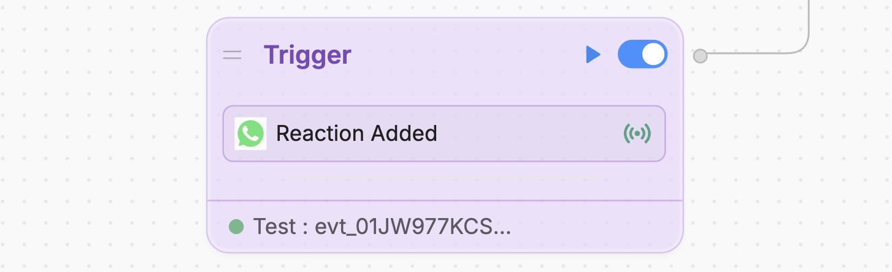
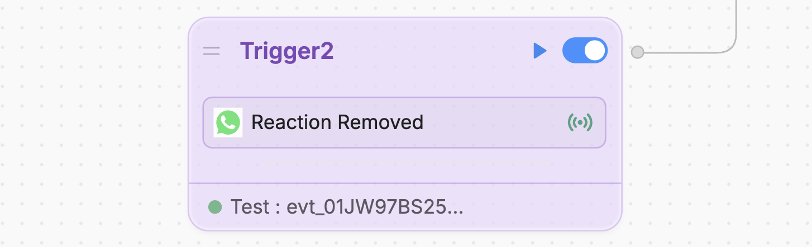

The WhatsApp integration includes the following [Triggers](/learn/reference/triggers):

## Reaction Added

The **Reaction Added** Trigger executes when the WhatsApp user [adds a reaction to a message](https://developers.facebook.com/docs/whatsapp/cloud-api/messages/reaction-messages/):

<Frame>
    
</Frame>

It receives the `whatsapp:reactionAdded` event, which contains the following payload:

<ResponseField name="payload" type="object">
    <Expandable title="properties">
        <ResponseField
            name="conversationId"
            type="string"
            required
        >
            The ID of the conversation where the reaction was added.
        </ResponseField>
        <ResponseField
            name="messageId"
            type="string"
            required
        >
            The ID of the message the reaction was added to.
        </ResponseField>
        <ResponseField
            name="userId"
            type="string"
            required
        >
            The ID of the user who added the reaction.
        </ResponseField>
        <ResponseField
            name="reaction"
            type="string"
            required
        >
            The emoji used for the added reaction.
        </ResponseField>
    </Expandable>
</ResponseField>

## Reaction Removed

The **Reaction Added** Trigger executes when the WhatsApp user [removes a reaction to a message](https://developers.facebook.com/docs/whatsapp/cloud-api/messages/reaction-messages/):

<Frame>
    
</Frame>

It receives the `whatsapp:reactionRemoved` event, which contains the following payload:

<ResponseField name="payload" type="object">
    <Expandable title="properties">
        <ResponseField
            name="conversationId"
            type="string"
            required
        >
            The ID of the conversation where the reaction was removed.
        </ResponseField>
        <ResponseField
            name="messageId"
            type="string"
            required
        >
            The ID of the message the reaction was removed from.
        </ResponseField>
        <ResponseField
            name="userId"
            type="string"
            required
        >
            The ID of the user who removed the reaction.
        </ResponseField>
        <ResponseField
            name="reaction"
            type="string"
            required
        >
            The emoji used for the removed reaction.
        </ResponseField>
    </Expandable>
</ResponseField>