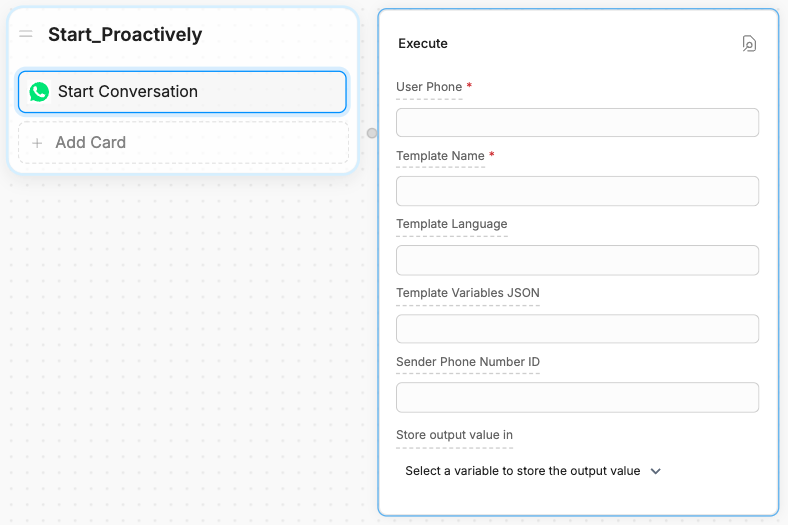
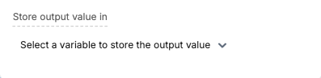

<Info>
  You will need:

  - A [configured WhatsApp integration](./introduction.mdx)
  - A [WhatsApp Message Template](https://developers.facebook.com/docs/whatsapp/message-templates/guidelines/)
</Info>

<Note>
  WhatsApp only allows proactively sending messages if they're created from a template. You can create a template from your [WhatsApp Manager dashboard](https://business.facebook.com/latest/whatsapp_manager/message_templates?business_id=3818287771769899&tab=message-templates&nav_ref=whatsapp_manager&asset_id=1022022276691875).

  After WhatsApp reviews and approves your template, follow the steps in this guide.
</Note>

## Setup

<Steps titleSize="h3">
  <Step title="Add the Start Conversation Card">
    In Studio, add a **Start Conversation** Card to any Node:

    

  </Step>
  <Step title="Fill in the required fields">
    Fill in the fields:

    <AccordionGroup>
      <Accordion
        title="User Phone"
      >

      The user's phone number, including the country code.
      
      **Example**: `+1 123 456 7890`
      </Accordion>
      <Accordion
        title="Template Name"
      >
        The name of your WhatsApp message template.

        **Example**: `proactive_message`
      </Accordion>
      <Accordion
        title="Template Language (Optional)"
      >
        The language code for your WhatsApp message template. Defaults to `en_US`.

        <Warning>
          Although this field is optional, an error will occur if you leave the field blank and your message template's language is not **English (US)**.
        </Warning>

        <Tabs>
          <Tab title="Country qualifier">
            If the language you selected for your template has a country qualifier, then you need to specify a value in the `language_COUNTRY` format, where:

            - `language` is the 2-letter lowercase [ISO language code](https://en.wikipedia.org/wiki/List_of_ISO_639-1_codes)
            - `COUNTRY` is the 2-letter uppercase [ISO country code](https://en.wikipedia.org/wiki/ISO_3166-1_alpha-2)

            For example, if you selected the **English (UK)** option, enter `en_GB`.
          </Tab>
          <Tab title="No country qualifier">
            If the language you selected for your template has no country qualifier, just specify the 2-letter lowercase [ISO language code](https://en.wikipedia.org/wiki/List_of_ISO_639-1_codes).

            For example, if you selected the **French** option, enter `fr`.
          </Tab>
        </Tabs>
      </Accordion>
      <Accordion
        title="Template Variables JSON (Optional)"
      >
      A JSON array containing the values for your message template's variables.

      WhatsApp uses numbers to name variables within message templates. For example, if you have two variables, you need to name them `{{1}}` and ``{{2}}``

      When you enter your JSON array in Botpress, you can order the entries based on how you want WhatsApp to assign the values:

      ```json
      ["First value", "Second value"]
      ```

      With the above array:
      - `"First value"` will be assigned to `{{1}}`
      - `"Second value"` will be assigned to `{{2}}`.

      </Accordion>
      <Accordion
        title="Sender Phone Number ID (Optional)"
      >
      
      The WhatsApp Phone Number ID that will message your user. Defaults to the Phone Number ID you used to configure your integration.

      <Note>
        To use a different WhatsApp Phone Number ID, you need to have added it via your [Meta developer dashboard](https://developers.facebook.com/apps/).
      </Note>
      </Accordion>
    </AccordionGroup>
  </Step>
</Steps>

<Check>
  Your bot is ready to proactively start a conversation with your user! 
</Check>

## Access the Conversation ID

You can access the proactively started conversation's ID in Studio by storing the **Start Conversation** Card's output in a variable. Just select a variable to store the value in:



The output value of this action will be an object with the following structure:

```js
{
  conversationId: 'xxxxxxxxxxxxxxxxxxxxx'
}
```

## Create the conversation from code

You can also call `actions.whatsapp.startConversation` in an [Execute Code](/learn/reference/cards/execute) Card to start a conversation:

```ts
actions.whatsapp.startConversation({
  conversation: {
    userPhone: '+1 123 456 7890',
    templateName: 'test_message',
    templateLanguage: 'en',
    templateVariablesJson: JSON.stringify(['First value', 'Second value'])
  }
})
```