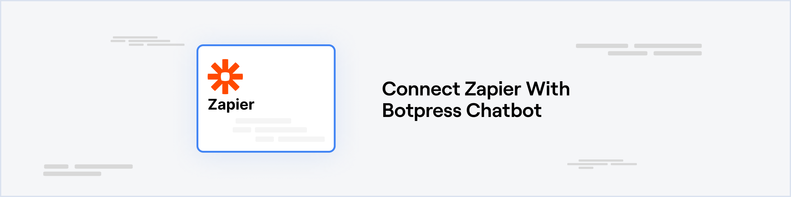

import { integrationVersions } from '/snippets/integrations/versions.mdx'

*Version: {integrationVersions.zapier}*

<Info>

The Botpress app for Zapier is currently in BETA. In order to use Botpress in your Zaps please [click here to obtain access](https://zapier.com/developer/public-invite/179950/2d89a44be6d7ddcae4ae23df0be19b3c/) to the private beta in Zapier.

</Info>



## Prerequisites

* A [Zapier](https://zapier.com/) account
* BETA access to the Botpress app in Zapier [request here](https://zapier.com/developer/public-invite/179950/2d89a44be6d7ddcae4ae23df0be19b3c/)
* A [Botpress Cloud account](https://sso.botpress.cloud) and a [Botpress Bot](/learn/get-started/quick-start)

## Setting up the Zapier integration in Botpress

1. Go to the [Integration Hub](https://app.botpress.cloud/hub) in Botpress Cloud (if you don't have the integration installed yet).
2. Find and open the Zapier integration then click on the "Install to Bot" button, now go back to your bot.

{/* vale Botpress.workflows = NO */}
## Setting up a Zapier workflow

1. Create a new zap in your Zapier account and search for "Botpress" either in the Trigger or Action of your zap.
2. Zapier will guide you through the process of authenticating to your Botpress account, follow the steps provided there.
3. Once you have authenticated, when setting up the Trigger or Action of your zap to use Botpress you'll be asked for the "Webhook URL", which you can find in your Botpress Cloud dashboard inside the "Integrations" tab of your bot and then clicking on the Zapier integration.

### Using Botpress to trigger a Zapier workflow
{/* vale Botpress.workflows = YES */}

1. If you're setting up Botpress as a Trigger in Zapier there will be an option to test the trigger and see some sample data that could be received from your bot. Use this to create the rest of your Zap.
2. To make your bot send real data to Zapier, you'll find a "Send to Zapier" action card in Botpress Studio which you can use to send data from your bot to your Zap:


3. It's recommended that you send your data in JSON format so you can send multiple value at once, as Zapier will automatically parse it. For example, you could use the following expression to send a JSON object with multiple values in the "Trigger Data" field of the "Send to Zapier" action:

```
{{ JSON.stringify({ myVariable1: workflow.myVariable1, myVariable2: workflow.myVariable2 }) }}
```

### Using Zapier to trigger an action in your Botpress bot

1. If you're setting it up as an Action in Zapier, you can send custom Event Data to your bot and an optional Correlation ID which you can use to associate individual zap runs with a particular event in your bot.

2. Zapier only allows entering a single text value for the Event Data, but you can put a Code Step from Zapier before the Botpress action in your zap in order to construct an object with multiple values and then use `JSON.stringify()` in your Code Step to convert the object to a text field that you can use in the last part of your zap as the Event Data to send to Botpress.

3. To receive data from Zapier in your bot, you can use the "Event from Zapier" trigger in the Studio:


4. Then add an Execute Code card with the following code assuming you sent your data in JSON format:

```js
workflow.zapierData = JSON.parse(event.payload.body)
```
{/* vale Botpress.workflows = NO */}
5. Now the rest of your trigger workflow can use the `{{ workflow.zapierData }}` variable to access the data you sent from Zapier.
{/* vale Botpress.workflows = YES */}

### Testing your Zapier integration

You can create an "echo" zap in Zapier to test if everything works well. For example, you can create a zap that triggers when you send a message to your bot and then sends the same message back to your bot.\
Here's what a simple echo zap would look like:


The first action receives an event from the bot, and the second one sends the same event back to the bot. You can see the events you receive on the "Discover Events" button on the node containing "Events from Zapier" card.


